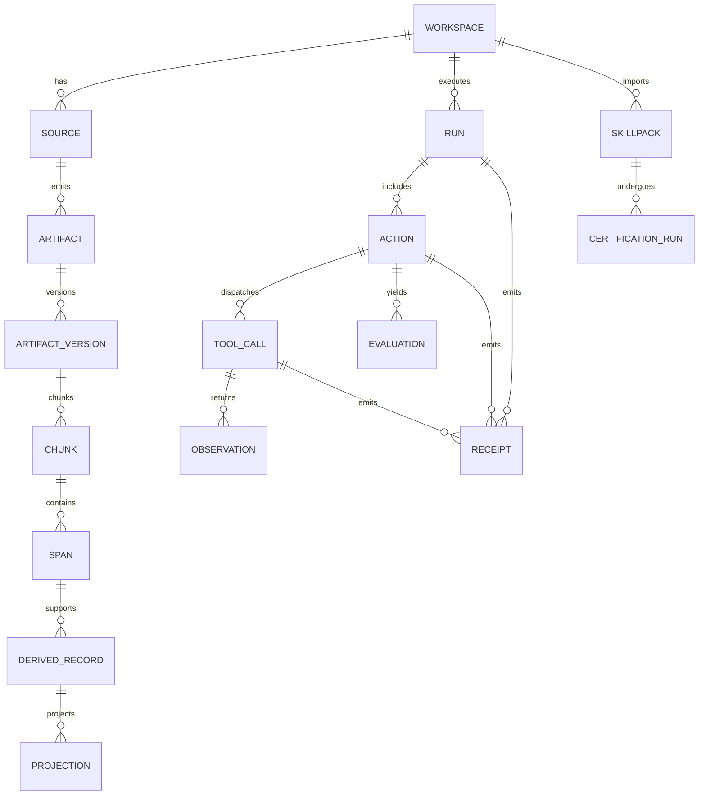
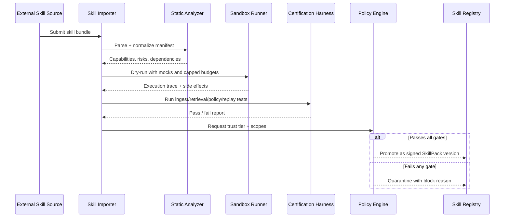
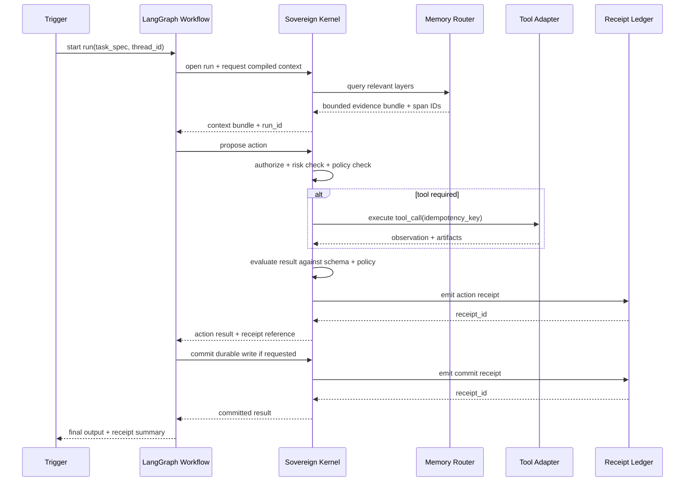
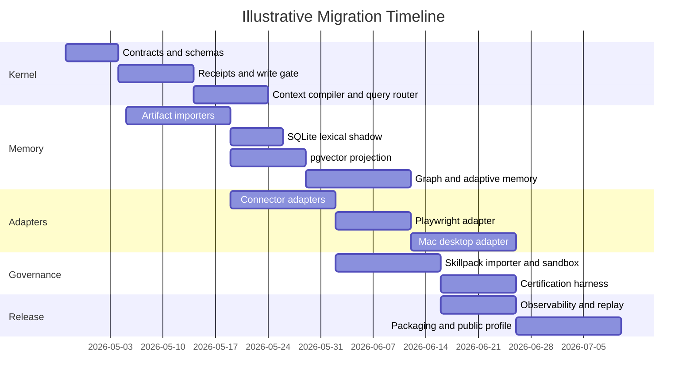

# Entif.AI - NOT LAME (v0.1) - PRD - Neurologic Orchestration Topology for Layered Agentic Memory and Evolution

**Prepared for:** implementation handoff to Claude Code or GPT Codex
**Date:** April 23, 2026
**Language:** en-US
**Document status:** research-backed draft PRD
**PRD stance:** opinionated, fail-closed, governance-first

## Executive Summary

This PRD recommends building the system as a **sovereign kernel plus workflow fabric**, not as another harness-centered agent stack. The kernel should own provenance, receipts, write admission, policy enforcement, context compilation, memory routing, and adapter certification. LangGraph should be used for durable workflows, interrupts, subgraphs, and long-running stateful execution, while LangChain should be used only where it helps with structured outputs and tool abstractions. Third-party harnesses and imported skills should be demoted to **replaceable worker surfaces** that can never write canonical state directly. That recommendation is driven both by the project’s own stated Rosetta direction—typed run/action/tool/observation/evaluation/receipt flow, receipts-first execution, guard-enforced writes, bounded context packages, and forge-style subsystems—and by the failure modes documented in the OpenClaw and Hermes inventories, where destructive compaction, overwritten canonical files, duplicate state authorities, unwired “constitutional” rules, silent dropouts, and unbounded redirect loops repeatedly destroyed trust.

The recommended product shape is a **hybrid sovereign agent system** with five memory layers under one governor: constitutional documents, artifact/source store, semantic recall layer, temporal graph, and adaptive/prioritized memory. Each layer keeps a different truth claim and jurisdiction. The artifact/source layer is authoritative for raw source and spans; the constitutional layer is authoritative for doctrine and policy; the vector layer is authoritative for nothing and is only a candidate-recall aid; the temporal graph is authoritative only for modeled relationships and event structure derived from source; and the adaptive layer is authoritative only for salience and resurfacing decisions. That structure preserves the intentional multi-layer memory vision while fixing the older harness failure in which rival stores acted like co-equal kings with no sovereign authority above them.

The canonical registry should be **PostgreSQL**, not SQLite, because PostgreSQL gives you row-level security with default-deny semantics when no policy exists, plus logical replication and a durable publisher/subscriber model for multi-device replication. SQLite is still extremely useful, but it should be an **edge cache, local shadow, or offline retrieval substrate**, not the cross-device canonical registry, because its WAL mode is explicitly same-host only and unsuitable for network filesystem multi-host usage. SQLite FTS5 remains excellent for on-device lexical retrieval, snippets, highlighting, and BM25 ranking, and should be used heavily on local nodes.

For orchestration, LangGraph fits the problem far better than the harnesses already tried because it is explicitly a low-level runtime for stateful, long-running agents with durable execution, interrupts, persistence, and subgraphs, rather than a “helpful agent shell” pretending to be a sovereign operating environment. Its docs also make two constraints highly relevant here: side effects should be wrapped in tasks so they are not accidentally repeated on resume, and code before an interrupt is rerun when execution resumes, which means approval paths and write admission must be designed to be idempotent and explicitly side-effect-safe. In addition, per-thread subgraphs should not be invoked in parallel when they share a namespace, which matters for any multi-agent memory design.

The deployment recommendation is a **hybrid topology**. The Mac Studio M3 Ultra should be the first-class **privileged node** because local macOS automation depends on Apple Events entitlements, AppleEvents usage descriptions, accessibility trust, and local Shortcuts/automation access. Public or always-on ingress for Telegram, Slack, and Discord should terminate in a cloud or edge relay layer with narrow scopes. Slack should use HTTP Events API for any public-distribution path because Slack’s own docs say Socket Mode apps are not currently allowed in the public Slack Marketplace; Discord should prefer Interactions-first public UX and fall back to Gateway only where message-stream ingestion is truly required; Telegram may use standard HTTPS Bot API and optionally a local Bot API server later if oversized file handling or local-path uploads become important.

The deepest implementation lesson from the current failures is blunt: **nothing constitutional may live only in prose**. Every policy that matters has to exist as an executable check, an interrupt policy, a write gate, a receipt condition, or a sandbox boundary. That is the spine of this PRD.

## Product Framing

### Rosetta v3 Conventions Used in This PRD

This PRD uses the Rosetta conventions already surfaced in prior project materials and discussion: a typed operational spine of **Run → Action → ToolCall → Observation → Evaluation → Receipt**, receipts-first accounting, deny-by-default guarded execution, separation of proposer/gatekeeper/executor roles, bounded compiled context bundles, and pack- or forge-like subsystems for files, authorization, metadata, archiving, and versioning. The project’s own architecture notes also emphasize local-first portability, meaning the same cognitive system should be able to operate across a laptop, a cluster, or a distributed mesh without changing its constitutional rules.

Because the currently accessible project evidence in this session is strongest on **failure analysis** rather than a full canonical Rosetta v3 repository snapshot, this PRD treats the Rosetta conventions above as the binding architectural intent and explicitly marks infrastructure details that remain unspecified as assumptions. That is preferable to pretending the missing repo details are already settled.

### Goals

| Goal | Requirement |
|---|---|
| Sovereign control | All durable writes, promotions, connector actions, and privileged tool operations must pass through a central write-admission gate. |
| Multi-layer memory | Preserve distinct memory layers with distinct truth claims rather than collapsing them into one summary store. |
| Provenance-first cognition | Every answer, memory promotion, graph edge, or adaptive priority change must resolve back to source spans and receipts. |
| Durable orchestration | Survive crashes, resumes, human interrupts, scheduled cycles, and device restarts without silent state loss. |
| Safe skill portability | Import external Claude/Codex/OpenClaw-style skills only through parse/normalize/quarantine/certify/promotion flow. |
| Local privileged automation | Support guarded Mac desktop control and headless browser control with strong approval and logging boundaries. |
| Multi-device operability | Run in local, hybrid, and public-hosted profiles without changing core contracts. |
| Autonomous improvement | Allow background research, ingestion, task mining, and optimization proposals, but never uncontrolled constitutional mutation. |

These goals are not abstract. They are directly aligned to the observed failures: OpenClaw’s destructive compaction and overwritten doctrinal files, memory-store conflict and nondeterministic orchestration, and Hermes’s split state, unwired session artifact pipeline, unwired mechanisms, silent gaps, and absent durable learning store all point to the need for sovereign control, provenance, durable orchestration, and strict admission boundaries.

### Non-Goals

| Non-goal | Rationale |
|---|---|
| Fully autonomous constitutional rewriting in the first release | The current failure history shows prose rules are easily bypassed and self-improvement loops are dangerous when they can mutate authority directly. |
| Active-active multi-master canonical writes in the first release | Split-brain was already a problem; first release should be single-writer canonical with replicas and append-only ingress. |
| Unscreened execution of third-party skills | The supply-chain risk is too high; all imported skills must be sandboxed and certified first. |
| Harness-led memory authority | No third-party harness may own canonical memory or policy. |
| Arbitrary desktop control without step-up approval | macOS automation surfaces are too powerful for unrestricted autonomy. |
| One universal “memory god” database | The design intentionally requires multiple memory modalities with explicit jurisdiction. |

### Success Metrics

| Metric | Target | Why it matters |
|---|---|---|
| Unauthorized durable writes that succeed | 0 | Prevents the exact category of overwritten state and doctrinal corruption already observed. |
| Receipt coverage for material actions | 100% | If a write, promotion, tool call, or rejection happened, it must have a receipt. |
| Crash recovery from last committed checkpoint | 100% in chaos tests | Prevents silent work loss and restart amnesia. |
| Silent background gaps | No gap longer than one scheduled interval without an alert | Direct response to the documented 72-hour invisible dropout. |
| Provenance completeness for promoted memory | 100% | Every derived record must cite spans or be rejected. |
| Adapter certification pass requirement before promotion | 100% | Broken adapters must not be “helpfully” enabled. |
| Retrieval precision at 5 on curated benchmark | ≥ 0.80 | Forces semantic and lexical layers to prove usefulness. |
| Duplicate YouTube transcript ingestion for same canonical video/version | 0 | Supports the desired “transcribe once, attach to many playlists” behavior. |
| Desktop destructive operations without step-up approval | 0 in production profile | Strong local guardrail. |
| Context budget violations per 100 runs | < 1 | Helps suppress context slop and stateful prompt bloat. |

These metrics are shaped by the concrete failures already documented: unreliable session persistence, silent duplication, lost artifacts, broken memory retrieval, and endless loops without value.

### Assumptions

| Assumption | Current state | PRD handling |
|---|---|---|
| Cloud provider | Unspecified | Keep control plane provider-neutral; support Docker Compose locally and container orchestration in cloud later. |
| Authentication system | Unspecified | Assume local admin bootstrap plus service tokens in alpha; keep SSO/OAuth pluggable at auth gateway. |
| User counts and tenant counts | Unspecified | Size the first release for owner-led use and a small private beta; public multi-tenant hardening is a later gate. |
| Latency/throughput targets | Unspecified | Use provisional SLOs: connector ack fast-path under platform deadlines; background ingestion eventually consistent. |
| Existing infra and secrets tooling | Unspecified | Assume environment-based secrets in alpha, but design vault integration and step-up auth interfaces now. |
| Embedding models and dimensions | Unspecified | Vector layer must be model-agnostic and version embeddings by model family and dimension. |
| Exact Rosetta v3 repo snapshot | Not directly enumerated here | Use the Rosetta conventions already surfaced in earlier project notes and validate naming/details against the canonical repo during implementation. |
| Public distribution model | Desired, but channel mix unspecified | Ship private/local profile first; promote to public-hosted profile only after connector auth, RLS, and skill quarantine pass. |

## System Architecture

### Recommended Topology

The recommended topology is **hybrid by design**:

| Node type | Role | Authority | Typical location |
|---|---|---|---|
| Sovereign node | Canonical write gate, doctrine, provenance, privileged local tools, artifact ingest from local files, desktop automation | High | Mac Studio M3 Ultra |
| Relay node | Public connector ingress, queueing, webhook handling, interaction response deadlines, low-risk background jobs | Low | Cloud |
| Worker node | Embeddings, classification, reranking, transcription, bulk extraction, graph enrichment | None over canonical state | Cloud or local |
| Follower node | Read-only or narrowly writable replica for additional devices | Limited | Other devices |

The central architectural rule is that **public ingress need not imply public authority**. That matters because Slack, Discord, and Telegram all impose availability and timing constraints at the connector layer, but the project’s own failures show that state authority must remain narrow and explicit. The relay plane can therefore be append-only or proposal-only while the sovereign core retains final admission authority over durable writes and privileged operations.

For cross-device replication, PostgreSQL is the better canonical control plane because it supports logical replication through publisher/subscriber architecture and row-level security with default-deny behavior when no policy exists. SQLite remains a strong local database, but WAL mode is documented as same-host only and unsuitable for a multi-host network filesystem deployment, which makes it the wrong canonical registry for this product.

### Connector Requirements

The connector layer should be implemented as narrow adapters with platform-native security and timing rules:

| Connector | Product requirement | Design choice |
|---|---|---|
| Telegram | Messaging bridge, command intake, digest delivery, optional bot-driven workflows | Use HTTPS Bot API. Prefer webhooks for always-on cloud relay; polling only for local development. Optional local Bot API server later if oversized file flows or local-path upload matter. |
| Slack | Internal team operations, notifications, slash commands, app mentions, workflow events | Use Events API for public distribution; Socket Mode may be acceptable for private/internal deployments but not for public Slack Marketplace exposure. Verify signatures on HTTP requests. |
| Discord | Interactive commands, channel workflows, notifications, optional message-driven agent behavior | Prefer Interactions-first design. Use Gateway only if message stream ingestion is essential, and request only the intents that are truly necessary. |
| Browser | Headless or headed browsing, authenticated site workflows, scraping, form actions | Use Playwright with isolated BrowserContexts per run, traces on risky workflows, and segregated auth state. |
| Mac desktop | Finder/app control, GUI apps, local creative and office software, guarded shell and automation | Use Shortcuts where possible, then Apple Events for scriptable apps, then Accessibility-based UI automation only when necessary and explicitly authorized. |

The rationale for these connector decisions is straightforward. Slack’s docs state that Socket Mode apps are not currently allowed in the public Slack Marketplace; Slack’s Events API supports both HTTP delivery and OAuth-scoped event subscriptions, and Slack signs HTTP requests with HMAC-based request signing. Discord offers both Gateway and Interactions models, but privileged intents become compliance-sensitive as bots scale, and interaction initial responses must be sent within 3 seconds while tokens remain usable for follow-up messages for 15 minutes. Telegram’s Bot API is HTTPS-based, can run against Telegram’s servers or a local Bot API server, and Telegram’s own FAQ recommends a secret path in webhook URLs.

For browser automation, Playwright’s core strengths map cleanly onto the product requirements: BrowserContexts are isolated, non-persistent sessions that improve reproducibility; Playwright can record traces; and Playwright’s docs explicitly warn that saved authentication state may contain impersonation-grade cookies and headers and should not be committed to source control. That aligns naturally with a receipt-heavy, isolate-per-run adapter design.

For macOS desktop control, the safest order of operations is **Shortcuts → Apple Events → Accessibility UI scripting**. Apple documents that Shortcuts can be run from the command line on Mac; sending Apple Events to control other apps requires an AppleEvents usage description and, for hardened runtime apps, an Apple Events entitlement; and Accessibility trust can be checked through `AXIsProcessTrustedWithOptions`, which can prompt the user if the process is not trusted. Those platform gates should be treated as product guardrails, not annoyances to work around.

### Memory Sovereignty Map

| Layer | Purpose | Authority claim | Canonical writes allowed from | Read pattern | Recommended storage |
|---|---|---|---|---|---|
| Constitutional documents | Stable doctrine, rules, operator-authored principles, profile manifests | Authoritative only for doctrine and policy text | Human owner, reviewed Codex-class changes, gated migrations | Policy lookup, compile-time context | Git-backed files plus artifact registry |
| Artifact store | Raw source of truth for files, transcripts, logs, messages, exports, media, notes | Authoritative for source bytes/text and metadata | Ingest adapters only | Verification, chunking, evidence retrieval | Object/file store + Postgres registry |
| Semantic vector store | Approximate recall and candidate retrieval | Authoritative for nothing | Projection workers only | Fuzzy recall, reranking candidates | pgvector first; Qdrant optional |
| Temporal graph | Entities, relationships, events, chronology | Authoritative only for modeled relations derived from evidence | Projection workers only | “What happened when,” related entities, timelines | Postgres graph tables first; external graph optional later |
| Adaptive/prioritized memory | Salience, resurfacing, pruning, reinforcement | Authoritative only for priority/ranking heuristics | Projection workers only | “What should I revisit,” queueing, reminders | Postgres tables + scheduled scoring |
| Local lexical shadow | Fast on-device search and fallback retrieval | Authoritative for nothing | Local sync/index workers only | Quick local lookup, snippets, offline recall | SQLite FTS5 |

This sovereignty map is the core corrective to the old failure mode in which Markdown, Honcho, QMD, OB1, and Graphiti were allowed to conflict with no governance hierarchy, and in which stored “thoughts” or summaries could drift from evidence. The point is not to simplify the ontology; it is to make each layer keep to one job and one truth claim.

### Design Alternatives

The registry choice should be made explicitly, because it determines the system’s sovereignty boundary.

| Option | Strengths | Weaknesses | Recommendation |
|---|---|---|---|
| PostgreSQL as canonical registry | RLS, logical replication, relational joins, ACID, central policy enforcement, compatible with pgvector | Heavier local setup than SQLite | **Recommended canonical registry** |
| SQLite as canonical registry | Excellent embedded/local use, FTS5, JSON, easy packaging, strong on-device speed | WAL is same-host only, no native cross-device logical replication, weaker tenancy controls | **Recommended only as local shadow/cache** |

This comparison is grounded in official docs: PostgreSQL supports row-level security with a default-deny outcome when RLS is enabled and no policy exists, and logical replication via walsender/apply architecture; SQLite’s WAL mode is powerful locally but officially same-host only, while FTS5 provides BM25 ranking, snippets, and highlighting.

The vector-store choice should also be explicit:

| Option | Strengths | Weaknesses | Recommendation |
|---|---|---|---|
| pgvector | Keeps vectors with relational data, exact and ANN search, JOINs, ACID, backups/PITR with Postgres | Operational and performance limits if vector workload becomes dominant | **Recommended starting point** |
| Qdrant | Purpose-built vector database, JSON payload filtering, multitenancy and tenant-promotion patterns, good for high-scale vector workloads | Additional service to operate, weaker “all state in one place” story | **Recommended when vector scale or tenancy isolation justifies it** |

The official pgvector README emphasizes exact and approximate nearest-neighbor search inside Postgres, while Qdrant’s docs emphasize collections of vectors plus payload, payload-based filtering, and a multitenancy model that discourages creating huge numbers of collections and instead recommends payload-based partitioning within collections.

### Entity Relationship Model

The entity model below is the smallest version that still preserves sovereignty, provenance, and replayability.



This ER model reflects both the Rosetta-style typed operational spine and the need to preserve traceability back to source spans rather than letting summaries or graph edges become untraceable pseudo-truth.

## Governance, Security, and Runtime Controls

### Threat Model

| Threat | Illustrative failure or surface | Control |
|---|---|---|
| Prompt injection from documents, transcripts, logs, or web pages | Imported artifacts and transcripts can carry hostile instructions | Parse-then-classify ingest, no raw instruction execution, source labeling, context compiler strips executable prompts |
| Skill supply-chain compromise | Claude/Codex/OpenClaw skill files may contain hidden side effects or assumptions | Importer normalization, static scan, mocked dry-run, sandbox execution, certification gate |
| Split-brain state | OpenClaw and Hermes both documented multiple state authorities and drift | Single canonical write gate, one authoritative registry, projection rebuilds, no direct writes by harnesses |
| Replay or duplicate side effects on resume | LangGraph restarts the node from the beginning on resume | Enforce idempotency keys, wrap side effects in tasks, stage approvals before execution |
| Tenant bleed | Multi-user or public-facing future deployment | PostgreSQL RLS, tenant scoping everywhere, connector tokens per tenant/workspace |
| Slack request forgery | Public HTTP ingress | Verify Slack request signatures and request timestamps |
| Discord forged interactions | Public interaction endpoints | Verify Ed25519 request signatures and respond within required timing windows |
| Telegram webhook spoofing | Public webhook intake | Secret-path webhook endpoints, IP/rate controls, token-scoped routes |
| Browser credential leakage | Saved auth states and cookies | Encrypted auth-state storage, no Git commits, expiry, per-run isolated contexts |
| Desktop privilege escalation | Apple Events and Accessibility can control other apps | App allowlists, step-up auth, TCC/AX checks, session recording, destructive-op policy |
| Hallucinated or unsupported memory promotion | Broken extractors already produced uniform scores/no tags | Mandatory span-backed promotion, certification harness, low-authority projections |
| Silent operational failure | Hermes documented 72-hour silent gap | Receipts, health beats, missing-receipt alerts, run watchdogs, replay diagnostics |

This threat model is deliberately tied to the observed failure history, rather than to generic AI security theater. The prior inventories already showed state drift, misleading summaries, missing artifact conversion, broken retrieval layers, and silent operational failure, so the controls here are meant to be formative constraints, not optional afterthoughts.

### Identity and Provenance Model

Every entity should have both a **logical identity** and, where applicable, a **content identity**:

| Entity | Logical ID | Content proof |
|---|---|---|
| Artifact | `art_<uuidv7>` | current canonical source locator |
| Artifact version | `avr_<uuidv7>` | SHA-256 digest of normalized bytes/text |
| Chunk | `chk_<uuidv7>` | hash of version ID + chunk boundaries + normalized text |
| Span | `spn_<uuidv7>` | structural locator such as page/cell/time/char offsets |
| Run | `run_<uuidv7>` | manifest digest + policy digest |
| Action | `act_<uuidv7>` | parent run + normalized task spec digest |
| Tool call | `tc_<uuidv7>` | tool name + args digest + idempotency key |
| Observation | `obs_<uuidv7>` | artifact/version digests returned |
| Evaluation | `evl_<uuidv7>` | rubric digest + schema digest + result digest |
| Receipt | `rcp_<uuidv7>` | canonical receipt JSON digest |

For provenance, every answer, summary, tag, edge, score, or adaptive priority change must carry either `supporting_span_ids`, `supporting_receipt_ids`, or both. A projection without a reversible line back to source spans is not promotable. PostgreSQL’s `pgcrypto` extension is suitable for hashing and HMAC support inside the canonical registry, though end-to-end signing can also be handled outside the database if desired.

### Write-Admission Gate Design

The write-admission gate is the constitutional heart of the system. Every durable mutation follows this state machine:

1. **Propose**: a worker, human, or workflow submits a typed `ProposedWrite`.
2. **Normalize**: schema validation, actor normalization, target classification, idempotency key generation.
3. **Authorize**: tenant scope check, policy lookup, required approvals, step-up rules, skill trust level.
4. **Ground**: verify supporting spans or receipts exist and are readable under current tenancy.
5. **Checkpoint**: record pre-write state and open write-intent receipt.
6. **Apply**: execute inside a deterministic task wrapper or transactional mutation.
7. **Observe**: re-read state, compute before/after digests, validate invariants.
8. **Receipt**: emit final committed or rejected receipt.
9. **Project**: schedule downstream vector/graph/adaptive rebuilds asynchronously.

Any missing policy, missing provenance, or stale/ambiguous target must fail closed. That fail-closed posture is consistent both with the internal Rosetta direction and with PostgreSQL’s RLS model, where enabling row security without a policy yields default-deny behavior. It is also the only sane answer to the documented pattern of “rules in prose, violations in runtime.”

### Context Compiler Specification

The context compiler exists to prevent exactly the pattern documented in OpenClaw, where sub-agents were overfed verbose, stateful context and produced high-synthesis, low-reliability sludge. The compiler should emit **bounded context bundles** by role and risk class, not one giant monologue. The compiler is also where query routing, provenance selection, relevance ranking, and token budgeting happen before a model ever sees the task.

A recommended bundle structure is:

| Bundle segment | Purpose | Default token ceiling for bounded workers | Default token ceiling for Codex/GPT constitutional engineering |
|---|---|---:|---:|
| Task spec | Typed request, desired output schema, stop conditions | 600 | 900 |
| Constitutional constraints | Relevant doctrine, permission policy, non-goals | 800 | 1,200 |
| Primary evidence | Best spans and artifacts for this task | 3,000 | 10,000 |
| Memory recall | Prior decisions, related receipts, graph facts | 1,200 | 3,000 |
| Tool policy | Allowed tools, prohibited tools, approval rules | 500 | 800 |
| Open questions | Explicit uncertainties to resolve | 300 | 600 |

All bundles should be emitted with span/receipt handles and explicit recency metadata. Summaries are allowed only as derived aids inside the bundle, never as unsupported replacements for evidence. Where models support native structured output, LangChain’s provider strategy should be preferred; otherwise, tool-calling structured output with validation and retries should be used so workers return typed objects instead of free-form sludge.

### Query Router Rules

| Query intent | Primary layer | Secondary layer | Final arbitration |
|---|---|---|---|
| Doctrine / “what is the rule” | Constitutional docs | Receipts on prior decisions | Constitutional docs win |
| Source verification / “where did this come from” | Artifact store + spans | Receipts | Source spans win |
| Fuzzy recall / “have we seen something like this” | Vector store | SQLite FTS5 lexical fallback | Returned results must resolve to spans |
| Temporal / “what happened when” | Events + temporal graph | Artifact chronology | Event graph, then source |
| Relationship / “what is connected to what” | Temporal graph | Chunks and spans | Graph edge must resolve to source |
| Priority / “what should be revisited” | Adaptive memory | Receipts + events | Adaptive score may prioritize, not redefine truth |
| Uploaded-doc search | Artifact store + FTS/vector | Graph | Source spans win |

This router formalizes what the old systems lacked: not one store to rule them all, but one governor that knows which memory layer is relevant for which question and how to resolve conflicts. SQLite FTS5 is explicitly valuable here as a fast lexical fallback because it provides built-in BM25 ranking, snippets, and highlighting, while the vector layer should remain only a candidate generator.

### Certification Harness for Adapters and Skills

Every adapter and skillpack must pass a certification harness before production promotion. That requirement is not bureaucracy; it is the direct answer to previously broken ingest paths, broken semantic stores, uniform scores, missing tags, timeouts, and unwired features.

| Test class | Pass condition |
|---|---|
| Ingest | Preserves artifact identity, versioning, and provenance; rejects or deprioritizes obvious junk |
| Retrieval | Returns known-correct sources or span-backed projections for curated benchmark queries |
| Tagging | Produces non-empty, differentiated tags where the adapter claims to support them |
| Scoring | Importance/salience scores vary meaningfully across junk, note, doctrine, and high-signal evidence |
| Round-trip provenance | Every derived item resolves back to exact source spans |
| Replay safety | Re-running the same input with same idempotency key does not duplicate durable side effects |
| Policy compliance | Imported skill honors declared permissions and cannot undeclared-write in sandbox |
| Timeout/health | Adapter fails loudly and observably rather than silently hanging or timing out without receipts |

### Skillpack Importer and Quarantine Flow

Imported skills are an explicit product requirement, but they must be treated as untrusted until proven otherwise.



The importer should accept OpenClaw/Codex/Claude-style assets such as `SKILL.md`, prompt sets, manifests, scripts, and tool declarations, then normalize them into an internal `SkillPack` format with declared tools, permissions, side effects, schemas, and tests. No imported skill should ever gain direct writes, unrestricted network, or unrestricted filesystem access on first import. This is particularly important given the prior history of path confusion, cron/entrypoint corruption, cross-contamination between harness environments, and unwired skills.

### Desktop and Browser Guardrails

The browser adapter should run with **context-per-run isolation**, trace capture on risky flows, redaction of auth-state artifacts, and clear domain allowlists. Desktop control should have a stricter ladder: an app allowlist, operator-visible mode switch, session recording, destructive-op step-up approval, and immediate kill switch. That difference mirrors the platform reality: Playwright BrowserContexts are cheap to isolate, while Apple Events and Accessibility can reach deep into local applications and user data.

A practical step-up policy should require explicit approval for file deletion, irreversible browser actions, terminal commands outside a safe allowlist, credential exposure, cross-tenant data export, external posting on behalf of the user, and active desktop interactions that move or delete content. LangGraph’s interrupt model is a good fit here, because it allows the graph to persist state, pause, and resume after human approval. Just remember that nodes restart from the beginning on resume, so the gate and tool wrapper must be written idempotently.

## Orchestration, Schemas, and Contracts

### LangChain and LangGraph Integration

LangGraph should sit in the **workflow plane**, never in the constitutional plane. Its job is to manage durable execution, persistence, threads, interrupts, subgraphs, retries, and scheduled or long-running workflows. LangChain should be used for structured output, tool abstraction, and model invocation convenience, not for truth or policy. LangGraph’s own positioning is that it is a low-level orchestration framework focused on durable execution, streaming, and human-in-the-loop rather than a high-level “smart agent” product.

The integration contract should therefore be:

| Plane | Owns | Must not own |
|---|---|---|
| Sovereign kernel | Receipts, write gate, policy, provenance, memory routing, certification, context compilation | Workflow scheduling or model prompting details |
| LangGraph | Workflow state, threads, checkpoints, interrupts, retries, subgraph composition | Canonical writes, final policy decisions, raw tool authority |
| LangChain | Model wrappers, schema validation, tool abstraction, structured outputs | Durable state, tenancy, memory truth |
| Adapters | Narrow execution against external systems | Cross-layer policy, memory authority, direct canonical writes |

Two LangGraph implementation constraints matter enough to make product requirements. First, side effects and nondeterministic operations should be wrapped in tasks so they are not replayed on resume. Second, per-thread subgraphs are useful when a subagent needs multi-turn memory, but the docs explicitly warn that per-thread subgraphs do not support parallel tool calls when they share the same namespace. That means any long-lived specialist subagents need stable namespaces and serialized access, or they must be treated as stateless per-invocation subgraphs instead.

### Model Role Taxonomy

| Model role | Allowed tasks | Forbidden tasks | Recommended engine class |
|---|---|---|---|
| Constitutional engineer | schema design, migrations, router rules, guard logic, code review, red-band changes, failure diagnosis | autonomous doctrinal self-editing without approval | Codex / GPT-class |
| Planner / reviewer | decompose work, recommend priorities, evaluate proposals, write acceptance tests | final durable writes without gate | Codex / GPT-class |
| Bounded worker | extraction, classification, tagging, claim proposals, summary proposals, local patch drafts | reconciliation of truth, direct promotion, policy changes | MiniMax / Nvidia-class |
| Projection worker | embeddings, reranking, graph edge proposals, salience scoring, chunk labeling | canonical decisions, destructive actions | Nvidia / MiniMax-class |
| Connector responder | prepare typed outbound payloads, draft replies, invoke safe connector actions | unsafe posting without approval, tenant-crossing retrieval | Mixed, task dependent |

This taxonomy is partly architectural and partly a reaction to the documented absence of reliable model routing and the explicit failure to wire Codex/GPT for hard tasks in Hermes. LangChain’s structured output facilities help here because they let the higher-risk model roles produce validated typed objects while lower-trust models can be constrained to tool-style structured responses with retries and schema validation.

### Sample Data Schema

The schema below is intentionally relational-first. It is designed so that vectors, graph edges, adaptive scores, and receipts all hang off the same canonical entity model.

```sql
-- Canonical registry: PostgreSQL
create extension if not exists pgcrypto;

create table workspaces (
  workspace_id      uuid primary key,
  slug              text unique not null,
  created_at        timestamptz not null default now()
);

create table artifacts (
  artifact_id       uuid primary key,
  workspace_id      uuid not null references workspaces(workspace_id),
  source_kind       text not null,         -- slack, discord, telegram, file, transcript, youtube, note
  source_locator    text not null,         -- canonical URI or provider key
  canonical_key     text not null,         -- e.g. youtube:VIDEO_ID
  artifact_class    text not null,         -- doctrine, transcript, note, log, doc, spreadsheet, slide, code
  created_at        timestamptz not null default now(),
  unique (workspace_id, canonical_key)
);

create table artifact_versions (
  artifact_version_id uuid primary key,
  artifact_id         uuid not null references artifacts(artifact_id) on delete cascade,
  content_sha256      text not null,
  mime_type           text,
  byte_length         bigint,
  normalized_text     text,
  metadata_json       jsonb not null default '{}'::jsonb,
  observed_at         timestamptz not null default now(),
  unique (artifact_id, content_sha256)
);

create table chunks (
  chunk_id            uuid primary key,
  artifact_version_id uuid not null references artifact_versions(artifact_version_id) on delete cascade,
  ordinal             integer not null,
  text_content        text not null,
  token_estimate      integer not null,
  start_offset        integer,
  end_offset          integer,
  locator_json        jsonb not null default '{}'::jsonb,
  unique (artifact_version_id, ordinal)
);

create table derived_records (
  derived_record_id   uuid primary key,
  workspace_id        uuid not null references workspaces(workspace_id),
  record_kind         text not null,       -- summary, tag, claim, entity, relationship, salience, task, doctrine_note
  payload_json        jsonb not null,
  trust_tier          text not null,       -- proposed, certified, canonical
  created_by_actor    text not null,
  created_at          timestamptz not null default now()
);

create table derived_record_support (
  derived_record_id   uuid not null references derived_records(derived_record_id) on delete cascade,
  chunk_id            uuid not null references chunks(chunk_id) on delete cascade,
  support_role        text not null default 'evidence',
  primary key (derived_record_id, chunk_id)
);

create table runs (
  run_id              uuid primary key,
  workspace_id        uuid not null references workspaces(workspace_id),
  trigger_kind        text not null,       -- user, schedule, webhook, replay
  thread_id           text not null,
  manifest_digest     text not null,
  policy_digest       text not null,
  started_at          timestamptz not null default now(),
  finished_at         timestamptz
);

create table actions (
  action_id           uuid primary key,
  run_id              uuid not null references runs(run_id) on delete cascade,
  action_kind         text not null,
  task_spec_json      jsonb not null,
  started_at          timestamptz not null default now(),
  finished_at         timestamptz
);

create table tool_calls (
  tool_call_id        uuid primary key,
  action_id           uuid not null references actions(action_id) on delete cascade,
  tool_name           text not null,
  args_digest         text not null,
  idempotency_key     text not null,
  started_at          timestamptz not null default now(),
  finished_at         timestamptz,
  unique (tool_name, idempotency_key)
);

create table events (
  event_id            uuid primary key,
  workspace_id        uuid not null references workspaces(workspace_id),
  entity_type         text not null,
  entity_id           text not null,
  event_kind          text not null,
  event_ts            timestamptz not null,
  payload_json        jsonb not null default '{}'::jsonb
);

create table projections (
  projection_id       uuid primary key,
  workspace_id        uuid not null references workspaces(workspace_id),
  projection_kind     text not null,       -- vector, graph, adaptive, lexical_shadow
  subject_type        text not null,
  subject_id          text not null,
  payload_json        jsonb not null,
  refreshed_at        timestamptz not null default now()
);

create table receipts (
  receipt_id          uuid primary key,
  workspace_id        uuid not null references workspaces(workspace_id),
  run_id              uuid references runs(run_id),
  action_id           uuid references actions(action_id),
  tool_call_id        uuid references tool_calls(tool_call_id),
  decision_kind       text not null,       -- allow, reject, commit, rollback, observe
  before_digest       text,
  after_digest        text,
  receipt_json        jsonb not null,
  emitted_at          timestamptz not null default now()
);
```

This relational schema is aligned to PostgreSQL’s strengths—RLS, logical replication, transactional writes, and cryptographic digest support—while still leaving room for pgvector or external Qdrant-backed vector projections and SQLite lexical shadows on device.

### Example JSON Receipt

```json
{
  "receipt_id": "rcp_01JSK....",
  "workspace_id": "ws_01JSK....",
  "run_id": "run_01JSK....",
  "action_id": "act_01JSK....",
  "tool_call_id": "tc_01JSK....",
  "timestamp": "2026-04-23T20:14:35Z",
  "actor": {
    "type": "model",
    "id": "gpt-codex",
    "role": "constitutional_engineer"
  },
  "policy": {
    "policy_digest": "sha256:4d8d...",
    "decision": "allow",
    "step_up_required": false
  },
  "input": {
    "context_bundle_id": "ctx_01JSK....",
    "supporting_span_ids": [
      "spn_01JSK....",
      "spn_01JSK...."
    ]
  },
  "tool": {
    "name": "playwright.goto",
    "args_digest": "sha256:96a1...",
    "idempotency_key": "goto:example.com:thread-123"
  },
  "observation": {
    "artifact_version_ids": [
      "avr_01JSK...."
    ],
    "output_digest": "sha256:1a79..."
  },
  "evaluation": {
    "schema_valid": true,
    "risk_band": "yellow",
    "confidence": 0.93
  },
  "write": {
    "target": "derived_records/dr_01JSK....",
    "before_digest": "sha256:0000...",
    "after_digest": "sha256:8f14..."
  },
  "status": "committed"
}
```

### API Contracts

| API | Purpose | Must enforce |
|---|---|---|
| `POST /v1/runs` | open a run and bind thread/workspace/policy | valid manifest digest, actor identity, tenancy |
| `POST /v1/context/compile` | build bounded context bundle | query routing, token budgets, provenance handles |
| `POST /v1/actions/propose` | submit typed action proposal | schema validation, role routing |
| `POST /v1/toolcalls/execute` | execute approved tool call | idempotency key, approval tier, sandbox profile |
| `POST /v1/writes/commit` | apply durable mutation | supporting spans/receipts, policy allow, transactionality |
| `POST /v1/query` | query memory mesh | declared intent, tenancy scope, final arbitration |
| `POST /v1/ingest/artifacts` | import files/messages/transcripts/logs | canonical key, hash, dedupe, parsing policy |
| `POST /v1/skillpacks/import` | ingest untrusted skill bundle | parse, normalize, quarantine, no promotion |
| `POST /v1/skillpacks/{id}/promote` | promote certified skillpack | successful certification, policy scope, signature |
| `GET /v1/receipts/{id}` | fetch audit trail | tenancy, redaction policy |
| `POST /v1/replay/runs/{id}` | replay run for debugging | dry-run or explicitly authorized replay mode |

The contracts above are designed so that LangGraph nodes call the kernel APIs rather than writing state directly. That is what turns LangGraph into a workflow layer instead of a sovereign authority. LangChain’s structured output support is valuable here because the output of many calls can be required to conform to schemas, with provider-native structured output where available and tool strategy fallback where it is not.

### Core Run Lifecycle



The flow above directly encodes the Rosetta spine and avoids the older anti-pattern where tools, memory writes, and summaries occurred without reliable ordering, checkpointing, or evidentiary receipts. It also aligns with LangGraph’s durable execution and interrupt model.

## Delivery, Migration, and Operations

### Migration Plan

The migration should be **phased and cert-gated**, not “big-bang harness replacement.”

| Phase | Objective | Legacy system treatment |
|---|---|---|
| Evidence salvage | Preserve transcripts, configs, canonical docs, logs, cron inventories, and any useful artifacts | OpenClaw/Hermes become evidence sources only |
| Sovereign kernel bootstrap | Stand up registry, receipts, write gate, context compiler, query router | No legacy harness regains authority |
| Artifact and doctrine import | Import Markdown, transcripts, docs, logs, prompts, exports, videos, notes | Source preserved intact; no destructive recoding |
| Lexical and semantic retrieval | Build SQLite FTS5 local shadows and pgvector projections | QMD/Honcho only reconsidered as projection adapters if they pass certification |
| Temporal graph and adaptive memory | Add event/entity graph and salience engine | Graphiti or similar only via certified projection adapter |
| Connectors and guarded tools | Bring up Telegram, Slack, Discord, Playwright, desktop adapters | No connector or tool gets direct write access |
| Skillpack importer | Normalize and quarantine external skill ecosystems | OpenClaw/Claude/Codex skills imported only as quarantined packs |
| Public packaging | Ship safe defaults, profile system, public docs, and starter templates | Desktop control disabled by default in public profile |

This phased order is the safest response to the recorded legacy failures. The old stacks did not merely underperform; they corrupted state, lost session knowledge, broke routing, and let documented mechanisms die outside the actual runtime path. That means migration must proceed from evidence and contracts outward, not from feature parity inward.

### Migration Timeline

The timeline below is deliberately conservative and assumes a small, focused implementation effort. It is a planning timeline, not a promise.



### CI, Testing, Monitoring, and Observability

CI/CD should be contract-heavy and replay-heavy:

| Area | Requirement |
|---|---|
| Schema | All migrations run in ephemeral Postgres; rollback path required for every destructive migration |
| Replay | Golden-run replay tests from receipts for critical workflows |
| Adapter health | Certification harness runs in CI for every adapter or skillpack change |
| Connector simulation | Local test harnesses for Slack, Discord, Telegram signatures and payload timing |
| Browser/desktop | Fixture-driven integration tests with tracing and approval mocks |
| Policy | Unit tests for write-gate rules, step-up auth rules, and fail-closed defaults |
| Chaos | Crash/resume tests, duplicate-event tests, idempotency tests, missing-receipt alerts |
| Packaging | Build local profile and hybrid/cloud profile from same repo and manifests |

Monitoring should focus on **signals the old systems lacked**: no receipts emitted in an expected interval, repeated idempotency collisions, queue depth anomalies, connector authentication failures, stale state readers, projection lag, repeated certification failures, and schedule gaps longer than one cycle. For SQLite shadows, pin patched SQLite versions and monitor WAL growth and checkpoint starvation if WAL mode is used, because the official SQLite docs explicitly note both same-host constraints and a recently fixed WAL-reset corruption bug in affected versions.

Replay should be a first-class debugging and compliance feature. If an answer or background action is questioned, the system should be able to reconstruct the run from manifest, context bundle digest, tool-call records, receipts, and supporting spans. That is far more important than “agent personality continuity,” because trust in this product has to come from evidence and reproducibility.

### Implementation Roadmap

The roadmap below is intentionally implementation-facing and should be handed directly to Claude Code or GPT Codex.

| Ticket | Priority | Effort | Acceptance criteria |
|---|---|---:|---|
| Bootstrap monorepo with node profiles and manifests | P0 | S | Local, hybrid, and public profiles build from same repo; manifests validated in CI |
| Define canonical Postgres schema and migrations | P0 | M | All core tables created; migrations reversible; seed workspace profile supported |
| Implement receipt ledger and digesting | P0 | M | Every run/action/tool/wire rejection emits a receipt with stable JSON structure |
| Implement write-admission gate | P0 | M | Unauthorized writes fail; span-backed writes commit transactionally; before/after digests recorded |
| Build artifact ingestion service | P0 | M | PDF/DOCX/XLSX/PPTX/Markdown/text/chat/log artifacts create artifact + version + chunk records without destructive rewriting |
| Build YouTube/video transcript dedupe logic | P0 | S | Same video/version is not retranscribed; new playlist references create attachment edges only |
| Build SQLite FTS5 local shadow | P1 | S | Local lexical retrieval with snippets/highlighting works across imported artifacts |
| Build pgvector projection service | P1 | M | Embeddings versioned by model and dimension; fuzzy recall returns span-backed candidates |
| Build temporal graph projection | P1 | M | Event/entity/relationship records derive from source spans and can be replayed |
| Build adaptive salience engine | P1 | M | Resurfacing and pruning scores are computed without becoming source truth |
| Build context compiler | P0 | M | Bundle segments and token budgets enforced by worker role and risk band |
| Build query router | P0 | M | Queries route by intent and resolve conflicts using sovereignty map |
| Integrate LangGraph runtime | P0 | M | Runs persist with thread IDs; interrupts resume correctly; no direct graph writes to canonical state |
| Integrate LangChain structured output wrappers | P1 | S | Typed outputs validated for worker and engineer roles; retries on schema errors |
| Build Telegram/Slack/Discord adapters | P1 | M | Signature/interaction/webhook deadlines satisfied in test harnesses |
| Build Playwright adapter with trace capture | P1 | M | Context-per-run isolation, trace collection, and auth-state segregation verified |
| Build Mac desktop adapter with step-up auth | P1 | L | Shortcuts, Apple Events, and Accessibility paths all gated; destructive ops require approval |
| Build SkillPack importer and quarantine | P0 | M | Imported skills parsed to internal manifest, sandboxed, and blocked until certification passes |
| Build adapter certification harness | P0 | M | Ingest/retrieval/tag/score/round-trip tests automatically gate promotion |
| Build observability, alerts, and replay CLI | P0 | M | Missing-receipt, stale-cycle, connector-failure, and replay mismatch alerts fire in staging |

**Effort key:** S = roughly 1–3 focused implementation days, M = roughly 3–7 days, L = roughly 1–3 weeks. These are planning estimates only because exact staffing, existing infra, and repo maturity are unspecified.

### Prioritized Source List

The most important internal project sources for this PRD were the Rosetta-oriented architectural notes already referenced in the prior project discussion—especially the typed run/action/tool/observation/evaluation/receipt spine, guarded execution, bounded context, local-first portability, and forge-like module boundaries—as well as the two uploaded failure inventories for OpenClaw and Hermes, which documented the destructive compaction, overwritten doctrine, state drift, unwired session pipelines, silent dropouts, broken memory layers, and absent governance that this PRD is designed to correct.

The highest-priority external implementation references are the official LangGraph docs on durable execution, interrupts, persistence, and subgraphs; the official LangChain docs on structured output; official Playwright docs on BrowserContexts, tracing, actionability, and authentication state; official Apple docs on Shortcuts, Apple Events entitlements, AppleEvents usage descriptions, and Accessibility trust; official Slack docs on Events API, Socket Mode, and signed request verification; official Discord docs on Gateway, intents, interactions, and response deadlines; official Telegram Bot API docs and FAQ; official PostgreSQL docs on row-level security, logical replication architecture, and configuration; official SQLite docs on WAL and FTS5; and the official pgvector and Qdrant documentation for vector-layer alternatives.

The bottom-line product decision is simple: **build the sovereign kernel first, use LangGraph for workflow orchestration, keep the multi-layer memory design, and make every connector, harness, and imported skill constitutionally subordinate to receipts, provenance, tenancy, and write admission**. That is the shortest path from the current month of chaos to something that can actually be trusted.

---
