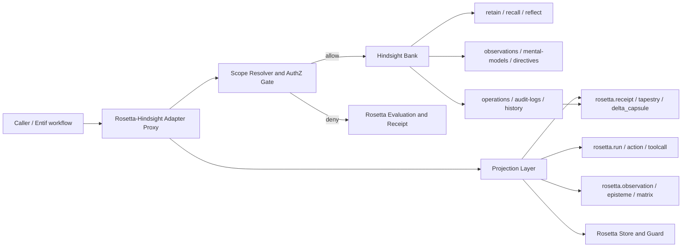
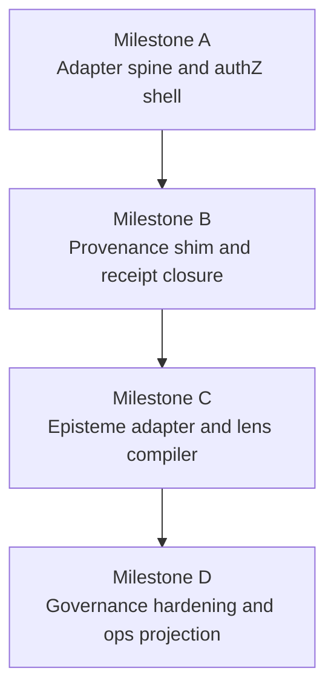

# Rosetta v0 on Hindsight

## Executive summary

Hindsight looks like a very strong **operational memory substrate** for Rosetta v0, but a weak **constitutional truth-and-provenance substrate** unless it is wrapped by Rosetta rather than treated as Rosetta. The fit is strongest where Rosetta wants: isolated memory domains, evolving observations, curated “lenses” in the form of mental models, directive-driven reasoning, entity extraction/classification, async operations, auditability, and history/time-series. The fit is weakest where Rosetta’s doctrine is strictest: deterministic canonicalization, stable CIDs, signed receipts, receipt-bundle closure, retrieval-boundary rights enforcement, and explicit run/action/toolcall/evaluation artifacts. In plain English: Hindsight already gives you a smart nervous system; Rosetta still needs to remain the skeleton, blood chemistry, and chain-of-custody law. citeturn6view0turn4search0turn1view1turn14view0turn10search0turn12search0 fileciteturn15file0L1-L1 fileciteturn17file0L1-L1 fileciteturn20file0L1-L1 fileciteturn21file0L1-L1 fileciteturn22file0L1-L1

The best v0 move is therefore **not replacement**. It is a **Rosetta–Hindsight adapter/proxy** that lets Hindsight own memory operations and reflective synthesis while Rosetta mints the canonical tiles, receipts, CIDs, signatures, and rights-scoped evidence packages around every meaningful Hindsight interaction. That posture matches Rosetta’s staging doctrine: parse-only by default, no meaningful transform without a receipt path, rights enforced at the retrieval boundary, and separation between truth/provenance, temporal history, and activation/recall planes. citeturn6view0turn1view0turn10search0 fileciteturn15file0L1-L1 fileciteturn13file0L1-L1

My bottom-line recommendation is to ship Rosetta v0 as **five tightly-coupled issues**: a Hindsight adapter/proxy, an episteme adapter, a provenance shim, a lens compiler, and governance middleware. A sixth issue for ops/audit projection is worth including if you want temporal plane visibility immediately. That sequence preserves Rosetta’s doctrine while exploiting the huge implementation head start Hindsight already provides. citeturn4search0turn1view1turn9search0turn10search0 fileciteturn15file0L1-L1 fileciteturn30file0L1-L1 fileciteturn31file0L1-L1 fileciteturn32file0L1-L1

## Evidence-aligned fit and gaps

Rosetta’s current repo already has the pieces that make a wrapper strategy viable. The repo describes itself as a receipts-first constitutional monorepo with canonical tiles, signed/verified RRP receipts, a rights-checked tile store, a minimal guard, source-substrate modeling, and an in-progress meaning pipeline. The current code and package READMEs show concrete support for `rosetta.run`, `rosetta.action`, `rosetta.toolcall`, `rosetta.observation`, `rosetta.evaluation`, `rosetta.receipt`, `rosetta.tapestry`, `rosetta.episteme`, `rosetta.matrix`, and `rosetta.delta_capsule`; receipt signing is already Ed25519-backed; the store already performs rights checks; and Guard is already deny-by-default for side effects in parse-only mode. fileciteturn17file0L1-L1 fileciteturn19file0L1-L1 fileciteturn20file0L1-L1 fileciteturn21file0L1-L1 fileciteturn22file0L1-L1 fileciteturn30file0L1-L1 fileciteturn31file0L1-L1 fileciteturn32file0L1-L1 fileciteturn33file0L1-L1

Hindsight, by contrast, already gives you the parts Rosetta would otherwise take a long time to rebuild from scratch. Banks are isolated containers that hold memories, documents, extracted entities/relationships, and directives. Retain can extract facts plus controlled `entity_labels`, optionally write labels as tags, and automatically trigger observation consolidation. Observations are synthesized knowledge built from raw facts and explicitly preserve contradictory-evidence evolution rather than flattening history. Mental models are saved reflect responses that can auto-refresh from observations, support `full` or `delta` refresh modes, expose history, and are checked before observations and raw facts during reflect. Reflect itself is an agentic loop with a retrieval hierarchy, directive enforcement, disposition controls, evidence citation, and optional trace output. Operations, audit logs, history endpoints, consolidation controls, and memory/time-series stats are already there. citeturn6view0turn4search0turn4search4turn1view1turn2view1turn3view0turn14view0turn13search1turn10search0turn12search0

That means Hindsight maps unusually well to Rosetta’s **plane 2 and plane 3 ambitions**: temporal state/history, evolving knowledge, activation-oriented retrieval, and contextual interpretation. It does **not** map cleanly to Rosetta’s **plane 1 law**: immutable receipted truth objects, deterministic content addressing, rights-scoped retrieval with no “retrieve then filter later,” and signed provenance closure. Hindsight directives are strict behavioral rules during reflect, but the docs describe them as prompt-injected rules, not a storage/query authorization system. Rosetta governance, on the other hand, explicitly requires authZ at the retrieval boundary and Guard-mediated control for side effects. So Hindsight directives are useful, but they are governance seasoning, not the lock on the door. citeturn5search0turn14view0turn10search0 fileciteturn15file0L1-L1 fileciteturn13file0L1-L1

A few practical gaps matter most:

| Area | What Hindsight already has | What Rosetta still needs |
|---|---|---|
| Memory isolation | Banks are isolated; memories in one bank are not visible to another. citeturn6view0 | Subject-aware bank resolution, scope contracts, cross-bank denial guarantees, and receipted bank-routing decisions. fileciteturn15file0L1-L1 |
| Knowledge synthesis | Raw facts → observations → mental models; contradiction-aware updates and freshness tracking. citeturn4search0turn1view1turn14view0 | Rosetta-native episteme/matrix projection, evaluation tiles, and explicit evidence closure. fileciteturn31file0L1-L1 fileciteturn32file0L1-L1 |
| Reflection/lenses | Reflect uses mental models, observations, raw facts, directives, and disposition. citeturn14view0turn13search1 | Compile Rosetta LensPacks from bank config + directives + mental models + tag policies, with replayable deltas and signatures. fileciteturn15file0L1-L1 |
| Provenance | Audit logs, operation histories, memory/observation histories, and source references exist. citeturn10search0turn12search0 | Deterministic CID minting, receipt signing, bundle/tapestry closure, and explicit provenance tiles. fileciteturn20file0L1-L1 fileciteturn33file0L1-L1 |
| Governance | Directives, tool allowlists, tags, bank config. citeturn6view0turn9search0 | Pre-call authZ middleware, retrieval-boundary enforcement, query-shaping, mutation admission control, and Guard tokens. fileciteturn15file0L1-L1 fileciteturn22file0L1-L1 |
| Packaging | Bank template import can create/update config, directives, and mental models asynchronously. citeturn9search0 | Rosetta-native, signed, content-addressed LensPacks and Delta Capsules. fileciteturn32file0L1-L1 |

The key strategic inference is simple: **Hindsight is already very close to Rosetta’s “learn, remember, interpret, adapt” surfaces, but not to Rosetta’s “prove, sign, scope, replay, verify” surfaces.** If that distinction stays explicit, the springboard move is genuinely strong. If that distinction blurs, you get clever memory with mushy constitutional guarantees. citeturn4search0turn14view0turn10search0 fileciteturn15file0L1-L1

## Primitive mapping

The table below compares the Rosetta primitives you named to the nearest Hindsight surfaces and the exact adapter work still required.

| Rosetta primitive | Rosetta meaning today | Nearest Hindsight surface | Fit | Exact gap to implement |
|---|---|---|---|---|
| `Run` | Top-level execution/unit-of-work tile. fileciteturn32file0L1-L1 | A bank-scoped operation sequence; async ops list/get. citeturn1view0turn10search0 | Partial | Mint `rosetta.run` for every adapter session/workflow; record bank, actor, scope contract, and requested objective. |
| `Action` | Intent-bearing step under a run. fileciteturn32file0L1-L1 | Retain / recall / reflect / consolidate / create mental model / update directive. citeturn6view0turn9search0turn12search0 | Strong | Define canonical Rosetta action taxonomy for Hindsight API verbs. |
| `ToolCall` | Concrete tool invocation artifact. fileciteturn32file0L1-L1 | Hindsight HTTP calls; reflect trace tool calls when enabled. citeturn13search1turn10search0 | Strong | Capture request/response snapshots and hash them; attach authZ decision token and scope proof. |
| `Observation` | Raw signal turned into a Rosetta observation tile. fileciteturn32file0L1-L1 | Hindsight memories and auto-consolidated observations. citeturn4search0turn12search0 | Strong | Distinguish Hindsight raw facts from Rosetta observation projections; preserve source spans and history references. |
| `Evaluation` | Verdict-bearing evaluation tile. fileciteturn32file0L1-L1 | Reflect answer + directive compliance + freshness handling. citeturn14view0turn13search1 | Partial | Mint explicit `rosetta.evaluation` for policy checks, stale-observation verification, contradiction reconciliation, and egress filtering. |
| `Receipt` | Signed provenance artifact with bundle verification. fileciteturn20file0L1-L1 | No direct equivalent; audit logs/ops/history are helpful but unsigned operational traces. citeturn10search0turn12search0 | Weak | Add provenance shim that canonicalizes Hindsight request/response JSON, mints CID, signs receipt, and stores bundle closure. |
| `Tapestry` | Bounded packaging of subject/evidence/policy closure. fileciteturn33file0L1-L1 | Mental models are the closest semantic analogue; reflect `based_on` is the closest evidence analogue. citeturn1view1turn13search1 | Partial | Compile Hindsight evidence sets into signed `rosetta.tapestry` artifacts with stable prefix, dynamic tail, and required scope. |
| `Delta Capsule` | Portable change bundle. fileciteturn32file0L1-L1 | Mental model history, observation history, audit logs, memory timeseries. citeturn3view0turn10search0turn12search0 | Partial | Materialize config/directive/model changes into signed `rosetta.delta_capsule` bundles for replay and migration. |
| `LensPack` | Contextual interpretive lens bundle | Bank config (`reflect_mission`, dispositions, observations mission), directives, mental models, tag policy, MCP allowlist. citeturn6view0turn1view1turn9search0 | Strong | No native compiled, signed, exportable Rosetta LensPack exists yet; build compiler and schema. |

The cleanest conceptual mapping is this: **Hindsight mental models are not Rosetta tapestries, but they are excellent source material for them; Hindsight observations are not Rosetta epistemes, but they are strong inputs to them; Hindsight audit/history are not Rosetta receipts, but they are exactly the raw metal a receipt shim should hammer into shape.** citeturn4search0turn1view1turn10search0turn12search0 fileciteturn31file0L1-L1 fileciteturn33file0L1-L1

## Architecture, security, and delivery

The minimal v0 architecture should keep Hindsight behind a Rosetta-owned boundary. The proxy resolves the caller’s tenant/subject/scope to a bank, validates rights before any query goes out, calls Hindsight, then projects the result into Rosetta tiles/receipts/tapestries. That matches Rosetta’s retrieval-boundary law and lets Hindsight remain the operational memory engine rather than the constitutional record. This is a proposed architecture, not a currently implemented one. It is inferred from Rosetta’s doctrine and current package capabilities plus Hindsight’s bank, reflect, directive, operations, and audit APIs. citeturn6view0turn14view0turn10search0 fileciteturn15file0L1-L1 fileciteturn20file0L1-L1 fileciteturn21file0L1-L1 fileciteturn22file0L1-L1



Security is the make-or-break part. Hindsight banks give isolation, tags give scope hints, directives give hard reasoning rules, and `mcp_enabled_tools` can constrain tool exposure, but Rosetta doctrine requires more than that. The middleware must enforce authority **before** `retain`, `recall`, `reflect`, `create_mental_model`, `refresh_mental_model`, `create_directive`, `update_bank_config`, or any other mutation/retrieval API call leaves the proxy. Inference: if you rely on directives alone, you are governing what the model says after retrieval, not what it was allowed to see in the first place. Rosetta explicitly forbids that posture for sensitive/scoped data. citeturn6view0turn9search0turn14view0 fileciteturn15file0L1-L1

The concrete enforcement points should be these:

| Enforcement point | What it must do | Hindsight surfaces touched | Why it cannot be deferred |
|---|---|---|---|
| Bank resolution gate | Resolve `tenant + subject + lens + rights` to an allowed `bank_id`; deny cross-bank access. | Banks, config. citeturn6view0 | Bank isolation is necessary but not sufficient; the proxy must stop bank-ID spoofing. |
| Retrieval boundary gate | Rewrite/validate `tags`, `fact_types`, excluded mental models, and scope policy **before** recall/reflect. | `POST /memories/recall`, `POST /reflect`, mental model visibility. citeturn13search0turn14view0turn3view0 | Prevents “retrieve broad, filter later,” which Rosetta doctrine forbids. fileciteturn15file0L1-L1 |
| Mutation admission gate | Validate who may retain, consolidate, alter directives, refresh mental models, or change bank config. | Retain, consolidate, directives CRUD, bank config, mental models CRUD. citeturn6view0turn9search0turn12search0 | Otherwise any adapter caller can silently reshape the bank’s disposition and rules. |
| Receipt/provenance gate | Canonicalize every request/response, mint CID, sign receipt, store bundle. | All Hindsight calls. | Without this, Rosetta loses its core receipts-first law. fileciteturn20file0L1-L1 |
| Egress evidence gate | Verify every returned cited memory/model/directive ID is in-scope and actually retrieved; then compile tapestry. | Reflect `based_on`, trace, recall results. citeturn13search1turn14view0 | Stops citation laundering across scopes. |
| Audit projection | Pull operations, audit logs, history, timeseries into Rosetta temporal memory/projection. | Operations, audit logs, memory history, timeseries. citeturn10search0turn12search0turn11search0 | Needed for replay, anomaly detection, and rights investigations. |

A practical four-step implementation timeline falls out naturally:



| Milestone | Scope | Exit criteria | Main risk | Mitigation |
|---|---|---|---|---|
| A | Proxy + bank resolution + retrieval/mutation gates + basic retain/recall/reflect passthrough | Every Hindsight call emits `run/action/toolcall`; cross-bank and out-of-scope calls fail closed | Cross-tenant bleed | Hard bank resolver; deny-by-default scopes; replay tests |
| B | Provenance shim + CID/signature minting + tapestry bundle closure | Every adapter response has a Rosetta receipt chain and signed digest of Hindsight I/O | Operational trace without constitutional proof | Canonicalize Hindsight JSON immediately at proxy boundary |
| C | Episteme adapter + lens compiler | Mental models/directives/config compile into LensPack; observations/reflect become episteme/matrix projections | Semantic drift between Hindsight summaries and Rosetta claims | Project, don’t promote raw Hindsight output without evaluation tile |
| D | Governance middleware hardening + ops/audit/history projection | Audit dashboards, delta capsules, anomaly detection, rollback/replay tests | Mistaking directives for authZ | Keep directives as soft governance layer under hard middleware |

That sequence is my recommendation because it mirrors Rosetta’s own staging logic: get the spine honest first, then widen usefulness. fileciteturn15file0L1-L1 fileciteturn13file0L1-L1

## Prioritized issue drafts

The repo’s current intake process treats Markdown files under `docs/intake/issue-drafts/` as the local staging queue before promotion to GitHub issues, and the existing drafts use sectioned Markdown rather than YAML frontmatter in the examples I reviewed. The files below follow that repo practice. fileciteturn24file0L1-L1 fileciteturn17file0L1-L1

### Priority view

| Priority | File | Purpose |
|---|---|---|
| P0 | `docs/intake/issue-drafts/ros-hs-001-hindsight-adapter-proxy.md` | Stand up the Rosetta-owned adapter/proxy boundary |
| P0 | `docs/intake/issue-drafts/ros-hs-002-governance-middleware.md` | Enforce authZ and Guard posture before every Hindsight call |
| P1 | `docs/intake/issue-drafts/ros-hs-003-provenance-shim.md` | Mint receipts/CIDs/signatures around Hindsight operations |
| P1 | `docs/intake/issue-drafts/ros-hs-004-episteme-adapter.md` | Project Hindsight observations/mental models/reflect into Rosetta episteme/evaluation surfaces |
| P1 | `docs/intake/issue-drafts/ros-hs-005-lens-compiler.md` | Compile LensPacks from Hindsight config + directives + mental models |
| P2 | `docs/intake/issue-drafts/ros-hs-006-ops-audit-history-projection.md` | Feed temporal/history plane from operations, audit logs, and history endpoints |

The drafts below are ready to paste.

### `docs/intake/issue-drafts/ros-hs-001-hindsight-adapter-proxy.md`

This issue is grounded in Hindsight’s banked memory APIs and Rosetta’s requirement that the truth/provenance spine remain explicit and rights-scoped. citeturn6view0turn13search0turn14view0 fileciteturn15file0L1-L1 fileciteturn17file0L1-L1

```md
# ROS-HS-001: Rosetta–Hindsight adapter/proxy for banked memory operations

## Summary
Introduce a Rosetta-owned adapter/proxy that fronts Hindsight for retain, recall, reflect, bank config, consolidation, and mental-model/directive management.

## Why This Matters
Hindsight is a strong operational memory engine, but Rosetta must remain the constitutional source of content-addressed, receipted, rights-scoped artifacts.
The adapter/proxy is the seam that makes that possible.

## Scope
- Add a `packages/hindsight-adapter` package in the TS/Nx spine.
- Expose typed proxy methods for:
  - retain
  - recall
  - reflect
  - get/update bank config
  - trigger consolidation
  - list/get operations
  - list/create/update/delete directives
  - list/create/get/update/refresh/delete mental models
- Emit Rosetta `run`, `action`, and `toolcall` tiles for every adapter invocation.
- Store raw Hindsight request/response payloads as source/provenance artifacts for later receipt minting.

## Hindsight API Touchpoints
- `POST /v1/default/banks/{bank_id}/memories`
  - Request:
    - `items: [{content, context?, document_id?, tags?, timestamp?, ...}]`
    - `async?: boolean`
  - Response:
    - sync: `{success, bank_id, items_count, async, usage?}`
    - async: `{success, bank_id, items_count, async, operation_id?, operation_ids?}`
- `POST /v1/default/banks/{bank_id}/memories/recall`
  - Request:
    - `query`
    - `types?`
    - `budget?`
    - `max_tokens?`
    - `include?`
    - `tags?`, `tags_match?`, or structured tag groups
  - Response:
    - `{results, trace?, entities?, chunks?, source_facts?}`
- `POST /v1/default/banks/{bank_id}/reflect`
  - Request:
    - `query`
    - `budget?`
    - `max_tokens?`
    - `fact_types?`
    - `exclude_mental_models?`
    - `exclude_mental_model_ids?`
    - `include?`
    - `response_schema?`
  - Response:
    - `{text, based_on?, structured_output?, usage?, trace?}`
- `GET /v1/default/banks/{bank_id}/config`
  - Response:
    - `{bank_id, config, overrides}`
- `PATCH /v1/default/banks/{bank_id}/config`
  - Request:
    - bank-level config updates map
  - Response:
    - resolved/updated config payload
- `POST /v1/default/banks/{bank_id}/consolidate`
  - Response:
    - `{operation_id, deduplicated}`

## Rosetta Projection Rules
- Mint `rosetta.run` at the start of every adapter workflow.
- Mint `rosetta.action` per high-level verb (`retain`, `recall`, `reflect`, `configure_bank`, etc.).
- Mint `rosetta.toolcall` for every concrete Hindsight HTTP invocation.
- Do not yet promote outputs to `rosetta.observation` / `rosetta.episteme` in this issue; that lands in follow-on issues.

## Receipt, CID, and Signature Plan
- Mint CIDs for request and response canonical JSON bodies immediately after each proxy call returns.
- Store those digests in provisional provenance payloads.
- Full signed receipts are blocked on ROS-HS-003.

## Acceptance Criteria
- Typed adapter methods exist for all API touchpoints above.
- Every adapter call emits `run`, `action`, and `toolcall` Rosetta tiles.
- Failed Hindsight calls still emit Rosetta artifacts with failure metadata.
- Bank config, directives, and mental models can all be reached through the proxy without bypassing it.
- Adapter tests cover:
  - sync retain
  - async retain
  - recall
  - reflect
  - consolidation trigger
  - directive CRUD
  - mental-model create + refresh
  - bank config read/write
  - API error passthrough

## Dependencies
- None

## Labels
- integration
- hindsight
- rosetta-core
- receipts-first
- priority:P0

## Effort
- L (4–6 days)

## Suggested Assignees
- Unspecified
```

### `docs/intake/issue-drafts/ros-hs-002-governance-middleware.md`

This issue exists because Hindsight directives are reflect-time hard rules, but Rosetta doctrine still requires retrieval-boundary rights enforcement and Guard-mediated control. citeturn5search0turn6view0turn14view0 fileciteturn15file0L1-L1 fileciteturn22file0L1-L1

```md
# ROS-HS-002: Governance middleware for rights-scoped Hindsight access

## Summary
Implement the Rosetta-side governance layer that enforces rights and Guard posture before any Hindsight memory, reflection, or configuration call is made.

## Why This Matters
Hindsight directives are necessary but insufficient for Rosetta.
They govern reflect behavior, not constitutional authZ.
Rosetta doctrine forbids retrieve-then-filter-later for scoped data.

## Scope
- Add a middleware layer in front of the Hindsight adapter.
- Resolve `tenant + subject + session + lens + requested operation` to an allowed `bank_id`.
- Enforce:
  - deny-by-default
  - bank isolation
  - tag scope restrictions
  - fact-type restrictions
  - tool allowlists
  - mutation admission control
- Emit Guard/evaluation artifacts for allow and deny decisions.

## Enforcement Points
- Pre-retain:
  - validate subject may write to bank
  - validate allowed tags and observation scopes
- Pre-recall / pre-reflect:
  - constrain `tags`, `tags_match`, `fact_types`, and excluded model lists
  - deny cross-bank reads
- Pre-config/directive/model mutation:
  - require elevated rights
  - deny unauthorized changes to `reflect_mission`, `observations_mission`, `mcp_enabled_tools`, directives, or mental models
- Post-response egress:
  - verify all cited evidence IDs are in-scope before returning payloads to caller

## Hindsight API Touchpoints
- `POST /v1/default/banks/{bank_id}/memories`
- `POST /v1/default/banks/{bank_id}/memories/recall`
- `POST /v1/default/banks/{bank_id}/reflect`
- `GET /v1/default/banks/{bank_id}/config`
- `PATCH /v1/default/banks/{bank_id}/config`
- `GET/POST/PATCH/DELETE /v1/default/banks/{bank_id}/directives{/{directive_id}}`
- `GET/POST/PATCH/DELETE /v1/default/banks/{bank_id}/mental-models{/{mental_model_id}}`
- `POST /v1/default/banks/{bank_id}/mental-models/{mental_model_id}/refresh`

## Expected Request/Response Shapes Used by Middleware
- Directive create/update payloads:
  - `{name, content, priority?, is_active?, tags?}`
- Mental model create/update payloads:
  - `{id?, name, source_query, tags?, max_tokens?, trigger?}`
- Bank config updates:
  - partial updates map containing only allowed override fields
- Reflect response egress check:
  - `based_on.memories[]`
  - `based_on.mental_models[]`
  - `based_on.directives[]`

## Rosetta Receipt, CID, and Signature Plan
- Mint `rosetta.evaluation` for every policy decision.
- Mint `guard.decision_token` or equivalent policy artifact for every allowed side-effecting mutation.
- Hash the normalized policy input (subject, requested bank, operation, scope, config diff).
- Sign deny/allow decisions in the follow-on provenance shim or in-line if ROS-HS-003 lands first.

## Acceptance Criteria
- Unauthorized cross-bank access is denied before any Hindsight call executes.
- Unauthorized reads with broadened tags/fact_types are denied or narrowed before execution.
- Unauthorized directive, mental-model, and bank-config mutations are denied.
- Allowed calls carry a machine-checkable policy decision artifact.
- Egress validation rejects or redacts out-of-scope cited evidence.
- Test matrix covers:
  - cross-tenant bank spoofing
  - unauthorized directive creation
  - unauthorized config mutation
  - out-of-scope reflect request
  - out-of-scope evidence egress
  - allowed in-scope success path

## Dependencies
- ROS-HS-001

## Labels
- governance
- security
- authz
- guard
- hindsight
- priority:P0

## Effort
- L (5–7 days)

## Suggested Assignees
- Unspecified
```

### `docs/intake/issue-drafts/ros-hs-003-provenance-shim.md`

This issue is the constitutional heart of the integration: Hindsight supplies logs and histories, but Rosetta must supply canonicalization, signing, and closure. citeturn10search0turn12search0 fileciteturn20file0L1-L1 fileciteturn15file0L1-L1

```md
# ROS-HS-003: Provenance shim for receipts, CIDs, signatures, and bundle closure

## Summary
Wrap Hindsight operations in Rosetta-native provenance so every meaningful interaction produces a deterministic, signed receipt path.

## Why This Matters
Hindsight provides operations, audit logs, and history.
Rosetta requires canonicalization, stable CIDs, signed receipts, and bundle closure.
This issue bridges that gap.

## Scope
- Canonicalize all Hindsight request/response JSON using the Rosetta canonicalization stack.
- Mint content IDs for:
  - request payload
  - response payload
  - authZ decision payload
  - operation snapshots
  - audit-log snapshots
- Sign receipt artifacts using the existing Rosetta receipt/signing stack.
- Bundle related receipts into tapestry-ready closure.

## Hindsight API Touchpoints
- `GET /v1/default/banks/{bank_id}/operations`
  - Response:
    - `{bank_id, total, limit, offset, operations:[{id, status, task_type, created_at, ...}]}`
- `GET /v1/default/banks/{bank_id}/operations/{operation_id}?include_payload=true`
  - Response:
    - `{operation_id, status, operation_type, created_at, updated_at, completed_at?, error_message?, result_metadata?, child_operations?, task_payload?}`
- `DELETE /v1/default/banks/{bank_id}/operations/{operation_id}`
  - Response:
    - `{success, message, operation_id}`
- `POST /v1/default/banks/{bank_id}/operations/{operation_id}/retry`
  - Response:
    - `{success, message, operation_id}`
- `GET /v1/default/banks/{bank_id}/audit-logs`
  - Response:
    - `{bank_id, total, limit, offset, items:[{id, action, transport, bank_id, started_at, ended_at, duration_ms, request, response, metadata}]}`
- `GET /v1/default/banks/{bank_id}/memories/{memory_id}/history`
  - Response:
    - observation/memory history payload (pass-through JSON for now)
- `GET /v1/default/banks/{bank_id}/mental-models/{mental_model_id}?detail=full`
  - Response includes:
    - `reflect_response`
    - `is_stale`
    - content/config metadata

## Rosetta Projection Rules
- Mint `source.fetch_receipt` for Hindsight request/response acquisition snapshots.
- Mint `source.evaluation_receipt` for authZ and integrity judgments.
- Mint `rosetta.receipt` for every successful or failed adapter action.
- Mint `rosetta.tapestry` when a caller requests a compiled evidence package.
- Mint `rosetta.delta_capsule` for directive changes, mental-model refreshes, and bank-config changes.

## Receipt, CID, and Signature Storage
- Store canonical request/response bodies in Rosetta provenance payloads.
- Store signed receipts in the Rosetta store keyed by CID.
- Include:
  - Hindsight `bank_id`
  - endpoint path
  - method
  - request CID
  - response CID
  - operation ID (if async)
  - audit-log ID (if available)
  - policy decision CID
  - parent receipt IDs
- Sign with the existing Ed25519 receipt stack.

## Acceptance Criteria
- Every adapter call produces a deterministic request CID and response CID.
- Every meaningful adapter call produces a signed Rosetta receipt.
- Async operations can be reattached to their originating request via operation ID chaining.
- Audit-log and operation snapshots can be bundled into a tapestry closure for a returned answer or mutation.
- Delta capsules are emitted for:
  - directive create/update/delete
  - mental-model create/refresh/update/delete
  - bank config update
- Verification tests prove:
  - same payload => same CID
  - tampered payload => signature/bundle verification fails
  - async operation retry/cancel preserves lineage

## Dependencies
- ROS-HS-001
- ROS-HS-002

## Labels
- provenance
- receipts
- cid
- signatures
- hindsight
- priority:P1

## Effort
- L (5–7 days)

## Suggested Assignees
- Unspecified
```

### `docs/intake/issue-drafts/ros-hs-004-episteme-adapter.md`

This issue leverages Rosetta’s emerging episteme/matrix layer and Hindsight’s facts/observations/mental-models/reflect hierarchy. citeturn4search0turn1view1turn14view0turn13search1 fileciteturn30file0L1-L1 fileciteturn31file0L1-L1 fileciteturn32file0L1-L1

```md
# ROS-HS-004: Episteme adapter from Hindsight observations, mental models, and reflect

## Summary
Project Hindsight’s raw facts, observations, mental models, and reflect outputs into Rosetta `observation`, `episteme`, `matrix`, and `evaluation` artifacts.

## Why This Matters
Without this layer, Hindsight remains operational memory only.
With it, Rosetta can interpret Hindsight state through its own epistemic grammar.

## Scope
- Project retained Hindsight facts into Rosetta observation candidates.
- Project Hindsight observations into Rosetta evidence-bearing observations with freshness metadata.
- Project mental models into bounded interpretation artifacts.
- Project reflect responses into:
  - `rosetta.episteme`
  - `rosetta.matrix`
  - `rosetta.evaluation`
- Preserve contradiction and history context where Hindsight exposes it.

## Hindsight API Touchpoints
- `POST /v1/default/banks/{bank_id}/memories/recall`
  - use `types: ["observation"]` and mixed retrieval when needed
- `POST /v1/default/banks/{bank_id}/reflect`
  - use `include.facts`
  - optionally `include.tool_calls`
  - optionally `response_schema`
  - response fields used:
    - `text`
    - `based_on.memories[]`
    - `based_on.mental_models[]`
    - `based_on.directives[]`
    - `usage`
    - `trace?`
- `GET /v1/default/banks/{bank_id}/mental-models?detail=content|full`
  - response fields used:
    - `id`
    - `name`
    - `source_query`
    - `content`
    - `last_refreshed_at`
    - `reflect_response?`
    - `is_stale?`
- `GET /v1/default/banks/{bank_id}/memories/{memory_id}/history`
  - use to populate contradiction/evolution context for projected observation or episteme states
- `DELETE /v1/default/banks/{bank_id}/memories/{memory_id}/observations`
  - optional operational hook for re-synthesis tests

## Projection Rules
- Hindsight memory unit => Rosetta `rosetta.observation` shadow artifact
- Hindsight observation => Rosetta `rosetta.observation` with:
  - freshness metadata
  - source memory IDs
  - contradiction/evolution note if history indicates correction
- Hindsight mental model => candidate `LensPack` component and/or `rosetta.tapestry` ingredient
- Hindsight reflect response => `rosetta.episteme` claim + `rosetta.matrix` confidence axes + `rosetta.evaluation` verdict

## Receipt, CID, and Signature Plan
- Mint receipt on every projection.
- Store Hindsight object IDs and timestamps as external references inside the payload.
- Parent projected artifacts to the request/response receipts from ROS-HS-003.
- Sign only the Rosetta-projected form, not the upstream mutable Hindsight object directly.

## Acceptance Criteria
- Adapter can create Rosetta episteme artifacts from reflect responses with `based_on` evidence mapped.
- Freshness and stale-state are represented explicitly when Hindsight marks models stale or observations need re-checking.
- Contradictory/corrective history can be represented in projected artifacts without overwriting prior lineage.
- Matrix/evaluation payloads are deterministic for a fixed input projection.
- Tests cover:
  - raw-fact projection
  - observation projection
  - mental-model projection
  - reflect-to-episteme projection
  - corrective history case
  - stale mental-model case

## Dependencies
- ROS-HS-001
- ROS-HS-003

## Labels
- semantics
- episteme
- observations
- reflect
- hindsight
- priority:P1

## Effort
- M/L (4–6 days)

## Suggested Assignees
- Unspecified
```

### `docs/intake/issue-drafts/ros-hs-005-lens-compiler.md`

This issue treats Hindsight’s bank config, directives, and mental models as the raw ingredients for a Rosetta LensPack. citeturn6view0turn1view1turn9search0turn14view0 fileciteturn15file0L1-L1

```md
# ROS-HS-005: Lens compiler from bank config, directives, and mental models

## Summary
Compile a Rosetta LensPack from Hindsight bank configuration, directives, mental models, and scoped tag policies.

## Why This Matters
The closest native Hindsight equivalents to Rosetta contextual lenses already exist:
- `reflect_mission`
- disposition traits
- `observations_mission`
- directives
- mental models
- memory/tag scoping
What is missing is a Rosetta-native compiler, content-addressed packaging, and replayable change model.

## Scope
- Define a LensPack schema in Rosetta terms.
- Compile LensPack inputs from:
  - bank config
  - active directives
  - selected mental models
  - tag scope rules
  - optional MCP enabled-tools constraints
- Support deterministic rebuild of the same LensPack from the same Hindsight state.
- Support LensPack publication as a Rosetta `tapestry` and `delta_capsule` lineage.

## Hindsight API Touchpoints
- `GET /v1/default/banks/{bank_id}/config`
  - consume:
    - `reflect_mission`
    - disposition traits
    - `observations_mission`
    - `retain_mission`
    - `mcp_enabled_tools`
    - retrieval budget settings as needed
- `GET /v1/default/banks/{bank_id}/directives`
  - consume active directives and priority ordering
- `GET /v1/default/banks/{bank_id}/mental-models?detail=content|full`
  - consume name, source query, content, trigger, freshness
- `POST /v1/default/banks/{bank_id}/mental-models`
  - optional: create compiled mental models when a LensPack build declares missing models
- `PATCH /v1/default/banks/{bank_id}/mental-models/{mental_model_id}`
- `POST /v1/default/banks/{bank_id}/mental-models/{mental_model_id}/refresh`
- `POST /v1/default/banks/{bank_id}/import`
  - optional bootstrap/import path for applying a LensPack-derived bank template

## LensPack Output Shape
Suggested fields:
- `lens_pack_id`
- `bank_id`
- `mission`
- `disposition`
- `observations_mission`
- `directive_refs`
- `mental_model_refs`
- `scope_policy`
- `tool_policy`
- `compiled_at`
- `source_receipt_ids`
- `version`

## Receipt, CID, and Signature Plan
- Mint a CID over the compiled LensPack JSON.
- Mint a signed receipt for each compilation.
- Store the compiled LensPack as:
  - a Rosetta canonical artifact
  - a `rosetta.tapestry` for retrieval/use
  - a `rosetta.delta_capsule` when it supersedes a prior lens version

## Acceptance Criteria
- Same bank state compiles to the same LensPack CID.
- Directive priority and active/inactive state are preserved.
- Mental model freshness and trigger mode are preserved in the compiled representation.
- LensPack diffing produces a deterministic delta capsule.
- Optional import/export bootstrap path is validated via dry-run or equivalent.
- Tests cover:
  - initial compile
  - recompile without changes
  - directive change
  - mental-model refresh change
  - bank mission/disposition change
  - scope-policy change

## Dependencies
- ROS-HS-001
- ROS-HS-003

## Labels
- lenses
- mental-models
- directives
- tapestry
- delta-capsule
- hindsight
- priority:P1

## Effort
- M (3–5 days)

## Suggested Assignees
- Unspecified
```

### `docs/intake/issue-drafts/ros-hs-006-ops-audit-history-projection.md`

This issue is optional for the first usable cut, but it is the fastest path to a meaningful temporal memory plane and operational introspection. citeturn10search0turn12search0turn11search0 fileciteturn13file0L1-L1

```md
# ROS-HS-006: Project Hindsight operations, audit logs, and history into Rosetta temporal memory

## Summary
Project Hindsight async operations, audit logs, memory/observation histories, and memory-ingestion timeseries into Rosetta temporal/state artifacts.

## Why This Matters
Rosetta doctrine separates truth/provenance from temporal history.
Hindsight already exposes the raw operational data needed for that plane.

## Scope
- Poll or consume Hindsight operational endpoints through the proxy.
- Convert operational events into Rosetta temporal projection artifacts.
- Maintain lineage back to originating run/action/toolcall/receipt objects.
- Expose operational replay and anomaly-detection hooks.

## Hindsight API Touchpoints
- `GET /v1/default/banks/{bank_id}/operations`
- `GET /v1/default/banks/{bank_id}/operations/{operation_id}?include_payload=true`
- `GET /v1/default/banks/{bank_id}/audit-logs`
- `GET /v1/default/banks/{bank_id}/audit-logs/stats`
- `GET /v1/default/banks/{bank_id}/memories/{memory_id}/history`
- `GET /v1/default/banks/{bank_id}/stats/memories-timeseries`

## Projection Targets
- `rosetta.delta_capsule` for change bundles
- `rosetta.observation` or dedicated temporal tiles for operational facts
- `rosetta.evaluation` for detected anomalies or failed operations
- tapestry bundles for audit investigations

## Receipt, CID, and Signature Plan
- Hash and sign operation snapshots and audit-log pages at projection time.
- Link snapshots to the originating adapter request receipts.
- Treat mutable stats/timeseries as derived projections, not constitutional truth claims.

## Acceptance Criteria
- Operations can be projected with lineage to the request that spawned them.
- Audit logs can be queried and bundled into a Rosetta evidence package.
- Memory history and mental-model refresh chains can be replayed in timestamp order.
- Failed operations produce evaluable Rosetta incident/evaluation artifacts.
- Tests cover:
  - async retain completion chain
  - failed operation chain
  - retry chain
  - audit-log projection
  - memory history projection
  - timeseries snapshot projection

## Dependencies
- ROS-HS-001
- ROS-HS-003

## Labels
- operations
- audit
- temporal-memory
- history
- hindsight
- priority:P2

## Effort
- M (3–5 days)

## Suggested Assignees
- Unspecified
```

## Open questions and limitations

The strongest limitation in this pass is evidentiary, not conceptual. I aligned directly against raw governance docs and current package/code surfaces in the repo, but the PRD/RFC layer available through the connector was most accessible via the repo’s docs-intelligence extractions, which explicitly point back to source `docs/PRDs/...` and `docs/RFCs/...` files rather than exposing all raw source bodies inline in this environment. I treated the extractions as planning evidence and the raw governance docs/current code as primary implementation constraints, which is consistent with the repo’s own intake workflow, but it still means some PRD/RFC-derived phrasing here is one layer removed from the original documents. fileciteturn25file0L1-L1 fileciteturn24file0L1-L1 fileciteturn11file0L1-L1 fileciteturn12file0L1-L1 fileciteturn13file0L1-L1

There are also a few Hindsight schema areas where the public docs expose endpoint paths and top-level shapes but not fully stable nested contracts. In particular, `reflect_response`, `task_payload`, history payload details, and audit-log `metadata` are only partly specified in the snippets I could verify here. I would therefore treat those nested objects as pass-through JSON in v0 and lock the stricter Rosetta-side schema only after a small fixture corpus has been recorded from a running Hindsight instance. citeturn13search0turn10search0turn12search0

The final design choice is philosophical more than technical: whether Rosetta should treat Hindsight outputs as merely **operational evidence** or occasionally as **promotable semantic artifacts**. My recommendation for v0 is conservative: project everything, promote selectively, and never let upstream convenience outrun receipt law. citeturn14view0turn4search0 fileciteturn15file0L1-L1