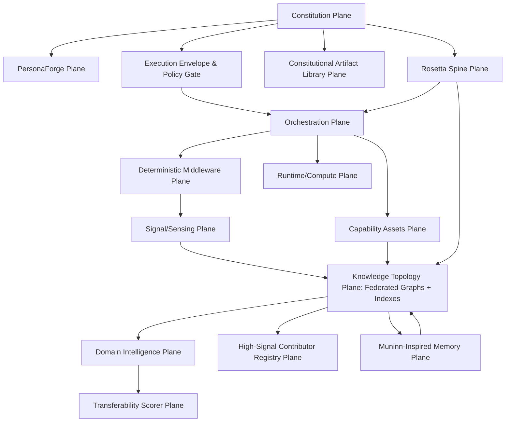
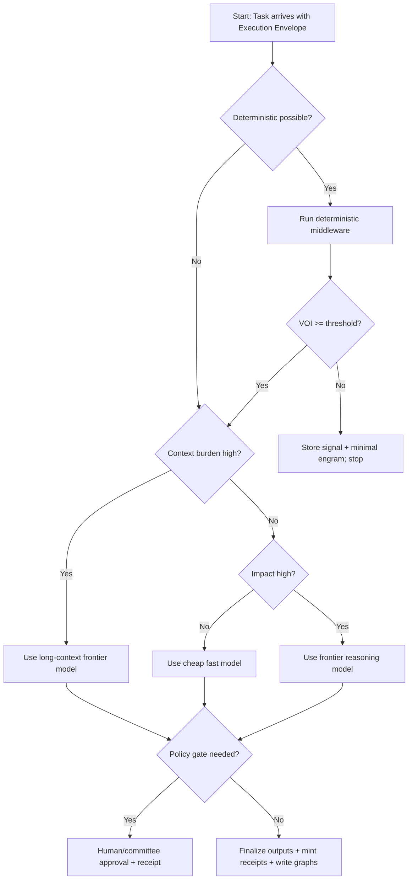
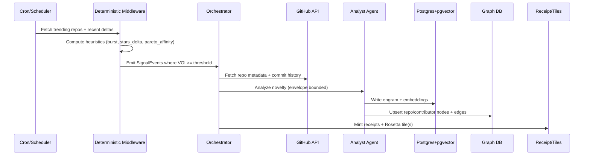

# Entif v0 Specification Deep Research Synthesis

## Executive Summary

Entif v0 is best framed as a **governed, receipts-first agentic operating substrate** whose core differentiator is not “more clever prompting,” but a **repeatable, audit-defensible pipeline** that turns signals (web, repos, docs, internal artifacts) into **canonical knowledge objects** (Rosetta cognitive tiles), routed through a **federated knowledge topology** (multiple graphs and indexes), executed via **deterministic middleware + policy-gated orchestration**, and iteratively improved via **measured scoring loops** (workflow/capability/transferability/persona). This stance directly matches your recurring themes: avoiding one-off execution, prioritizing replayability, scoring everything, and treating “more signal” as fuel rather than overload—because deterministic triage and learnable routing keep the system computationally bounded.

Three architectural commitments make the spec internally consistent at enterprise depth:

First, **Rosetta as the spine**: every material transformation produces a **canonicalized artifact** with strong content-addressing and receipts. Canonicalization must be deterministic to keep hashing/signing stable; RFC 8785 (JSON Canonicalization Scheme) is the right standard primitive for this. citeturn0search2turn0search3

Second, **federated knowledge, not monolith graphs**: your transcript’s insight (“don’t put everything into one graph”) becomes a design invariant—Entif routes queries and writes across **domain-scoped graphs**, with the orchestration layer choosing the minimal topology needed for the question, thereby reducing blast radius, contention, and schema sprawl (and enabling differential ACLs and retention). This also pairs cleanly with the “high-signal contributor registry” concept: a dedicated contributor graph can evolve independently while still participating in cross-graph joins via stable IDs and receipts.

Third, **personification as a governed performance lever**: the system should allow rich, evolving personas, but only inside a **persona contract** that specifies novelty budgets, drift metrics, dissent posture, and constitutional scope. This turns “personification” from vibes into a tunable control surface. The literature supports at least two adjacent claims: (a) role/role-play prompting can measurably improve response quality on domain tasks citeturn3search7turn3search10, and (b) diversity mechanisms (multi-agent debate, heterogeneous roles) can improve factual/reasoning outcomes under certain conditions citeturn3search2turn3search1. At the same time, creativity assistance can increase individual novelty but reduce collective diversity, implying the need for explicit anti-convergence governance in PersonaForge and councils. citeturn4search3

Implementation-wise, v0 should land a thin vertical slice: **GitHub trend ingestion → deterministic triage → contributor/Repo graph updates → Rosetta tile minting → retrieval API**. This slice proves: envelopes, receipts, routing, state manifests, TTL/decay, and workflow scoring. You can power it with a pragmatic stack: Postgres + pgvector citeturn5search2turn5search3, a primary graph DB (Neo4j or Neptune) citeturn5search1turn5search0, a durable workflow engine (Temporal or Argo) citeturn6search7turn6search4, and a message bus with replay/DLQ semantics (NATS JetStream + Kafka DLQ patterns where needed). citeturn10search0turn10search4

## Doctrine and Design Stance

Entif v0 doctrine is a set of non-negotiable invariants that the rest of the spec derives from.

**Receipts-first, canonical-by-default.** Every meaningful transformation (ingest → normalize → extract → embed → score → tile mint → graph write → decision) must emit a receipt that binds: inputs, tool/model identity, policy context, and outputs. Canonicalization must be deterministic so two agents independently producing the same semantic object converge to the same CID. RFC 8785’s rationale is explicitly “cryptographic operations like hashing and signing need the data to be expressed in an invariant format” and defines canonical JSON with deterministic property ordering. citeturn0search2

**Federate storage by domain + by epistemic tier.** Your voice transcript’s “not one graph DB” becomes doctrine: create separate knowledge topologies per domain and confidence tier (e.g., GitHub graph, Research graph, Product graph, Org/Policy graph) and use orchestration to route reads/writes to the smallest relevant graph(s). This reduces schema coupling and makes ACLs, retention, and quality scoring sharper.

**Determinism as the first gate; cognition as the second.** Expensive model cognition should only happen after deterministic middleware identifies “high VOI” (value-of-information) candidates. This mirrors the “Pareto contributor” watcher idea: deterministic heuristics catch commit explosions and network signals, then agentic deep analysis is invoked selectively.

**Personas are assets, not cosplay.** Allow rich personification (for novelty and dissent), but only under a **persona contract** that makes identity evolution measurable and bounded. Empirically adjacent mechanisms show: role-playing prompts can improve task answers (accuracy/comprehensiveness/acceptability in evaluated medical FAQ scenarios). citeturn3search7 Multi-agent debate can improve reasoning and factuality through iterative critique/consensus. citeturn3search2turn3search1 However, “AI help can increase creativity but make outputs more similar,” which mandates anti-convergence rules and dissent quotas as first-class governance artifacts. citeturn4search3

**Workflows over one-offs; scoring over bikeshedding.** Every non-trivial action must be either a workflow (multi-step, replayable) or a skill (repeatable primitive), each scored at completion with postmortem artifacts, but with strict limits to prevent endless refactors.

## Expanded-Plane Architecture

This section defines Entif v0 as an expanded-plane system. The “planes” are conceptual control surfaces; implementation modules may bundle multiple planes early on.

### Plane map and dependency graph

The dependency order below is intentionally “downward”: Constitutions constrain personas and execution; receipts bind everything; knowledge topology is fed by sensing and workflows.



### Constitution Plane

The Constitution plane is the system’s root of admissible action: **who can do what, under which constraints, with which evidence requirements**. Use an explicit artifact library (below) and **scope bindings** so the same constitutional principles can be applied differently for: personal single-tenant agents vs multi-tenant enterprise orchestration (your transcript’s mention of different stances is correct).

Key design pattern: constitutional policy is evaluated **before** tool execution, not after. This mirrors the “separation of reasoning from authority” pattern you’ve been emphasizing and aligns with the way modern agent APIs increasingly emphasize tool gating and structured refusal handling. OpenAI’s Structured Outputs explicitly supports “explicit refusals” as programmatically detectable, which is part of enforceable governance. citeturn11search5

### Signal/Sensing Plane

Signal ingestion is a collection of repeatable “feeds” (cron and event-driven). Your transcript describes two core feeds: (1) “top repos/projects” trending daily and (2) “small outlier research” discovered indirectly through paper → repo → contributor. Entif v0 formalizes this into two sensing classes:

**Bulk trend sensors**: low-cost daily/interval pulls (GitHub trending, package registry deltas, arXiv categories, security advisories). These emit normalized “SignalEvents.”

**Outlier path sensors**: event-driven follow chains from a discovered seed (paper, repo) to its neighborhood (contributors, org, dependency graph). This aligns with the “first starrer” discovery pattern you described.

### Knowledge Topology Plane: Federated graphs

Knowledge is stored in multiple topologies:

**Property graph for relationships and traversal** (contributors ↔ repos ↔ concepts ↔ decisions). Neo4j’s property graph model (nodes + relationships + labels + properties) is a canonical fit for agent knowledge graphs because it maps naturally to entity/relationship reasoning. citeturn5search1

**Managed alternative for enterprise deployments**: Amazon Neptune supports property graph via Gremlin/openCypher plus RDF/SPARQL, and offers managed HA and scaling characteristics. citeturn5search0

**Vector + hybrid index for similarity retrieval**: start with pgvector so vectors live with relational metadata (ACID, joins, PITR), and optionally graduate to a dedicated vector DB where needed (Qdrant/Weaviate/Milvus/Pinecone). pgvector’s core value prop is “store your vectors with the rest of your data,” supporting both exact and approximate NN search plus multiple distance metrics. citeturn5search2turn5search3

**Federation rule**: a “graph router” decides which topology receives a write/read, based on: domain, confidence tier, TTL, privacy class, and query pattern.

### Orchestration Plane

Orchestration is where your tiered org chart meets runtime reality: it maps “who decides” to “which workflow executes.” The orchestration plane owns:

**Workflow manifests**: immutable payload manifests that evolve by versioned handoff (you explicitly want “payload manifest immutable but evolves; new step-versioned payload on handoff”).  

**Replayability + DLQ**: message bus and workflow engine must support replay and dead-letter semantics.

Pragmatic engines:

Temporal provides “durable execution” where workflow state can be recovered/replayed and activities have built-in retries/timeouts; it is explicitly positioned as replacing brittle state machines with persisted workflow state. citeturn6search7

Argo Workflows is Kubernetes-native and supports DAG/step-based workflows as containers, useful when you want infrastructure-near batch style runs. citeturn6search4

### Domain Intelligence Plane

Domain Intelligence is where “analysis algorithms” live: repo novelty analysis, architectural pattern mining, security reviews, etc. It consumes canonical knowledge objects and emits new ones. It must be strictly downstream of the deterministic gate.

### Capability Assets Plane

Skills/tools are treated as versioned assets with contracts. OpenAI’s Structured Outputs and JSON schema features are important here because they make tool I/O type-safe and reduce glue-code fragility (schema adherence, explicit refusal detection). citeturn11search5turn11search11

### Runtime/Compute Plane

Runtime is multi-provider by design: local inference for cheap classifiers and embeddings; frontier models for deep reasoning; and sandboxed execution for code/tools.

vLLM is a practical open-source serving layer for local/open models and emphasizes throughput and KV-cache efficiency via PagedAttention. citeturn12search6

### PersonaForge/Tulpamancy Plane

PersonaForge is not “prompt decoration.” It is an operational subsystem that:

Creates persona contracts, allocates novelty budgets, tracks drift, and runs council processes to introduce structured dissent. Multi-agent debate frameworks show measurable benefits in reasoning/factuality under certain task conditions, especially with agent diversity. citeturn3search2turn3search1

### Deterministic Middleware Plane

This plane implements the “watcher + heuristic triage” concept from your transcript. Its characteristics:

It runs without LLM calls unless escalation is triggered.  

It computes features like “repo commit explosion,” “new collaborator graph,” “license compatibility,” “dependency risk,” and emits “EscalationCandidates.”

### High-Signal Contributor Registry Plane

A dedicated federated dataset representing “Pareto users.” It is a first-class registry with:

Contributor entity, trust score, novelty score trajectory, watch config, network neighborhood, and “co-signals” (who else they collaborate with).

### Transferability Scorer Plane

This is the heart of your “metacognitive transferable ideas” doctrine. It operationalizes transferability as a scored artifact, not a vibe.

### Constitutional Artifact Library Plane

A versioned library of constitutional packs that can be applied by scope (home/personal vs enterprise/multi-tenant). The PROV family is a useful foundational reference for provenance representation primitives (Entity/Activity/Agent), and PROV-O is a W3C Recommendation for expressing provenance in OWL/RDF. citeturn1search0

### Muninn-inspired Memory Plane

MuninnDB’s “cognitive primitives” map cleanly to Entif: you want memory as a **structured, neuro-inspired substrate** with explicit mechanisms for salience, decay, and cue-driven activation. The ACT-R literature provides a ready mathematical basis for scoring recency/frequency (“base-level activation”). A standard ACT-R base-level activation expresses a log of summed decayed traces. citeturn2search0turn2search3 This gives Entif v0 an implementable “activation score” for engrams and concepts, supporting pruning/decay and retrieval ordering.

Hebbian association is the conceptual basis for strengthening co-occurrence edges (“fire together wire together”), supporting reinforcement of concept links or contributor-pattern links. citeturn2search4

### Rosetta Spine Plane

Rosetta is the canonical semantic spine: a universal meaning encoding and receipts-first provenance layer. Entif v0 treats Rosetta as the authoritative data model for minted cognitive tiles and receipts, while graphs/indexes are materialized views optimized for different retrieval patterns.

## Canonical Schemas and Interfaces

This section gives explicit, implementation-grade schemas (JSON/YAML) and contracts. These are written as “v0” canonical forms; future versions may extend them but should preserve backward compatibility via versioning and strict canonicalization rules.

### Execution envelope

The execution envelope is the top-level admissibility container: every workflow step, skill invocation, or analysis run must occur inside an envelope.

```yaml
# entif.execution_envelope.v0.yaml
envelope_version: "entif.v0"
envelope_id: "env_01JABC..."
created_at: "2026-03-24T19:12:00Z"

actor:
  agent_id: "agent:emilie"
  persona_id: "persona:emilie.v0"
  clearance: "L4"            # L0..L5
  org_scope: "entif"         # venture/project scope

constitution:
  pack_id: "constit:opengates.v0"
  scope: "multi_tenant_enterprise"
  policy_snapshot_cid: "cid_sha256_..."

request:
  intent: "research_ingest"
  task_class: "ingest.github.repo"
  voI_estimate: 0.72         # 0..1
  required_outputs:
    - kind: "rosetta_tile"
      schema: "rosetta.tile.v3"
    - kind: "graph_write"
      target: "graph:contrib"

constraints:
  time_budget_ms: 600000
  token_budget:
    max_input_tokens: 120000
    max_output_tokens: 12000
  cost_budget_usd: 1.50
  pii_policy: "no_pii_write"
  licensing_policy: "non_viral_only"   # example

tools_allowed:
  - "http.fetch"
  - "github.api"
  - "graph.write"
  - "vector.embed"
  - "receipt.mint"

gates:
  human_in_loop:
    required: false
    reasons: []
  approvals_required:
    - gate: "legal_review"
      when: "license=unknown OR data_class=restricted"
    - gate: "exec_write"
      when: "action=deploy OR action=modify_prod"

trace:
  parent_envelope_id: null
  workflow_id: "wf_github_ingest_v0"
  step_id: "step_04"
  replay_of: null
```

Design rationale: this envelope makes governance machine-checkable and binds every action to policy + cost budgets. Structured Outputs (schema adherence + explicit refusal signaling) is strongly recommended for generating any envelope-adjacent JSON from models. citeturn11search5

### Persona contract

The persona contract formalizes your “personification” stance as measurable fields.

```yaml
# entif.persona_contract.v0.yaml
persona_id: "persona:frink.v0"
agent_id: "agent:frink"
created_at: "2026-03-24T00:00:00Z"
version: 0

identity_kernel:
  name: "Frink"
  role: "AI Research Lead"
  invariants:
    - "Evidence over elegance."
    - "Prefer primary sources; cite aggressively."
    - "Escalate uncertainty instead of guessing."

cognitive_coordinates:
  # normalized 0..1; used for routing and council composition
  risk_aversion: 0.65
  novelty_seeking: 0.80
  precision_bias: 0.75
  abstraction_bias: 0.70
  disagreement_tolerance: 0.85
  empathy_style: 0.30

novelty_budget:
  daily_token_share: 0.08          # fraction of token budget reserved for exploration
  exploration_domains:
    - "arxiv"
    - "agent_orchestration"
    - "memory_systems"
  hard_limits:
    max_usd_per_day: 2.00
    max_tools_calls_per_day: 250

curiosity_allocation:
  # how “free cycles” are spent
  scan_feeds_weight: 0.40
  deep_read_weight: 0.35
  prototype_weight: 0.25

dissent_posture:
  default_mode: "constructive_adversary"
  dissent_quota:
    min_counterarguments: 2
    require_minority_report_when_consensus_fast: true
  anti_convergence_rules:
    - "If two agents converge in <2 rounds, force a counterfactual pass."

expression_profile:
  verbosity: "high"
  tone: "technical"
  offensiveness_filter: "strict"
  formatting:
    prefer: ["schemas","tables","mermaid"]
    avoid: ["handwavy metaphors"]

drift_metrics:
  identity_embedding_cid: "cid_sha256_..."
  drift_thresholds:
    max_weekly_identity_drift: 0.15
    max_weekly_method_drift: 0.20
  measurement_windows:
    short_days: 7
    long_days: 60

constitutional_scope:
  allowed_scopes: ["entif","research"]
  forbidden_scopes: ["finance_exec","personal_private"]
  max_clearance: "L3"
```

Why this works: it preserves persona richness while keeping its evolution bounded. It also aligns with evidence that role/role-play prompting can improve perceived quality in evaluated tasks citeturn3search7, while guarding against the “collective similarity” effect documented in creativity assistance research. citeturn4search3

### Engram record

Engrams are the Muninn-inspired unit of memory. They are not raw text blobs; they are evidence-linked, activation-scored semantic objects.

```json
{
  "schema": "entif.engram.v0",
  "engram_id": "eng_01JABC...",
  "created_at": "2026-03-24T19:20:11Z",
  "source": {
    "kind": "github.repo",
    "uri": "https://github.com/org/repo",
    "snapshot": {
      "commit": "abc123",
      "fetched_at": "2026-03-24T19:18:00Z"
    }
  },
  "content": {
    "summary": "Repo introduces a deterministic workflow replay mechanism with manifest versioning.",
    "rosetta_tile_cid": "cid_sha256_...",
    "embedding": {
      "model": "text-embedding-3-small",
      "dims": 1536,
      "vector_ref": "pgvector://emb/eng_01JABC..."
    }
  },
  "activation": {
    "base_level": 1.12,
    "decay_d": 0.5,
    "last_accessed_at": "2026-03-24T19:20:11Z",
    "access_count": 1
  },
  "associations": [
    {"type": "concept", "id": "rosetta:concept:workflow_replay", "weight": 0.71},
    {"type": "contributor", "id": "contrib:gh:alice", "weight": 0.42}
  ],
  "ttl_policy": {
    "class": "warm",
    "soft_ttl_days": 90,
    "hard_ttl_days": 365,
    "decay_strategy": "actr_decay"
  },
  "provenance": {
    "receipt_id": "rcpt_01JABC...",
    "evidence_bundle_cid": "cid_sha256_..."
  }
}
```

Activation basis: ACT-R base-level activation models recency/frequency with decayed traces and provides an implementable formula for Entif’s “memory salience.” citeturn2search0turn2search3

### Contributor entity and registry record

```yaml
# entif.contributor.v0.yaml
contributor_id: "contrib:gh:srikanthbellary"
platform: "github"
handle: "srikanthbellary"
profile_url: "https://github.com/srikanthbellary"

pareto_class:
  is_pareto: true
  pareto_band: "99.9"       # 80/20 -> 99.9/0.1 dynamic
  discovery_path:
    - "paper:arxiv:2603.xxxx"
    - "repo:https://github.com/org/repo"
    - "contrib:gh:srikanthbellary"

watch_config:
  enabled: true
  signals:
    - "repo_create"
    - "release"
    - "commit_burst"
    - "new_collaborator"
  throttle:
    max_events_per_day: 200
    min_event_interval_sec: 60

scores:
  novelty: 0.83
  reliability: 0.76
  transferability: 0.71
  security_risk: 0.22
  license_friendliness: 0.90

network:
  collaborators:
    - "contrib:gh:someone_else"
  orgs:
    - "org:gh:some-lab"
  graph_signature_cid: "cid_sha256_..."

provenance:
  first_seen_at: "2026-03-20T02:10:00Z"
  receipts:
    - "rcpt_..."
  last_rescored_at: "2026-03-24T19:18:00Z"
```

### Graph-router API

Graph Router is the boundary between orchestration and federated storage; it must be deterministic and explainable.

```json
{
  "schema": "entif.graph_router.request.v0",
  "query": {
    "mode": "read|write",
    "domain": "contributors|repos|policies|research|products",
    "confidence_tier": "experimental|provisional|verified",
    "pattern": "traversal|lookup|similarity|hybrid"
  },
  "context": {
    "envelope_id": "env_...",
    "clearance": "L3",
    "ttl_class": "warm"
  },
  "payload": {
    "entity_type": "contributor",
    "entity_id": "contrib:gh:alice",
    "edges": ["AUTHORED","COLLAB_WITH","DERIVED_PATTERN"]
  }
}
```

Response:

```json
{
  "schema": "entif.graph_router.response.v0",
  "decision": {
    "targets": [
      {"store": "graph:contributors.neo4j", "reason": "domain=contributors"},
      {"store": "vec:pgvector", "reason": "pattern=similarity needs embedding"}
    ],
    "join_strategy": "application_layer",
    "cache": {"policy": "read_through", "ttl_sec": 900}
  },
  "explain": [
    "Contributor domain is isolated to reduce blast radius.",
    "Embedding retrieval uses pgvector near OLTP metadata."
  ]
}
```

### Deterministic middleware event schema

```json
{
  "schema": "entif.signal_event.v0",
  "event_id": "sig_01JABC...",
  "emitted_at": "2026-03-24T19:21:00Z",
  "source": {"kind": "github.webhook|cron_fetch", "name": "github"},
  "subject": {"type": "repo|user|org", "id": "repo:gh:org/name"},
  "features": {
    "commit_count_8h": 220,
    "contributors_8h": 3,
    "new_repo": true,
    "stars_delta_24h": 540,
    "license": "MIT"
  },
  "heuristics": {
    "burst_flag": true,
    "pareto_affinity": 0.88,
    "voi_estimate": 0.79
  },
  "actions_suggested": [
    {"type": "escalate_to_agent", "agent_role": "research_sme"},
    {"type": "mint_engram_candidate"}
  ],
  "provenance": {"receipt_id": "rcpt_..."}
}
```

### Transferability score schema

Transferability is scored per artifact (repo, pattern, workflow behavior) and can be tracked longitudinally.

```yaml
# entif.transferability_score.v0.yaml
target:
  kind: "repo|pattern|workflow|skill"
  id: "repo:gh:org/name"
  snapshot_ref: "cid_sha256_source_snapshot"

scores:
  overall: 0.74
  novelty: 0.81
  domain_agnosticism: 0.68
  composability: 0.77
  documentation_quality: 0.63
  reproducibility: 0.70
  security_alignment: 0.61

evidence:
  engrams:
    - "eng_..."
  receipts:
    - "rcpt_..."
  tests:
    harness_id: "petri:tf_01"
    pass_rate: 0.92

explain:
  positives:
    - "Reusable manifest versioning pattern independent of domain."
  negatives:
    - "Tight coupling to a single CI vendor."
```

### Constitutional pack schema

```yaml
# entif.constitution_pack.v0.yaml
pack_id: "constit:opengates.v0"
version: "0.0.0"
scope_profiles:
  - scope: "single_tenant_personal"
    constraints:
      pii_allowed: true
      external_sharing: false
  - scope: "multi_tenant_enterprise"
    constraints:
      pii_allowed: false
      external_sharing: "policy_gate"
      audit_required: true

policies:
  tool_use:
    default: "deny"
    allow:
      - "http.fetch"
      - "vector.embed"
      - "graph.read"
    conditional_allow:
      - tool: "fs.write"
        when: "approval(exec_write)=true"
  licensing:
    forbid:
      - "unknown"
      - "viral_copyleft"     # example policy
  safety:
    require_refusal_on:
      - "credential_exfiltration"
      - "prompt_injection_detected"

signing:
  canonicalization: "RFC8785_JCS"
  signature_required: true
  public_key_id: "pk_..."
```

Canonicalization reference: RFC 8785 defines JCS as a method to produce a “hashable” canonical JSON representation. citeturn0search2

### Receipts and audit schema

Receipts should be compatible with PROV modeling (Agent/Activity/Entity) to maximize interoperability. PROV-O defines these core classes and relationships as a W3C provenance standard. citeturn1search0

```json
{
  "schema": "entif.receipt.v0",
  "receipt_id": "rcpt_01JABC...",
  "activity": {
    "type": "workflow.step",
    "workflow_id": "wf_github_ingest_v0",
    "step_id": "analyze_repo_novelty",
    "started_at": "2026-03-24T19:21:11Z",
    "ended_at": "2026-03-24T19:22:09Z"
  },
  "agent": {
    "agent_id": "agent:frink",
    "persona_id": "persona:frink.v0",
    "model": {
      "provider": "openai",
      "name": "gpt-4.1",
      "snapshot": "gpt-4.1-2025-04-14"
    }
  },
  "inputs": [
    {"kind": "source_snapshot", "cid": "cid_sha256_..."},
    {"kind": "policy_snapshot", "cid": "cid_sha256_..."}
  ],
  "tool_calls": [
    {"tool": "github.api", "params_cid": "cid_sha256_", "result_cid": "cid_sha256_"}
  ],
  "outputs": [
    {"kind": "engram", "id": "eng_01JABC..."},
    {"kind": "transferability_score", "cid": "cid_sha256_..."}
  ],
  "cost": {"usd_estimate": 0.18, "input_tokens": 4200, "output_tokens": 980},
  "integrity": {
    "canonicalization": "RFC8785_JCS",
    "hash_alg": "sha256",
    "receipt_cid": "cid_sha256_..."
  }
}
```

## Data Model, Storage Topology, Provenance, Decay, and Access Control

### Storage choices and why they fit Entif’s invariants

Entif v0 needs at least three “storage muscles”: relational truth, graph traversal, and vector similarity.

**Relational store (PostgreSQL) as the system-of-record** for receipts, envelopes, scores, and registry records. pgvector keeps embeddings co-located with metadata and supports ANN search plus the operational benefits of Postgres (ACID, PITR, joins). citeturn5search2turn5search3

**Primary graph DB (choose one for v0):**

Neo4j for maximum developer velocity: explicit property-graph concepts (nodes/relationships/labels/properties) align with your agentic entity model. citeturn5search1  

Amazon Neptune for managed enterprise posture: supports Gremlin/openCypher for property graph and RDF/SPARQL for semantic web workloads; also offers managed HA patterns. citeturn5search0  

**Vector DB (optional in v0, but compare-ready):** Qdrant’s “vector + payload” model and filterable HNSW design is strong for production hybrid retrieval with metadata filtering. citeturn7search0turn7search3 Weaviate is positioned as an open-source “AI database” with built-in hybrid search and filtering; useful if you want more batteries-included retrieval patterns. citeturn7search4turn7search11 Milvus is open-source and scales distributed vector search; suitable once embeddings volume becomes huge. citeturn7search12turn7search7 Pinecone is a managed option emphasizing serverless scaling and hybrid search; use if you want minimal ops. citeturn7search1turn7search2

### Indexing strategy

Relational indexing: (envelope_id, workflow_id, step_id), contributor_id, repo_id, CID, and time-based partitions for high-volume receipts.

Graph indexing: ensure uniqueness keys for stable entity IDs; use labels per domain to keep traversals bounded.

Vector indexing: store multiple embeddings per engram (summary embedding, code embedding, concept embedding) and choose distance functions appropriate to the embedding normalization. OpenAI embeddings are normalized; their documentation notes cosine similarity can be computed as dot product and cosine and Euclidean yield identical rankings under normalization. citeturn11search9

### Provenance model

Use PROV-inspired core primitives:

Entity: any stored artifact (tile, engram, score record, source snapshot).  
Activity: workflow step, tool run, model inference.  
Agent: persona instance and/or human approver.

PROV-O explicitly defines these classes and relationships as a W3C provenance standard, making it a good conceptual grounding even if you store receipts as JSON rather than RDF. citeturn1search0

### TTL/decay and memory pruning

Adopt Muninn-inspired tiering plus ACT-R-derived activation scoring:

Hot: working memory / in-context ephemeral.  
Warm: short-to-mid retention with full fidelity objects.  
Cool: longer retention but with downsampled/compacted representations.  
Cold: archive / gist-level summaries and graph edges only.

ACT-R base-level activation provides a practical lever: engrams accessed frequently/recently stay “active” and resist decay; unused ones decay and are candidates for compaction or pruning. citeturn2search0turn2search3

### Access control and privacy

Entif v0 requires multi-layer enforcement:

**Store-level ACLs**: graph domains separated so sensitive enterprise domains are isolated from public ingestion domains.

**Envelope-level scoping**: every action requires a clearance level and constitutional scope binding (see envelope schema).

**Row-level / field-level rules**: e.g., contributor graph can store public GitHub metadata; private vault data is separate.

**Audit-grade logging**: every tool call and policy decision produces receipts.

## Model Routing Policy Matrix and Cost/Latency Tradeoffs

Entif’s routing policy is not “best model always.” It is “cheapest model that meets the envelope’s correctness risk.”

### Model families and reference points

**Frontier non-reasoning generalists**: OpenAI GPT-4.1 is positioned as a “smartest non-reasoning model” with a 1M token context window and explicit tool calling support; pricing is published per 1M tokens. citeturn11search0

**Frontier reasoning models**: OpenAI’s pricing page lists GPT‑5.4 as a flagship model priced per input/output tokens (and notes token-length pricing bands). citeturn11search6 OpenAI also notes o‑series reasoning models can call tools within the Responses API, preserving reasoning tokens across tool calls. citeturn11search8

**Fast/cheap models for classifiers**: Google Gemini pricing shows low-cost “Flash” tiers (e.g., Gemini 2.5 Flash pricing) and explicit paid/free tiers, batch discounts, and context caching pricing. citeturn13search0

**Fast/cheap plus tool-use**: Anthropic positions Claude 3.5 Haiku as a fast model with published per‑million pricing for input/output tokens. citeturn12search5turn12search3

**Embeddings**: OpenAI’s text-embedding-3-small/large have documented costs per 1M tokens. citeturn11search1turn11search2 Cohere’s Embed models provide multiple dimensions and modalities, relevant if you want multimodal embedding for docs/PDFs. citeturn12search0turn12search8

**Local inference**: vLLM is a strong serving layer for open models, emphasizing throughput and KV-cache efficiency. citeturn12search6

### Routing matrix

| Task type | Context burden | Impact (blast radius) | Ambiguity | Default model class | Escalation triggers |
|---|---:|---:|---:|---|---|
| Deterministic triage / feature extraction | Low | Low | Low | No LLM (middleware) | If VOI high → analyst agent |
| Short classification (labeling, tagging) | Low–Med | Low | Med | Cheap fast model (Flash/Haiku-class) citeturn13search0turn12search5 | If disagreement across judges or policy-sensitive |
| Long-context synthesis | High | Med | Med–High | Frontier non-reasoning long-context (GPT‑4.1 class) citeturn11search0 | If safety/legal gating, or uncertainty high |
| High-stakes decisions / policy conflicts | High | High | High | Frontier reasoning model (GPT‑5 class / o‑series reasoning) citeturn11search6turn11search8 | Always require verifier branch + receipts |
| Code review / security scanning | Med | High | Med | Dual-path: deterministic scanners + strong coder/reasoner | If exploit-like patterns or elevated permissions requested |
| Embedding generation | Low | Low | Low | Embedding models (OpenAI v3 embeddings) citeturn11search1turn11search2 | If multimodal docs → Cohere Embed v4 / optical pipeline citeturn12search0 |

### Model-routing decision flow



## Workflow and Skill Lifecycle, Scoring, Telemetry, and Postmortems

### Workflow lifecycle

A workflow is a versioned DAG/sequence with immutable manifests and replayable steps. Orchestration engines that naturally support retries/state include Temporal and Argo; Temporal emphasizes durable workflow state and replay, while Argo emphasizes Kubernetes-native containerized DAG execution. citeturn6search7turn6search4

Workflow lifecycle states:

Draft → Certified (Petri-tested) → Released → Deprecated → Retired.

Artifacts produced each run:

Execution envelope, receipts, scorecards, failure log, and update proposals.

### Skill lifecycle

Skills are smaller, repeatable actions with strict I/O contracts. They should be built as capability assets with:

Input schema; output schema; deterministic “precheck”; and a minimal scoring rubric.

### Scoring frameworks

Entif v0 uses five orthogonal scorecards:

**Output score**: correctness, completeness, calibration, citation density, and policy compliance.

**Workflow score**: latency, cost, failure rate, replay success, DLQ frequency.

**Capability score**: contract stability, performance, security posture, and composability.

**Transferability score**: see schema above.

**Persona score**: novelty contribution, calibration, “false friction” rate, and drift stability.

This is consistent with the research signal: role prompting can improve measured acceptability/quality citeturn3search7, and debate/councils can improve factuality/reasoning but require governance to avoid majority pressure suppressing correction (a known failure mode in debate dynamics research). citeturn3search4turn3search13

### Telemetry and postmortems

Minimum telemetry per workflow step:

Latency, token counts, $ cost, tool calls, refusal events, and drift metrics.

Postmortem artifact should include:

Root cause, reproduction steps, envelope snapshot, receipt chain, suggested rubric changes, and proposed skill/workflow evolution.

## Implementation Roadmap, Alternatives, Risks, KPIs, and Appendices

### Phased roadmap

**v0 (2–4 weeks, thin vertical slice)**  
Goal: prove the spine.

Modules:
1) Envelope + receipt minting (canonical JSON + CID hashing) using RFC 8785 canonicalization citeturn0search2  
2) Deterministic middleware for GitHub signals (cron + webhook)  
3) Contributor registry + repo graph (single graph DB) citeturn5search1turn5search0  
4) Engram + embeddings in Postgres + pgvector citeturn5search2  
5) Graph-router API  
6) Minimal policy pack (opengates v0) with deny-by-default tool use

**v0.1 (next 4–8 weeks)**  
Add:
PersonaForge contracts + drift measurement; council workflow (debate + minority report). citeturn3search2turn3search4  
Transferability scorer v1; license classifier; security gating.

**v1 (3–6 months)**  
Add:
Multi-graph federation; Muninn-inspired memory tiering (activation/decay), richer provenance (PROV mapping), and marketplace-ready capability packaging.

### Minimal vertical slice run: Research ingestion workflow

This is the “skateboard” demonstration, end-to-end.



Step-by-step (operator view):
1) Create constitution pack + execution envelope templates.  
2) Stand up Postgres + pgvector extension (`CREATE EXTENSION vector;`). citeturn5search2  
3) Choose graph DB: Neo4j (fast start) or Neptune (managed). citeturn5search1turn5search0  
4) Implement a daily cron sensor that emits `signal_event.v0`.  
5) Implement deterministic burst heuristic (commits per 8h, contributor count).  
6) Orchestrator escalates to analyst persona if VOI high.  
7) Analyst writes engram + transferability score + receipts.

### Alternatives comparison tables

#### Graph databases

| Option | Strengths | Risks/Costs | When to choose |
|---|---|---|---|
| Neo4j | Clear property graph model; Cypher; strong dev UX citeturn5search1 | Self-manage unless Aura | v0 velocity, rich traversal |
| Amazon Neptune | Managed HA; supports Gremlin/SPARQL/openCypher citeturn5search0 | AWS lock-in; cost | Enterprise managed posture |
| ArangoDB | Multi-model (document+graph+kv) with unified queries citeturn8search0turn8search1 | More complex surface | If you want consolidation |
| FalkorDB | Property graph, OpenCypher, multi-tenant + GraphRAG positioning citeturn8search4turn8search6 | Vendor-specific extensions | If GraphRAG-first + Redis ecosystem |
| Dgraph | Distributed; GraphQL API focus citeturn9search2 | Different query paradigm | If GraphQL-native backend |

#### Vector stores

| Option | Strengths | Risks/Costs | When to choose |
|---|---|---|---|
| pgvector | Vectors in Postgres; ANN + strong ops story citeturn5search2turn5search3 | Not as specialized as dedicated vector DBs | Best default for v0 |
| Qdrant | Vector + payload + filterable HNSW; strong filtering story citeturn7search0turn7search3 | Another DB to operate | If metadata filters are core |
| Weaviate | Hybrid search + filtering positioned as AI DB citeturn7search4turn7search11 | More platform surface | If you want “batteries included” |
| Milvus | Distributed at scale; index variety (HNSW etc) citeturn7search12turn7search7 | More ops complexity | If you hit billions of vectors |
| Pinecone | Managed serverless; scale simplicity citeturn7search1turn7search2 | SaaS dependence | If “no ops” is priority |

#### Orchestration engines and queues

| Component | Option | Why it fits Entif | Citation |
|---|---|---|---|
| Durable workflows | Temporal | Durable workflow state, replay, retries citeturn6search7 |
| K8s workflows | Argo Workflows | DAG/step workflows as containers citeturn6search4 |
| DAG schedulers | Airflow | Scheduler triggers tasks once deps complete citeturn6search2 |
| Replayable bus | NATS JetStream | Persist and replay messages; retention policies citeturn10search0 |
| DLQ semantics | Kafka KIP | DLQ topics as first-class pattern citeturn10search4 |

#### LLM providers and local inference

| Provider/lane | Strengths | Pricing references |
|---|---|---|
| OpenAI | Structured Outputs (schema adherence), long-context GPT‑4.1, GPT‑5 tier pricing citeturn11search5turn11search0turn11search6 | OpenAI pricing pages citeturn11search6turn11search0 |
| Google Gemini | Wide pricing tiers, batch discounts, context caching; explicit “Flash” low-cost lane citeturn13search0 | Gemini pricing citeturn13search0 |
| Anthropic | Fast model pricing published for Haiku; tool-use emphasis citeturn12search5turn12search3 | Anthropic pricing refs citeturn12search5 |
| Local inference | vLLM serving throughput + efficiency citeturn12search6 | vLLM docs citeturn12search6 |

### Prioritized risks and mitigations

**Prompt/tool injection via connectors and tool surfaces**: MCP ecosystems have already seen security flaws in official servers, implying Entif must treat tool servers as potentially hostile and enforce strict sandboxing + path containment. citeturn0news57turn0search0  
Mitigation: deny-by-default tools, signed admission, sandboxed FS mounts, and receipt-based audit.

**Persona drift and monoculture**: creativity research shows assistance can reduce diversity at population level. citeturn4search3  
Mitigation: novelty budgets, forced dissent quotas, and drift thresholds in persona contracts.

**Graph sprawl**: monolith graphs become unmaintainable.  
Mitigation: federated domain graphs + router + CID-based crosslinks.

**Cost runaway**: frontier models are expensive and long-context amplifies risk. OpenAI and Gemini publish per‑1M token pricing with context-tier effects. citeturn11search6turn13search0  
Mitigation: deterministic gating, VOI thresholds, batch execution, cached contexts.

### Measurable KPIs

Signal-to-engram conversion rate; Pareto contributor precision/recall; median time from “signal” to “tile minted”; replay success rate; workflow failure rate; mean cost per high-signal ingestion; transferability uplift over baseline; persona drift stability; and postmortem closure time.

### Appendices

#### Example artifacts

**Execution envelope (JSON)**

```json
{
  "envelope_version": "entif.v0",
  "envelope_id": "env_01JXYZ",
  "actor": {"agent_id": "agent:emilie", "persona_id": "persona:emilie.v0", "clearance": "L5"},
  "constitution": {"pack_id": "constit:opengates.v0", "scope": "multi_tenant_enterprise"},
  "request": {"task_class": "ingest.github.trending", "voi_estimate": 0.78},
  "constraints": {"cost_budget_usd": 1.5},
  "tools_allowed": ["github.api", "graph.write", "receipt.mint"]
}
```

**Contributor record (JSON)**

```json
{
  "schema": "entif.contributor.v0",
  "contributor_id": "contrib:gh:alice",
  "is_pareto": true,
  "watch_config": {"signals": ["commit_burst", "release"], "max_events_per_day": 200},
  "scores": {"novelty": 0.82, "transferability": 0.71}
}
```

**Receipt (JSON)** (see above receipt schema)

#### Sample persona definitions

Below are compact persona contract “identity kernels” (the rest inherits from the persona contract schema):

Emilie (COO): highest clearance, governance-first, minimizes delegation of secrets.  
Frink (AI Research): novelty-seeking but evidence-bound.  
GeneDemo (Lead Architect): strict interfaces, reproducibility, CI discipline.  
AutoBek (Tech Lead): engineering execution, high iteration speed, safety gates.  
CrAIts (Digital Twin): voice/style mimic within explicit consent scope.  
Miles (Design): design patterns ingestion, UI consistency checks.  
Draper (Sales/Marketing): trend sensing, messaging experiments, KPI-driven.  
Alexandria (Shared Memory): only stores global-shared artifacts, strict ACL.  
Specter (Legal): license/policy, escalation routes.  
Monroe (Career ops): job workflows, document assembly.  
Jeavis (Home automation): single-tenant scope, local-first.  
AgentKaye (Enterprise tooling): hardened ops, high automation discipline.

#### Sample transferability scoring rubric

Scale each 0–5; normalize to 0–1:

Novelty: new pattern vs known cluster centroid.  
Domain-agnosticism: does it generalize beyond the repo’s domain?  
Composability: can it be expressed as a skill/workflow/method cleanly?  
Reproducibility: can we replay with receipts and get same result?  
Security alignment: does it reduce attack surface or increase it?  
License friendliness: compatible with target enterprise stance.

---

This specification is intentionally “spine-first”: once envelopes, receipts, federated routing, and deterministic gating exist, everything else—personas, councils, memory sophistication, marketplace packaging—becomes an additive layer rather than a rearchitecture.