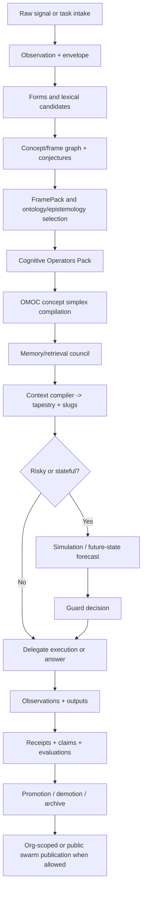

# Rosetta-OMOC-Swarm Gnosis Unified Thesis and Protocol Specification
## A cross-correlated protocol doctrine for Entif's mycelial metacognitive ecosystem

**Date:** April 12, 2026  
**Status:** Working draft, intended as a Rosetta-aligned companion specification  
**Audience:** Systems architects, ontology engineers, model designers, agent-framework builders, protocol authors, and future implementers of Entif / Rosetta  
**Extends:** Rosetta v3.0.0 by pack, profile, runtime, and governance doctrine only. This document does **not** redefine Rosetta core semantics.  
**Purpose:** To fold the strongest internal work to date into one cohesive thesis and engineering doctrine that:

1. keeps **Rosetta v3** as the invariant semantic and provenance spine,
2. introduces **OMOC** as the routing and specialization doctrine,
3. formalizes **Swarm Gnosis** as the distributed exchange layer for verified cognitive artifacts,
4. integrates the **MR TECH LEAD** model-stack ideology without letting compute innovations bloat the semantic constitution,
5. and aligns the whole organism with standards-oriented taxonomy, explicit epistemics, receipts-first governance, and buildable execution order.

---

## Abstract

This document argues that the next useful generation of agentic systems will not be won by larger prompts, broader personas, more autonomous loops, or a noisier mixture-of-experts bazaar. It will be won by **semantic sovereignty, provenance discipline, concept-native routing, governed memory, and layered compute specialization**.

Rosetta v3.0.0 already establishes the correct constitutional posture: a minimal, stable, extensible core spine built on content-addressed tiles, a universal operational trace, separation of raw signals from semantic interpretation, explicit uncertainty, and pack-based interoperability rather than core bloat. ROCK-31XX sharpens that posture by insisting that receipt authoring, verification, bundle closure, and provenance projection be treated as first-class interoperable behavior rather than ad hoc logging. The Entif architecture, secure-companion, decentralization, memory-doctrine, and roadmap corpus add the operating stance: receipts-first execution, cheap-first verify-then-escalate, deny-by-default gating, federated knowledge topologies, compiled context packages, and progressive promotion of successful cognition into reusable substrate. [I1][I2][I3][I4][I5][I6]

What has been missing is a single doctrine that cleanly marries these layers to the design ideology emerging from the OMOC work and the MR TECH LEAD model-stack thinking. This document provides that doctrine.

Its central thesis is simple:

- **Rosetta** is the sovereign semantic BIOS and provenance constitution.
- **OMOC** is the routing law that assembles task-specific mixtures of concepts rather than static expert identities.
- **Swarm Gnosis** is the federated exchange layer for verified tiles, tapestries, profiles, operators, and cognitive artifacts.
- **MR TECH LEAD** is not the constitution. It is the compute-and-reasoning stack that must remain subordinate to Rosetta semantics and Entif governance.

If implemented in this order, the result is not merely an agent framework. It is a **mycelial metacognitive operating substrate**: one that thinks in typed conceptual assemblies, carries explicit epistemic posture, preserves provenance as it reasons, compiles context economically, routes work across model scales and human operators, and gradually converts expensive cognition into compact reusable structure.

---

## Executive Summary

### The load-bearing claim

Entif and Rosetta should be built as a **provenance-first cognitive operating system** whose unit of work is not “a prompt/response pair” but a **typed cognitive episode** composed of observations, forms, lexemes, concepts, frames, conjectures, episteme, decisions, receipts, and replayable deltas. Rosetta v3 already defines the minimal invariant spine for that posture and explicitly requires that it serve as the single source of truth for meaning and process within EntifAI. [I1]

### What OMOC changes

OMOC replaces static persona libraries and conventional MoE framing with **ontological mixtures of concepts**. Instead of routing to “the geology expert” or “the backend expert,” the system compiles concept tranches from a faceted taxonomy and ontology graph, producing a task-local simplex of conceptual delegates. These delegates may be implemented by models, tools, human operators, rule engines, or compiled procedures, but the routing currency is conceptual structure, not role costume. [I5][I7][I8]

### What Swarm Gnosis changes

Swarm Gnosis turns the tile-first posture into a federated knowledge substrate. The atomic object is the **content-addressed cognitive tile**. The exchange object is the **tapestry**, a context-bound compiled working set. The public/private bridge is not raw prompt history but signed, rights-scoped, policy-aware semantic artifacts that can be verified, hydrated, and selectively disclosed. [I6][I9]

### What MR TECH LEAD changes

MR TECH LEAD contributes a coherent division of labor across compute strata:

- Rosetta for semantic control and canonical meaning.
- Draft-and-Prune, H-Neurons, and ELIXIR for reliability governance.
- ENGRAM-style conditional memory for static lookup.
- AttnRes for depth routing.
- CCA and Mamba-style sequence-mixing corridors for inference economics.
- TurboQuant for vector and cache compression.

But none of these are allowed to redefine semantic identity. Their role is to make cognition cheaper, safer, and more effective **under Rosetta**, not instead of Rosetta. [I5][I8]

### The practical consequence

The first build goal is not a universal swarm. It is a narrow, hard, verifiable wedge:

**typed episode -> canonical tile -> signed receipt -> compiled tapestry -> guarded action or audited answer**

Everything else should stack on top of that wedge.

---

## 1. Scope, Audience, and Non-Goals

### 1.1 Scope

This document specifies a unified architectural doctrine across six layers:

1. **Semantic Constitution** — Rosetta core invariants and pack discipline.
2. **Epistemic and Provenance Law** — receipts, claims, allowed use, evidence closure.
3. **OMOC Routing Doctrine** — conceptual specialization, applicability scope, survivorship.
4. **Memory and Context Constitution** — tiles, tapestries, Prism/Muninn/Engram integration, compaction, caching.
5. **Compute and Model Stack Integration** — MR TECH LEAD lanes and boundaries.
6. **Federation and Swarm Exchange** — org-scoped and public Swarm Gnosis.

### 1.2 Audience

This document is written for readers who must make decisions about:

- protocol and schema design,
- graph and ontology architecture,
- memory-layer implementation,
- runtime orchestration and safety,
- model-stack integration,
- build order and MVP slicing,
- and the long-term transition from “LLM harness” to “cognitive substrate.”

### 1.3 Non-Goals

This document does **not** do the following:

- redefine Rosetta core types or core meaning-pipeline semantics,
- choose one upper ontology as universal truth,
- claim that OMOC is already the only correct final routing mechanism,
- require a full custom foundation model before the architecture is valuable,
- collapse private and public swarm behavior into one undifferentiated network,
- or pretend that model advances are a substitute for semantic governance.

This is a **refinement-and-extension doctrine**, not a core rewrite.

---

## 2. Source Concordance: what each primary artifact contributes

The point of this document is not to produce a fresh cloud of abstractions. It is to tie together the strongest artifacts already produced.

| Source | Contribution to the unified thesis |
|---|---|
| **Rosetta v3.0.0 Core Spine Specification** | Establishes the invariant spine: content-addressed tiles, Run -> Action -> ToolCall -> Observation -> Evaluation, separation of signals and semantics, conjectures, episteme, tapestries, and pack-based extensibility. [I1] |
| **ROCK-31XX - Provenance, Receipts, TruthLint** | Establishes receipts as interoperable attestation artifacts, bundle-closure logic, PROV-O projection discipline, and refinement-before-extension posture. [I2] |
| **Taxonomy System Design** | Contributes the empire-map requirement: a hierarchy or facet system that can hold everything ideated, built, deferred, reused, or discovered without devolving into notebook chaos. [I3] |
| **Taxonomic Standards for Software** | Provides the standards spine-kit: OWL 2, RDF/RDFS, SKOS, SHACL, PROV-O, BPMN, DMN, SCXML, OpenAPI, AsyncAPI, CloudEvents, OpenTelemetry, WCAG/ARIA, Design Tokens, and the argument for facet taxonomies rather than one giant tree. [I4][E4][E5][E6][E7][E8][E9][E10][E11] |
| **Entif AI - Agentic Memory and Graph Design Doctrine** | Provides the expanded-plane architecture, execution envelopes, contributor registry, graph router, federated topology, Muninn-inspired memory plane, and receipts-first operating substrate. [I5] |
| **Holistic Entif AI Redesign (MR TECH LEAD)** | Provides the layered compute philosophy and the crucial boundary: Rosetta is semantic control plane; model-stack innovations each solve different dirty jobs and must not become one sacred block. [I7] |
| **mHCs and Engram in ML** | Sharpens the principle that ML primitives belong in packs, profiles, and runtime lanes, not Rosetta core; also surfaces Birkhoff/Sinkhorn-style alignment intuitions relevant to mapping and routing. [I8] |
| **Cognitive Tiles and Swarm Gnosis** | Provides tile-first, Merkle-DAG, proof-carrying, decentralized exchange, slugs, and economic decoding posture. [I6] |
| **Cognitive Tapestries via Semantic Latticing** | Provides the compiled-context and slug doctrine: information-dense, rehydratable semantic bundles rather than bloated prose history. [I9] |
| **Epistemic Sequencing in Scoping** | Provides the build-order law: build the smallest unit that resolves the most dangerous uncertainty and unlocks the next decision. [I10] |
| **YT, Agents, Auth and Cache / epistemic provenance notes** | Provides a clean pattern for epistemic provenance, claim typing, and allowed-use constraints so not all knowledge modes are allowed to drive policy. [I11] |
| **Metacognitive Atlas via Tulpamancy Archetypes** | Contributes the calibrated, non-collapse, multi-axis atlas view of perspectives and the explicit move from personas as costumes to concept-factor maps. [I12] |
| **Voice / workflows / architecture blueprints** | Provide parse-only defaults, cheap-first routing, compiled context, receipts, and the expectation that orchestration should be mode-separated and instrumented. [I13] |

The synthesis in this document is therefore **not** a speculative departure from the existing corpus. It is a deliberate consolidation.

---

## 3. Governing Invariants

These invariants are the steel beams. Everything else is an adapter, a runtime, or an experimental lane.

### 3.1 Rosetta remains sovereign over meaning and process

Rosetta core MUST remain the authoritative representation for:

- tile identity,
- semantic layer boundaries,
- observation/interpretation separation,
- operational trace structure,
- conjecture and epistemic handling,
- and canonical compiled working sets.

No memory engine, ontology import, model architecture, or swarm extension may redefine those core meanings. New capability arrives through packs, profiles, and runtime adapters. [I1][I2]

### 3.2 Receipts or it did not happen

Every meaningful transformation MUST emit a receipt or a receipt-equivalent attestation tile. This includes:

- ingest,
- normalization,
- extraction,
- routing,
- retrieval,
- verification,
- memory promotion and demotion,
- policy decisions,
- tool calls,
- and public or federated publication.

Receipts are not optional debugging fluff. They are the machine-readable chain of custody for cognition. [I2][I5]

### 3.3 Separation of signals and semantics is inviolable

Raw observation MUST remain immutable. No semantic interpretation may overwrite raw signal. Any later interpretation, clarification, disagreement, or abstraction must appear as a new derived artifact linked by provenance. [I1]

### 3.4 Non-collapse of uncertainty is mandatory

Ambiguity, conflict, multi-hypothesis state, and epistemic scope MUST remain first-class. If multiple candidate mappings or interpretations exist, the system should preserve them as conjecture distributions or scoped alternatives until there is sufficient evidence to collapse them. [I1][I12]

### 3.5 Context is compiled, not dumped

Working context MUST be assembled as a rights-scoped, purpose-scoped compiled package. Tapestries, compiled context envelopes, and slugs are the intended substrate. Giant undifferentiated prose histories are a temporary compatibility crutch, not an architectural goal. [I5][I6][I9]

### 3.6 Ontology is explicit, not accidental

Every imported vocabulary, schema, and ontology choice SHOULD declare:

- what ontology school or design posture it follows,
- what problem class it is meant to solve,
- what mappings exist,
- what constraints apply,
- and what it is *not* authoritative for.

The worst ontology is not a wrong one. It is an invisible one. [I4][E13][E14][E12]

### 3.7 Dangerous action requires forecast and gate

High-impact actions MUST pass through both:

1. a policy/gov gate, and
2. when materially stateful or irreversible, a future-state forecast or simulation lane.

Model confidence alone is never sufficient justification for irreversible action. [I5][I10][I13]

### 3.8 Build order follows epistemic sequencing

A work package is valid only when it resolves a prioritized uncertainty, produces diagnostic evidence, and unlocks a next decision. This applies to research, product, agent, and protocol work equally. [I10]

---

## 4. The Unified Layer Model

The cleanest integrated picture is a six-layer system.

### 4.1 Layer A: Constitution and Semantic Spine

This is Rosetta core plus ROCK-style refinement packs.

Responsibilities:

- canonical tile envelopes,
- stable content IDs,
- run/action/toolcall/observation/evaluation structure,
- forms/lexemes/concepts/frames/conjectures/episteme,
- receipt schema and bundle closure,
- controlled evolution through packs, translators, and profiles.

### 4.2 Layer B: Taxonomy, Ontology, and Common Understanding Model

This layer turns Rosetta from a bare protocol into a meaningful common-language substrate.

Responsibilities:

- concept schemes,
- ontology imports and mappings,
- software-domain facet taxonomies,
- lexical anchors,
- schema alignment,
- and the rules that correlate external resources into common internal meaning.

This is where the “common language and understanding model” lives. Rosetta is the sovereign interlingua, but it becomes genuinely useful only when crosswalked to external vocabularies and standards through disciplined packs. [I1][I4]

### 4.3 Layer C: Cognitive Routing and OMOC

This layer decides how work is decomposed and routed.

Responsibilities:

- concept signature extraction,
- operator selection,
- delegate compilation,
- applicability scoping,
- survivorship scoring,
- and the construction of conceptual simplexes rather than static role invocations.

### 4.4 Layer D: Memory, Context, and Economic Compilation

This layer keeps the machine from bleeding tokens and rethinking the same thought forever.

Responsibilities:

- activation memory,
- episodic and procedural traces,
- semantic compaction,
- prompt-band stabilization,
- cache-aware context assembly,
- tapestry construction,
- slug generation and hydration,
- and memory lifecycle transitions.

### 4.5 Layer E: Runtime, Guard, and Orchestration

Responsibilities:

- parse-only ingestion modes,
- deterministic middleware,
- skill and tool invocation,
- policy gating,
- scheduling,
- side-effect control,
- and replay.

### 4.6 Layer F: Compute and Federation

Responsibilities:

- model-stack integration,
- sequence-mixing economics,
- conditional memory,
- vector compression,
- structured-output reliability,
- and org-scoped/public swarm exchange.

A useful shorthand is:

- **A/B are constitutional**
- **C/D are cognitive**
- **E is operational**
- **F is infrastructural and federative**

---

## 5. Rosetta as the Common Language and Understanding Model

This is the part that must stay crisp: how data becomes shared internal meaning.

### 5.1 The meaning pipeline

Rosetta v3 already gives the key layered posture:

- **Layer 0: Signals / Observations**
- **Layer 1: Forms**
- **Layer 2: Lexemes**
- **Layer 3: Concepts and Frames**
- with **Conjectures** as explicit bridges across ambiguous mappings,
- and **Episteme / Matrix** artifacts for post-interpretive scoring and balance-sheet reasoning. [I1]

This is the backbone of a common-language system because it prevents a catastrophic shortcut that many agent systems take: they silently jump from raw text straight to action. Rosetta requires the machine to say what it saw, how it tokenized or normalized it, what lexical candidates were considered, which concepts and frames were selected, and what uncertainty remained.

### 5.2 External anchors without semantic surrender

Rosetta should absorb the world by anchor, not by annexation.

That means:

- WordNet-like or BabelNet-like lexical systems become **LEXID / anchor** material, not Rosetta identity.
- External OWL classes become anchorable or mappable semantic references, not authoritative internal identity.
- OpenAPI, AsyncAPI, BPMN, DMN, SCXML, and CloudEvents become **StdPack surfaces**, not constitution.
- Software architecture and UI standards become **descriptive/interoperability packs**, not core definitions of being.

This is how Rosetta can be the common language **without** claiming to be the one true ontology. [I1][I4][E4][E5][E6][E7][E8][E9][E10][E11]

### 5.3 Common understanding is not raw embedding consensus

A critical distinction from mainstream LLM practice:

Shared understanding in this architecture does **not** emerge from hoping that latent manifolds converge enough across vendors. It emerges from:

1. canonical semantic objects,
2. explicit mapping layers,
3. typed ambiguity,
4. stable references,
5. and verifiable evidence chains.

That is the semantic equivalent of gauge blocks in machining: portable reference artifacts that let different systems calibrate to the same thing instead of hand-waving similarity. [I4]

### 5.4 Proposed Rosetta extension for understanding alignment

This document recommends a new companion pack family for Rosetta:

- **OMOC Concept Pack** — concept families, delegate schemas, route plans.
- **Semantic Gauge Block Pack** — calibration corpora, alignment exemplars, canonical semantic fixtures.
- **Ontology Crosswalk Pack** — mappings between Rosetta concept families and imported vocabularies.
- **FramePack Registry** — task and domain framing templates with explicit ontology/epistemology slots.

These should be implemented as packs and profiles, not core mutations.

---

## 6. Taxonomy, Ontology, and Software-Architecture Crosswalk

### 6.1 Taxonomy is not one tree

The software-taxonomy and taxonomic-standards work makes the crucial move: stop trying to force all software, cognition, process, UI, deployment, and governance concerns into one monolithic biological tree. Use **facet-based classification** with multiple orthogonal schemes, and enforce valid combinations via constraints. [I3][I4]

That principle should govern OMOC as well.

A concept or artifact may simultaneously belong to facets such as:

- domain,
- task type,
- capability class,
- data sensitivity,
- execution mode,
- evidence mode,
- memory tier,
- ontology school,
- lifecycle stage,
- runtime substrate,
- policy profile,
- and federation scope.

This is precisely where SKOS and SHACL become powerful. SKOS is ideal for lightweight concept schemes and broader/narrower relationships; SHACL provides validation logic so not every possible combination becomes legal just because it can be stated. [E5][E6]

### 6.2 Standards spine kit

The internal taxonomy standards work points to a well-composed standards spine. This document accepts that posture and sharpens it:

#### Semantic and ontology layer

- **OWL 2** for class/property semantics and inference-friendly structure. [E4]
- **RDF/RDFS** as the projection substrate when graph export or linked-data interop is needed. [E4]
- **SKOS** for concept schemes, broader/narrower, and taxonomy interchange. [E5]
- **SHACL** for profile validation and graph-shape constraints. [E6]
- **PROV-O** for interoperable provenance projection. [E7]

#### Software-architecture and process layer

- **SEMAT Essence** for universal SDLC endeavor language. [E15]
- **ISO/IEC/IEEE 42010** for architecture description, views, stakeholders, and concerns. [E16]
- **ArchiMate** for layered architecture modeling across business, application, and technology. [E17]
- **BPMN** for process modeling. [E18]
- **DMN** for decision logic. [E19]
- **SCXML** for executable state-machine semantics where relevant. [I4]

#### Interface and event layer

- **OpenAPI** for request/response interface descriptions. [E8]
- **AsyncAPI** for event-driven interface descriptions. [E9]
- **CloudEvents** for standard event metadata and routing envelope conventions. [E10]
- **OpenTelemetry Semantic Conventions** for observability naming. [E11]

#### Metadata and resource envelope layer

- **NERDm-style JSON Schema + JSON-LD envelopes** for describing datasets, software, services, portals, tools, and resource bundles in an extension-friendly way. [E12][E20]

### 6.3 Ontology-school declaration

The top-level ontology survey and Semantic Arts material both reinforce a point this architecture must make explicit: **there are multiple ontology schools, with distinct commitments and consequences**. [E13][E14]

Therefore every ontology pack SHOULD declare a field such as:

```text
ontology_school:
  - philosophy
  - standards
  - taxonomy
  - linked-data
  - data-centric
  - object-oriented
  - hybrid
```

That declaration prevents accidental metaphysics. It also makes later audit and migration possible.

### 6.4 Property graphs vs knowledge graphs

The unified stance should be:

- Rosetta + standards layer = sovereign semantic identity and provenance
- property graphs = high-performance traversal and relationship views
- vector indexes = similarity substrate
- metadata envelopes = interoperable packaging layer

In other words, property graphs are not heresy. They are just not the constitution. [I5][E14]

---

## 7. Provenance, Receipts, TruthLint, and Epistemic Provenance

### 7.1 Receipts are the execution truth of the system

Rosetta receipts and ROCK-31XX receipt refinement establish that the system’s claim to rigor comes not from sounding careful but from being able to prove what happened.

Every cognitively meaningful event should be attestable as:

- what was observed,
- what was inferred,
- what policy or profile governed the move,
- what tool or model executed it,
- what outputs were produced,
- and how those outputs can be reverified or traced. [I2]

### 7.2 TruthLint posture

TruthLint should be understood here not as a single classifier but as a discipline:

- every claim is typed,
- every claim is evidentially anchored,
- every confidence statement is scoped,
- every policy-driving statement must satisfy stronger evidence constraints than narrative or ideation-oriented statements,
- and “verified” implies bundle closure and replayable or checkable support.

### 7.3 Epistemic provenance and allowed use

One of the strongest additions from the internal epistemic-provenance work is the refusal to collapse all ways of knowing into one undifferentiated truth scalar. The right move is to make epistemic provenance attachable and auditable.

Recommended extension pattern:

```text
epistemic.provenance@0.1
  mode: EMPIRICAL | TESTIMONIAL | REVELATORY | TRADITIONAL |
        INFERENTIAL | EXPERIENTIAL | SIMULATED | LENS_BASED
  witness_scope: FIRSTHAND | SECONDHAND | COMMUNITY | SYNTHETIC
  corroboration_refs[]
  contestability: FALSIFIABLE | PARTIAL | NONFALSIFIABLE
  allowed_use[]
  prohibited_use[]
  confidence_self_reported
  confidence_system_estimated
```

This does two important things:

1. it lets Rosetta represent heterogeneous knowledge modes honestly,
2. and it lets Guard enforce that not every knowledge mode can drive every action.

For example:

- a lens-based archetype appraisal may be allowed to influence brainstorming,
- but prohibited from driving compliance, access control, or deployment.

That is how the system remains epistemically rich without becoming governance soup. [I11][I12]

### 7.4 Claim vs receipt vs observation

This unified thesis recommends the following clear split:

- **Observation** = immutable raw signal
- **Claim** = an assertion, proposal, interpretation, or lens output
- **Receipt** = attestation that a process ran and produced specified artifacts under specified conditions

This split is small, but it prevents massive confusion downstream.

---

## 8. OMOC: Ontological Mixture of Concepts

### 8.1 Why OMOC is not mixture-of-experts

The core objection to naive MoE framing is sound: “expert” is both too broad and too brittle. Experts often contain internally mixed concepts already, while niche crossovers frequently appear exactly where no single named expert exists.

OMOC therefore changes the routing primitive from **expert identity** to **conceptual composition**.

The system should not ask:

- “Which expert do I wake up?”

It should ask:

- “What conceptual basis set is actually present in this task?”
- “Which concept intersections dominate?”
- “Which of those are stable primitives, which are domain-specific, which are ephemeral, and which already exist as reusable semantic artifacts or specialized sessions?”

### 8.2 Concept tranches and simplexes

OMOC should compile a task into a multi-scale structure:

1. **Foundational tranche** — highest-level primitives, general laws, core frames, constitutional rules.
2. **Domain tranche** — mid-level domain concepts.
3. **Intersection tranche** — crossover clusters where domains overlap.
4. **Problem tranche** — the specific configuration for the current task.
5. **Execution tranche** — tools, runtime limits, policy, memory requirements, and substrate choices.

Each task then yields a **concept simplex** rather than a static persona.

### 8.3 The conceptual delegate model

A delegate in this system is not inherently a humanoid agent. A delegate is any bounded operator with a concept profile and an admissible action profile. Delegates may be:

- a small specialist model,
- a tool or skill,
- a rule engine,
- a retrieval pattern,
- a human operator,
- a simulation lane,
- or a prior compiled procedure.

Recommended schema:

```text
omoc.delegate@0.1
  delegate_id
  concept_signature[]
  exclusions[]
  scope
  policy_profile
  substrate: MODEL | TOOL | HUMAN | RULE | WORKFLOW | SIMULATOR
  memory_needs
  evidence_requirements
  cost_profile
  trust_profile
```

### 8.4 Applicability scope and contextual survivorship

A concept, tile, pattern, or delegate that scores poorly in one situation should not be erased just because it failed there.

Therefore OMOC must carry two separate metrics:

- **local utility** in current context,
- **cross-context survivorship** across adjacent or known relevant contexts.

Suggested form:

```text
Utility_i(q) = aN*N_i(q) + aR*R_i(q) + aV*V_i(q) + aS*S_i(q)
               - aC*Cost_i(q) - aK*Risk_i(q)

Survivorship_i = max Utility_i(c)
                 for c in adjacent_contexts(q)
```

Where:

- `N` = novelty,
- `R` = relevance,
- `V` = value-add,
- `S` = resilience,
- `Cost` = token/runtime/delay burden,
- `Risk` = epistemic/policy/security risk.

Policy implication:

- high Utility + high provenance completeness -> promote
- low Utility + high Survivorship -> demote to colder tier, do not delete
- low Utility + low Survivorship -> prune or archive
- legal/privacy/retention conflict -> explicit deletion/withholding path

This is the rule that stops OMOC from kneecapping future niche work. [I5][I10]

### 8.5 Session specialization and resumption

If a previous task already created a high-value crossover region, the system SHOULD be able to resume that conceptual room rather than recreate it from scratch.

This means the memory layer must be able to store and retrieve:

- concept-simplex signatures,
- delegate sets,
- relevant tiles/tapestries,
- prior route plans,
- evidence states,
- and residual open questions.

That is the practical version of “frog biology meets rocketeering”: not a joke, but a test case for specific crossover resumption.

### 8.6 OMOC and archetypes

The metacognitive-atlas work provides an important refinement: perspectives should be treated as calibrated regions over concept factors, not just costumes. OMOC should therefore be able to include archetype-derived delegates, but only as **lens providers** with explicit epistemic and allowed-use typing. [I12]

---

## 9. Memory Constitution: Tiles, Tapestries, Prism, Muninn, Engram

### 9.1 The sovereign split

The right split is now clear:

- **Rosetta** = sovereign identity, provenance, and semantic representation
- **Prism** = rich session continuity, activation, handoff, compaction, visual memory, CRDT merge, dashboard-like cognition features
- **Muninn** = deterministic, cheap, explainable cognitive memory with engrams, activation, associations, and semantic triggers
- **Graph / vector sidecars** = retrieval topologies optimized for traversal or similarity
- **Engram-style conditional memory** = model-side lookup substrate for static or slowly changing knowledge

Rosetta is the constitution. The others are memory engines and runtime realizations underneath or alongside that constitution. [I5][E2][E3]

### 9.2 Memory planes

The memory doctrine and prior synthesis suggest the following stack:

1. **Constitutional memory** — policy, packs, schema, invariants, guard logic.
2. **Semantic memory** — concepts, frames, lexical anchors, mappings, long-lived knowledge.
3. **Episodic memory** — runs, observations, actions, receipts, events.
4. **Procedural memory** — workflows, skills, operator templates, proven patterns.
5. **Prospective memory** — queued intentions, deferred questions, reminders, future tasks.
6. **Activation memory** — recency/frequency/context-sensitive surfacing and suppression.

These should be represented in Rosetta-compatible envelopes even when stored in heterogeneous backends. [I5]

### 9.3 Tapestries and prompt-band stabilization

A tapestry should be treated as a **compiled working set**, not merely a bundle. In long-lived sessions, this compiled working set should itself have a stable internal organization:

- **Band 1: constitutional and invariant context**
- **Band 2: stable domain and project primitives**
- **Band 3: session-local but relatively persistent work context**
- **Band 4: dynamic turn-local or rapidly changing material**

The context compiler should minimize edits to higher bands and push volatility downward. That is what allows provider-side prompt caching to work economically. OpenAI’s prompt-caching docs and cookbook emphasize exact repeated prefix matching and show that stable long prefixes materially reduce repeated prefill cost and latency. [E1][E21]

### 9.4 Slugs and semantic latticing

The semantic-latticing doctrine should now be formalized as follows:

- **Optical slugs** represent visually compressed or rendered evidence.
- **Symbolic slugs** represent high-density conceptual bundles, route plans, or semantic subgraphs.
- A slug is not merely a hash. It is a compact, addressable, provenance-linked handle into a rehydratable semantic or evidential structure. [I9]

This is how context grows without dragging raw prose through every pass.

### 9.5 Deterministic local memory and “Why” traces

MuninnDB is compelling because it proves that a meaningful class of memory work does not require another LLM in the loop. The architecture should adopt that lesson.

Any memory backend chosen for important routing or surfacing duties SHOULD provide:

- deterministic scoring or at least deterministic replay of scoring inputs,
- explicit activation or association traces,
- explainable “Why did this memory surface?” answers,
- and cheap operation in local-first modes. [E3]

### 9.6 Memory lifecycle transitions

A practical lifecycle may look like:

- **Hot**: active working tiles/tapestries in session
- **Warm**: recent episodic context with full-resolution artifact pointers
- **Cool**: compressed summary + symbolic slug + selected evidence closure
- **Cold**: archived receipt-linked history retrievable by semantic or provenance criteria

The key is that these transitions preserve addressability and auditability, not just content.

---

## 10. Swarm Gnosis: Federation, Exchange, and Public Commons

### 10.1 The right federation order

Do not begin with a fully public global swarm.

Federation should proceed in layers:

1. **single-tenant local**
2. **multi-agent local**
3. **org-scoped federation**
4. **trusted inter-org exchange**
5. **public commons / open swarm**

Each layer requires stronger proof, rights, and abuse-handling than the last.

### 10.2 The exchange objects

The public or federated substrate should exchange:

- tiles,
- tapestries,
- skills/operators,
- archetype or lens packs,
- ontology packs,
- schema profiles,
- receipts and attestations,
- and, where appropriate, slugs plus witness packs.

It should **not** assume that raw session history, private context, or sensitive prompt scaffolds are the exchange default.

### 10.3 Human switchboard is part of the swarm

One of the smartest corrections in the recent synthesis is that not every best delegate is another model. The swarm should include a human switchboard and operator registry. A niche human specialist may be the best next hop for a specific problem.

Therefore Swarm Gnosis SHOULD support delegate substrates of type `HUMAN`, with:

- capability profile,
- domain signature,
- trust and policy envelope,
- evidence expectations,
- and communication contract.

This prevents “automation purity” from becoming a stupid optimization target. [I12]

### 10.4 Public commons route

The “public library” vision is strongest when framed as:

- an **Entif Commons** of signed packs, tiles, tapestries, skills, and validators,
- a **Rosetta verifier surface** so third parties can validate signatures, histories, and pack provenance,
- and a **commons route to interoperability** where adoption grows because verification and reuse are easier than siloing.

That is how Swarm Gnosis becomes infrastructure rather than mythology.

---

## 11. MR TECH LEAD Integration: model-stack ideology without semantic capture

### 11.1 The strata must stay separate

The MR TECH LEAD synthesis is valuable precisely because it clarifies that the candidate innovations are not all solving the same problem.

This document codifies the separation as follows:

| Component family | Dirty job it solves | Where it belongs |
|---|---|---|
| Rosetta | Canonical meaning, provenance, auditability, bundle semantics | Semantic constitution |
| Draft-and-Prune | multi-candidate search, semantic pruning, structured-output robustness | Reliability/governance lane |
| H-Neurons | hallucination-prone internal-state detection, abstention prior | Reliability/risk lane |
| ELIXIR / Learning-to-self-evolve | measured self-improvement and policy/routing evolution | Eval and governance lane |
| ENGRAM / conditional memory | static/local knowledge lookup instead of recomputation | Model/runtime memory lane |
| AttnRes | selective depth routing across prior layer states | Model architecture lane |
| CCA / attention-compression ideas | cheaper exact/global attention where still required | Model architecture lane |
| Mamba-style recurrent corridors | long-range sequence mixing without giant KV burden | Model architecture lane |
| TurboQuant / quantization | memory movement and vector compression | Systems and infrastructure lane |

This separation is not cosmetic. It is how the architecture avoids turning into cyber-chimera soup. [I7][I8]

### 11.2 Rosetta is not replaced by better residual routing

AttnRes and related innovations may improve inference behavior dramatically. They do not solve the meaning problem.

Rosetta exists because tokenizers, embeddings, and latent states are not in themselves a transparent, stable semantic substrate. Better internal routing can make a model smarter or cheaper. It does not make semantic identity, provenance, and interoperability disappear. [I7][I8]

### 11.3 ENGRAM is particularly important

The strongest conceptual bridge between Rosetta/Entif and the MR TECH LEAD stack is ENGRAM-style conditional memory.

The deeper shared principle is:

**not all knowledge should be simulated by runtime computation**

That principle rhymes directly with:

- tiles,
- tapestries,
- slugs,
- compiled contexts,
- reusable procedures,
- and semantic caches.

Rosetta + ENGRAM is therefore one of the most promising pairings in the whole architecture: Rosetta provides deterministic semantic keys and canonical objects; conditional memory provides cheap access to reusable structures at runtime. [I7][I8]

### 11.4 Draft-and-Prune + Rosetta

A second especially strong pairing is Draft-and-Prune with Rosetta. If candidate outputs are emitted as canonical semantic bundles rather than only text, semantic equivalence and contradiction become easier to detect. That is a major upgrade over raw textual self-consistency checks. [I7]

### 11.5 H-Neurons + Guard + receipts

A third strong pairing is H-Neurons-like risk priors with receipts and Guard. If the runtime has evidence that a generation or route entered a hallucination-prone or over-compliant regime, that signal should be attachable to the resulting claim/receipt chain and available to Guard or evaluators as a policy factor rather than hidden inside weights. [I7]

### 11.6 The phased build implication

The right order is not “build MR TECH LEAD whole.”

It is:

1. prove the semantic thesis,
2. improve reliability and memory,
3. selectively hybridize or replace model internals where there is clear leverage,
4. only then learn revision or self-evolution policies at scale.

This is consistent with the internal phased diagrams and with the general rule of not pretending future certainty too early. [I7][I10]

---

## 12. End-to-End Operating Flow

The following is the intended steady-state flow.



### 12.1 Sequence description

1. **Observe** — never skip raw capture.
2. **Interpret** — move through forms, lexemes, concepts, frames, and conjectures.
3. **Frame** — select ontology/epistemology and evaluation mode explicitly.
4. **Operate** — invoke named cognitive operators.
5. **Compile** — assemble OMOC delegate set and context tapestry.
6. **Forecast** — if action is risky, run simulation or future-state estimate.
7. **Gate** — require Guard decision where needed.
8. **Act or answer** — using bounded delegates and context.
9. **Attest** — mint receipts, claims, evaluations, and bundle closure.
10. **Learn** — promote successful structure, demote noise, but preserve scoped survivorship.
11. **Federate** — only if policy, rights, and packaging allow.

---

## 13. Data Contracts to Add or Formalize

This document recommends the following companion schemas.

### 13.1 `rosetta.claim`

A typed assertion or interpretation distinct from observation and receipt.

Suggested fields:

```text
claim_id
subjects[]
claim_kind
content
confidence
epistemic_provenance_ref
evidence_refs[]
allowed_use[]
policy_refs[]
```

### 13.2 `omoc.route_plan`

A compiled routing object.

```text
route_plan_id
task_signature
foundational_tranche[]
domain_tranche[]
intersection_tranche[]
problem_tranche[]
delegates[]
operators[]
memory_requirements
context_tapestry_ref
risk_flags[]
forecast_required
policy_profile
```

### 13.3 `omoc.concept_simplex`

A normalized representation of the active conceptual mixture.

```text
simplex_id
anchors[]
weights[]
orthogonality_notes[]
survivorship_scores[]
source_refs[]
```

### 13.4 `entif.compiled_context`

An explicit compiler output, which may be encoded as or attached to a tapestry.

```text
context_id
purpose
stable_band_refs[]
semi_stable_band_refs[]
dynamic_band_refs[]
slug_refs[]
rights_scope
cache_domain
hydration_policy
```

### 13.5 `memory.engram` refinement

The current engram object is already strong; it should additionally support:

- applicability scopes,
- survivorship score,
- operator provenance,
- and optional slug or tapestry references.

### 13.6 `epistemic.provenance` attachment

As described above.

---

## 14. Evaluation and Anti-Token-Bleed Economics

### 14.1 The four-axis value kernel

The token-economics and agent-harness work suggests a consistent evaluation kernel:

- **Novelty**
- **Relevance**
- **Value-add**
- **Resilience**

This document adopts that kernel as normative for routing, promotion, and self-improvement scoring, provided that cost and risk are also tracked. [I5]

### 14.2 Primary KPIs

Recommended system KPIs:

1. **Cost per successful cognition**  
   Total cost divided by episodes that meet quality threshold.

2. **Stable-prefix cache hit rate**  
   Measures whether context compiler is doing its job. [E1]

3. **Compiled context compression ratio**  
   Raw candidate context size vs final tapestry/slugs.

4. **Reuse ratio**  
   Fraction of cognition served by previously compiled artifacts, procedures, or memory rather than fresh full inference.

5. **Receipt completeness**  
   Fraction of meaningful steps that emit valid receipts.

6. **Forecast-before-action rate**  
   Fraction of risky actions preceded by a simulation or future-state lane.

7. **Cross-context survivorship precision**  
   Whether artifacts retained for adjacent contexts later prove useful.

8. **Rights-scope breach rate**  
   Should be zero.

### 14.3 Evaluation ladders

The system should not evaluate everything with the same instrument.

Use distinct ladders for:

- semantic correctness,
- policy admissibility,
- reasoning hygiene,
- cost efficiency,
- retrieval quality,
- memory usefulness,
- route quality,
- and public-federation safety.

### 14.4 ELPQ and multi-axis judgments

Where higher-level judgments are needed, Rosetta’s matrix/episteme structures remain the right carrier. Important judgments should stay multidimensional and topic-scoped, not reduced to one scalar reputation. [I1][I12]

---

## 15. Security, Governance, and Rights-Scoped Retrieval

### 15.1 Guard remains above the agents it governs

The secure-architecture and governance documents are clear: all high-impact action should pass through a Guard or PEP layer that can deny, modify, or escalate requests before harm occurs. That layer must remain structurally separate from the agents it oversees. [I13]

### 15.2 Rights are enforced at retrieval time

Rights-scoped retrieval means do not retrieve everything and filter later. The system must retrieve under scope. This is essential for:

- privacy,
- multi-tenancy,
- selective disclosure,
- cache-domain hygiene,
- and swarm publication safety. [I5]

### 15.3 Selective disclosure and witness packs

A public or federated artifact should be able to prove integrity without oversharing sensitive content. That implies:

- commitments and hashes,
- witness packs,
- redaction-friendly receipt design,
- and forkable policy profiles.

### 15.4 Parse-only by default

Ambient or broad ingest systems must remain parse-only by default. Suggestions are fine. Side effects require explicit command mode, guard passage, and receipts. [I13]

### 15.5 Dead-man, breach, and continuity concerns

The governance posture also implies continuity mechanisms, sealed ledgers, emergency lockouts, and succession/lockbox planning for catastrophic compromise. Those belong in the governance companion layer, not in the model itself, but the architecture must be able to represent and enact them via policies and receipts.

---

## 16. Build Order: tack, do not boil the ocean

This is where epistemic sequencing becomes operational.

### 16.1 Tack 0: prove the semantic kernel

Deliverables:

- Rosetta envelope and CID logic
- receipt minting and verification
- a minimal claim tile
- tapestry closure logic
- guard token admission for one no-side-effect tool

Acceptance gate:

- end-to-end zero-trust verification works on one vertical slice.

### 16.2 Tack 1: context compiler and stable prompt bands

Deliverables:

- compiled context object
- stable/semi-stable/dynamic bands
- cache-domain tagging
- measurable cache-hit improvement on repeated tasks

Acceptance gate:

- repeated bounded sessions show materially lower cost and latency than naive context replay. [E1]

### 16.3 Tack 2: taxonomy and ontology packs

Deliverables:

- SKOS concept schemes for core software and cognition facets
- ontology-school declarations
- first ontology crosswalks
- NERDm-like resource envelopes for artifacts and packs

Acceptance gate:

- imported vocabularies validate and remain clearly non-sovereign.

### 16.4 Tack 3: OMOC routing prototype

Deliverables:

- concept signature extractor
- delegate schema
- route-plan compiler
- cross-context survivorship logic
- one niche crossover session-resume demo

Acceptance gate:

- the system chooses different conceptual delegate sets for different tasks without manual persona curation.

### 16.5 Tack 4: memory substrate integration

Deliverables:

- Rosetta envelopes over Prism and/or Muninn
- engram lifecycle
- Why traces
- prompt-band-aware retrieval
- slug generation for selected artifact classes

Acceptance gate:

- useful memory emerges with fewer redundant tokens and clear retrieval explanations. [E2][E3]

### 16.6 Tack 5: MR TECH LEAD reliability lane

Deliverables:

- Draft-and-Prune on structured outputs
- H-Neurons-style risk flag integration if available
- ELIXIR-lite evaluation loop
- ENGRAM-style retrieval hooks where practical

Acceptance gate:

- route quality and structured-output reliability improve without changing Rosetta semantics. [I7][I8]

### 16.7 Tack 6: simulation-conditioned planning

Deliverables:

- canary/sandbox or repo-state forecast lane
- forecast object linked into route plans and receipts
- mandatory forecast policy for irreversible operations

Acceptance gate:

- risky actions are materially better predicted and more frequently blocked or corrected before execution.

### 16.8 Tack 7: org-scoped swarm federation

Deliverables:

- signed tile/tapestry publication
- operator registry
- rights-preserving exchange bundles
- verification tooling for external participants

Acceptance gate:

- third parties can verify what they receive without trusted-local-state assumptions.

---

## 17. Proposed Companion Documents and DocIDs

This document recommends the following companion artifacts, all as packs, profiles, or implementation guides rather than Rosetta-core revisions.

### Proposed ROCK / companion set

- **ROCK-3201 — OMOC Core Pack Specification**  
  Concept signatures, delegate profiles, route plans, applicability scopes, survivorship semantics.

- **ROCK-3202 — Epistemic Provenance and Allowed Use Profile**  
  Attachable schema for knowledge modes, corroboration, contestability, and action constraints.

- **ROCK-3203 — Semantic Gauge Blocks and Alignment Fixtures**  
  Canonical reference bundles for cross-model and cross-lab semantic calibration.

- **ROCK-3204 — Compiled Context and Tapestry Runtime Profiles**  
  Prompt-band stabilization, cache-domain tagging, hydration policy, slug references.

- **ROCK-3205 — Swarm Gnosis Federation Profile**  
  Signed publication, rights-scoped exchange, selective disclosure, verification closure.

- **ROCK-3206 — Cognitive Operators and Razors Pack**  
  Named operators, triggers, expected artifacts, pruning/evidence rules.

- **ROCK-3207 — MR TECH LEAD Compute Integration Guide**  
  Informative guide specifying the boundary between semantic constitution and model/runtime lanes.

- **ENTIF-OMOC-001 — Implementation Playbook**  
  Thin vertical slices, repo structure, test harnesses, acceptance gates, and microtiers.

These IDs are placeholders, but the idea matters: OMOC and swarm behavior should become disciplined document-suite citizens, not random notes.

---

## 18. Open Research Questions That Should Remain Open

This architecture is strongest when it knows what is still uncertain.

1. **How much of OMOC routing should be deterministic, and how much learned?**
2. **What is the minimum useful semantic gauge-block set for cross-model calibration?**
3. **Which ontology packs provide the best leverage early without ontology-religion drag?**
4. **How aggressively should symbolic/optical slugs be adopted before hydration quality becomes a bottleneck?**
5. **How soon should model-internal innovation be pursued relative to better external semantic structure?**
6. **What is the right public-commons licensing and governance model for Swarm Gnosis artifacts?**
7. **Which classes of human delegates belong in the switchboard first?**
8. **How should selective disclosure and proof-carrying bundles evolve for commercial multi-tenant use?**

These are not weaknesses. They are scoped unknowns.

---

## 19. Final Recommendation

The architecture should now be treated as settled enough to build against.

The thesis is:

- **Rosetta** remains the semantic constitution and single source of truth for meaning and process.
- **ROCK receipts** remain the interoperable evidence and attestation substrate.
- **Taxonomy and ontology packs** become the correlation layer that makes the system speak a common internal language across software, data, process, and cognition.
- **OMOC** becomes the routing doctrine that assembles mixtures of concepts instead of static experts.
- **Prism, Muninn, and Engram-like memory lanes** become subordinate memory substrates under Rosetta envelopes.
- **MR TECH LEAD** becomes the compute ideology, not the constitution.
- **Swarm Gnosis** becomes the federated distribution layer for signed cognitive artifacts, first privately, then across trust boundaries, then publicly.

This is the cleaner answer to the token-bleed problem, the persona-bloat problem, the provenance problem, the interoperability problem, and the “how do we make this bigger than one lab or one vendor?” problem.

It is also the right answer to the build-order problem.

Do not start by building a universe.
Start by proving the wedge:

**typed cognitive episode -> canonical semantic object -> signed receipt -> compiled tapestry -> guarded execution or audited answer**

Then let the mycelium spread.

---

## Internal References

- **[I1]** Rosetta v3.0.0 Core Spine Specification.
- **[I2]** ROCK-31XX - Rosetta Pasigraphy Protocol - Provenance, Receipts, TruthLint.
- **[I3]** 20251130 - ChatGPT 5.1 - Taxonomy System Design.
- **[I4]** Chat GPT - Taxonomic Standards for Software.
- **[I5]** 20260324 - Entif AI - Specification - Agentic Memory and Graph Design Doctrine.
- **[I6]** Cognitive Tiles and Swarm Gnosis.
- **[I7]** 20260325 - ChatGPT - Holistic Entif AI Redesign (MR. TECH LEAD).
- **[I8]** Chat GPT - mHCs and Engram in ML.
- **[I9]** Cognitive Tapestries via Semantic Latticing.
- **[I10]** 20260325 - ChatGPT - Epistemic Sequencing in Scoping.
- **[I11]** 20260221 / 20260226 epistemic provenance and allowed-use notes (YT, Agents, Auth and Cache / related exports).
- **[I12]** 260319 - Rosetta's Metacognitive Atlas via Tulpamancy Archetypes.
- **[I13]** Entif architecture, governance, workflows, and voice/control blueprints across the project corpus.

## External References

- **[E1]** OpenAI, *Prompt caching* and *Prompt Caching 101 / 201* guidance. Exact repeated prompt prefixes materially improve reuse of cached prefill work. [turn339384search0][turn339384search11][turn339384search6]
- **[E2]** dcostenco, *Prism MCP* GitHub repository. Persistent memory, semantic search, compression, CRDT multi-agent merging, and mind-palace features. [turn218345search1]
- **[E3]** MuninnDB official site and docs. Engram-based cognitive database, ACT-R-style activation, semantic triggers, single-binary local deployment. [turn218345search2][turn218345search8][turn218345search14]
- **[E4]** W3C, *OWL 2 Web Ontology Language Document Overview*. [turn218345search3]
- **[E5]** W3C, *SKOS Simple Knowledge Organization System Reference*. [turn947027search0]
- **[E6]** W3C, *SHACL (Shapes Constraint Language)*. [turn947027search3]
- **[E7]** W3C, *PROV-O: The PROV Ontology* and *PROV Overview*. [turn218345search0][turn947027search8]
- **[E8]** OpenAPI Initiative, *OpenAPI Specification*. [turn186562search0]
- **[E9]** AsyncAPI Initiative, documentation and specification references. [turn186562search1][turn186562search9]
- **[E10]** CNCF / CloudEvents official materials. [turn186562search6][turn186562search10]
- **[E11]** OpenTelemetry, *Semantic Conventions*. [turn186562search3]
- **[E12]** NIST, *NERDm* metadata model materials. [turn665065search1][turn665065search9][turn665065search13]
- **[E13]** University of Cambridge / CDBB, *A Survey of Top-Level Ontologies*. [turn665065search3]
- **[E14]** Semantic Arts, *Value of Knowledge Graphs in Common Use Cases* and related data-centric ontology practice. [turn665065search2]
- **[E15]** OMG, *Essence* specification. [turn110688search1]
- **[E16]** ISO/IEC/IEEE 42010:2022, architecture description. [turn110688search0]
- **[E17]** The Open Group, *ArchiMate* materials. [turn110688search2][turn110688search10]
- **[E18]** OMG, *BPMN* official materials. [turn110688search3]
- **[E19]** OMG, *DMN* official materials. [turn213814search0]
- **[E20]** NERDm data.gov catalog record for resource-description scope. [turn665065search0]
- **[E21]** OpenAI developer cookbook, stable-prefix and repeated-prefix prompt caching behavior. [turn339384search6][turn339384search11]

