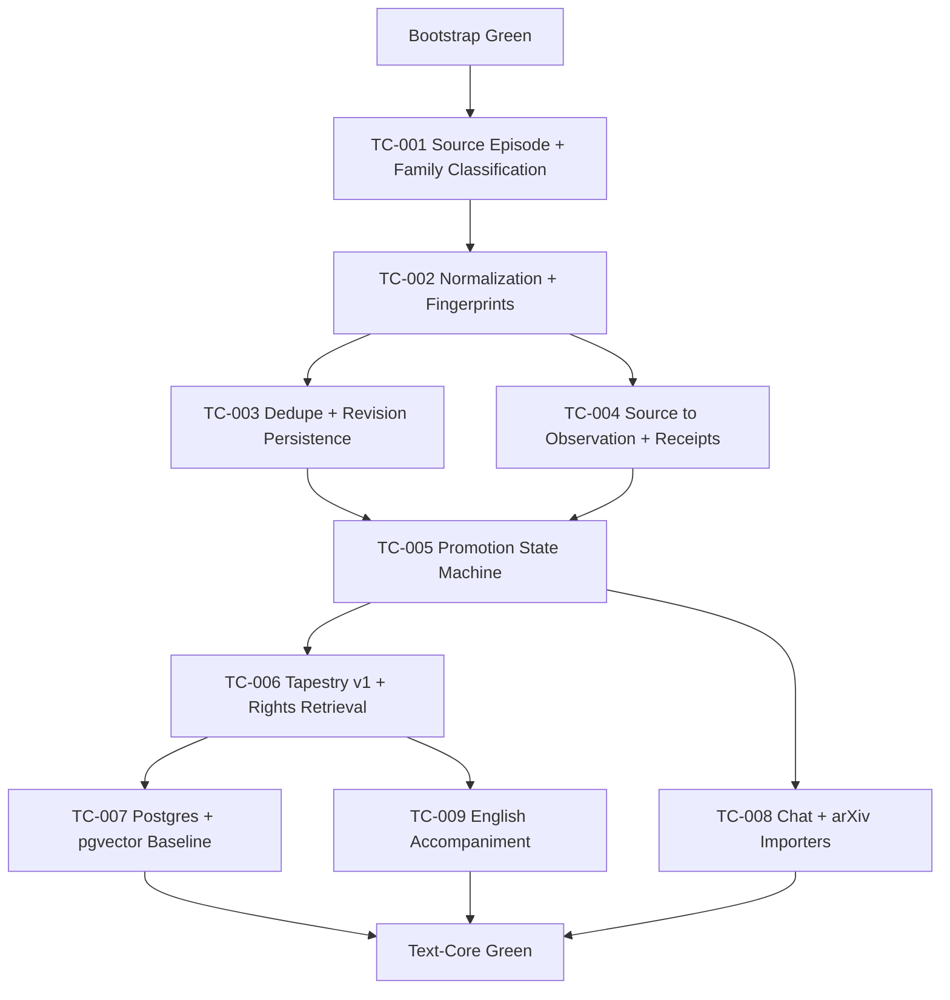

# Rosetta Text-Core MVP Scope Gate v0.1

Status: Draft, issue #4 work product  
Date: 2026-04-24  
Depends on: Bootstrap Green, docs intake ledger, Phased Backlog v0.1, Canonical Build Charter v0.1

## Decision

Text-Core MVP is the next rung after the current bootstrap provenance kernel. It should not start as a broad connector project. It should start as a small, receipt-bound text-ingest spine that proves source episodes can become observations, early interpretations, task-scoped tapestries, and rights-scoped retrieval results without losing raw provenance.

Minimum Text-Core Green means all of the following are true:

- at least two structurally different text-source families ingest end to end
- deterministic refinery behavior is green
- source -> observation -> interpretation -> tapestry flow is green
- rights-scoped retrieval is green
- minimum English accompaniment is green for promoted artifacts
- Postgres/pgvector path is green enough to stop relying on in-memory/fixture-only posture for serious RC claims

## Source Basis

- `docs/backlog/20260410 - Entif.AI - Rosetta - Phased Backlog (v0.1).md`
  - Defines Rung B as Text-Core MVP.
  - Lists B-001 through B-016, including ingest core, normalizer, dedupe, routing, tiling, tapestry, rights retrieval, Postgres/pgvector, two connector families, and English accompaniment.
  - Defines Text-Core Green as Bootstrap Green plus two text families, deterministic refinery, source -> observation -> interpretation -> tapestry, rights retrieval, minimum English accompaniment, and Postgres/pgvector.
- `docs/backlog/20260411 - Rosetta Canonical Build Charter (v0.1).md`
  - Defines Text-Core exit criteria and explicitly separates bootstrap proof from alpha claims.
  - States that Text-Core graduates beyond local CAS/SQLite toward Postgres JSONB, rights enforcement, and pgvector baseline.
- `docs/live/Entif.AI - Rosetta Pasigraphy Protocol - v3 - Architecture.md`
  - Current implementation is a provenance kernel with source-aware fixture inputs.
  - Live source acquisition, durable cache persistence, evidence-driven trust scoring, and large-scale corpus ingest are not yet implemented.
- `docs/RFCs/ontological_mixture_of_concepts_research_spec.md`
  - Supports an ingest pipeline of acquire, normalize, segment, provenance bind, dedupe/revision detect, risk score, deterministic extraction, semantic escalation gate, and tile emission.

## Scope Classification

### Must-Have

| ID | Capability | Package/App Targets | Source refs | Notes |
| --- | --- | --- | --- | --- |
| M1 | Source episode envelope and family classification | `packages/source-substrate`, `packages/ingress-refinery`, `packages/rosetta-schemas` | B-001, architecture source substrate/refinery layers | Use existing packages first. Split `packages/ingest-core` only when the API is stable enough to justify it. |
| M2 | Chronology-aware normalization and fingerprinting | `packages/rosetta-canon`, `packages/ingress-refinery`, `tools/doc-intake` | B-002, docs intake chronology correction | Preserve created/updated/exported/path/mtime evidence separately. Content fingerprint and revision fingerprint must be distinct. |
| M3 | Dedupe and revision graph with durable bootstrap persistence | `packages/canonical-cache` | B-003, B-011, architecture cache not-yet-implemented note | Raw source evidence remains append-only. Cache/index state may change but must preserve supersession trace. |
| M4 | Source -> observation tiling and transform receipts | `packages/ingress-refinery`, `packages/rosetta-core`, `packages/rosetta-receipts` | B-006, charter source -> observation boundary | No interpretation overwrites source. Observations reference evidence spans and emit transform receipts. |
| M5 | Structured extracts and promotion state machine | `packages/ingress-refinery`, `packages/rosetta-schemas`, eventual `packages/rosetta-pipeline` | B-007, B-008 | Extracts are derived artifacts. Ambiguity creates pending-confirmation or conjecture, not silent promotion. |
| M6 | Tapestry compiler v1 over bounded evidence sets | `packages/rosetta-tapestry`, `packages/rosetta-store` | B-009, OMOC tapestry-builder v0 | Context is a bounded compiled package, not raw prompt flooding. Closure claims must be verifiable. |
| M7 | Rights-scoped retrieval and cache domains | `packages/rosetta-store`, future `packages/index-postgres`, future `packages/index-pgvector` | B-010, B-011, charter storage law | Enforce rights before return. No retrieve-then-filter behavior. |
| M8 | Postgres/pgvector operational baseline | future `packages/index-postgres`, future `packages/index-pgvector` | B-011, charter Text-Core storage law | Required before claiming Text-Core Green. Can start with migration contracts and fixture-backed local DB tests. |
| M9 | Two text-source families end to end | `integrations/chat-import`, `integrations/arxiv-import` or existing refinery fixtures first | B-012, Text-Core Green | Minimum threshold is two structurally different families. Chat transcript plus arXiv/paper text is the strongest first pair. |
| M10 | Minimum English accompaniment | future `packages/english-accompaniment`, `packages/rosetta-tapestry` | B-015, charter exit criteria | Required for promoted artifacts: observation summaries, extract explanations, tapestry intros, refusal explanations. |

### Should-Have

| Capability | Rationale |
| --- | --- |
| GitHub text import after chat/arXiv | Valuable because the project itself is GitHub-native, but it should not precede the generic source episode and tiling contracts. |
| Journal/time-log/questionnaire import | Important personal artifact families, but they are second-wave Text-Core once chat/arXiv prove the core path. |
| Inspector-web read-only trace view | Useful for human inspection, but explicitly non-gating in B-016. |
| Evidence-derived trust scoring | Needed for mature source arbitration, but not required for the first two-family Text-Core path. |
| NERDm-style resource manifest adapter | Useful for compound artifacts and repos, but should wait until core text ingest and provenance binding are stable. |

### Deferred

| Capability | Deferral reason |
| --- | --- |
| YouTube transcript and social-thread import | Valid B-rung work, but not needed for the minimum two-family threshold. |
| Full Ithkuil corpus processing | C-rung/Alpha RC criterion, not first Text-Core MVP gate. |
| Temporal and activation memory planes | Alpha RC criteria after Text-Core proves source/provenance/retrieval basics. |
| Multimodal semantics, OCR/media pipelines, voice daemon | Explicitly postponed unless later doctrine promotes them. |
| Swarm replication, DHT, marketplace, distributed anchoring | Future ecosystem work, not Text-Core MVP. |

## Dependency Graph

## Follow-Up Implementation Issues

These are the next implementation issues to publish after this scope gate lands.

### TC-001 Source episode envelope and family classification

Priority: P1  
Targets: `packages/source-substrate`, `packages/ingress-refinery`, `packages/rosetta-schemas`

Acceptance:

- source episode type captures family, locator, raw evidence refs, rights scope, chronology, and parse-only mode
- unknown source family becomes `unresolved`, not silently dropped
- parse-only ingest cannot trigger side-effect tools

### TC-002 Chronology-aware normalization and fingerprints

Priority: P1  
Targets: `packages/rosetta-canon`, `packages/ingress-refinery`, `tools/doc-intake`

Acceptance:

- created/updated/exported/path/mtime evidence stays distinct
- content fingerprint is stable across formatting-only changes
- revision fingerprint changes when materially relevant content changes
- timestamp normalization is tested on chat transcript fixtures

### TC-003 Dedupe, revision graph, and cache persistence

Priority: P1  
Targets: `packages/canonical-cache`

Acceptance:

- repeated ingest of identical normalized content is idempotent
- revised content links as revision, not duplicate
- cache persistence survives restart in a local development path
- raw evidence is never deleted by dedupe

### TC-004 Source to observation tiling and transform receipts

Priority: P1  
Targets: `packages/ingress-refinery`, `packages/rosetta-core`, `packages/rosetta-receipts`

Acceptance:

- source and observation tiles remain separate
- observation tiles reference source spans
- transform receipts are emitted and verifiable
- derived summaries/extracts are separate artifacts

### TC-005 Promotion state machine and structured extracts

Priority: P1  
Targets: `packages/ingress-refinery`, `packages/rosetta-schemas`, `packages/rosetta-pipeline`

Acceptance:

- routing states are explicit and replayable
- ambiguous classification produces pending-confirmation
- blocked promotion emits refusal receipt
- entity/relationship extracts link to evidence spans

### TC-006 Tapestry v1, rights retrieval, and Postgres/pgvector baseline

Priority: P1  
Targets: `packages/rosetta-tapestry`, `packages/rosetta-store`, future `packages/index-postgres`, future `packages/index-pgvector`

Acceptance:

- task-scoped tapestry manifests have bounded members and provenance closure
- retrieval enforces rights before return
- cache domains cannot leak across tenant/sensitivity/purpose scopes
- migration contracts exist for Postgres JSONB and pgvector fixture tests

### TC-007 Chat + arXiv importers and English accompaniment

Priority: P1  
Targets: `integrations/chat-import`, `integrations/arxiv-import`, future `packages/english-accompaniment`

Acceptance:

- chat transcript fixture produces turn-aware observations
- arXiv/paper text fixture produces section-aware source episodes
- both families emit import and promotion receipts
- promoted artifacts have minimum English accompaniment with evidence refs or uncertainty markers

## Non-Goals For This Gate

- no implementation code changes
- no large-scale docs corpus ingest
- no live upstream fetchers until parse-only source episode contracts are green
- no Alpha RC claim

## Exit Criteria For Issue #4

- this document exists in the repo
- issue #4 links to this document
- follow-up implementation issues are publishable from the TC-001 through TC-007 list
- the next branch can start with TC-001 without rereading the whole corpus
