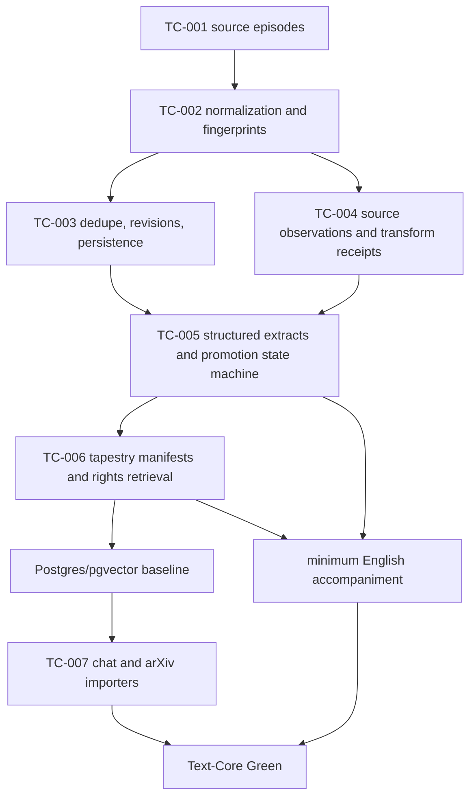

# Batch 1: Highest-Authority Rosetta Direction

## Source

- Path: Batch of six sources:
  - `docs/backlog/20260424 - Rosetta Text-Core MVP Scope Gate (v0.1).md`
  - `docs/backlog/20260411 - Rosetta Canonical Build Charter (v0.1).md`
  - `docs/backlog/20260410 - Entif.AI - Rosetta - Phased Backlog (v0.1).md`
  - `docs/live/Entif.AI - Rosetta Pasigraphy Protocol - v3 - Architecture.md`
  - `docs/governance/REPO_SHAPE_AND_CONSTRAINTS.md`
  - `docs/governance/SERVICE_INVENTORY.md`
- Title: Highest-authority Rosetta direction batch
- Date evidence: top matter and filenames dated 2026-04-10, 2026-04-11, and 2026-04-24
- Authority tier: high; backlog, live architecture, and governance/service inventory
- Freshness: current April 2026 direction
- Word count: 8,572 across the six source files
- Extractor: Codex
- Extraction date: 2026-04-24

## Summary

This batch confirms that the current build should stay on the Text-Core MVP rung, but with a narrower priority than "keep implementing Text-Core broadly." TC-001 through TC-004 have landed. The next implementation issue, TC-005, is directionally valid, but it should be treated as the bridge from source observations into explicit, evidence-linked interpretation artifacts and replayable promotion decisions. It should not absorb tapestry compilation, retrieval, Postgres/pgvector, importers, or English accompaniment.

Text-Core Green remains larger than TC-005. It requires two structurally different text-source families, deterministic refinery behavior, source-to-observation-to-interpretation-to-tapestry flow, rights-scoped retrieval, minimum English accompaniment, and a Postgres/pgvector path.

This artifact is not a plan to ingest repository documents into Rosetta tiles or tapestries. It is a docs-intelligence planning artifact: a human/agent-readable extraction from `docs/` that helps decide what to build next.

## Boundary Correction

There are two different jobs that must stay separate:

| Job | Current status | Outputs | Non-goals |
| --- | --- | --- | --- |
| Docs intelligence over repo `docs/` | Active now | extraction artifacts, findings ledgers, issue drafts, GitHub comments, project-board recommendations | no Rosetta tiles, no tapestries, no runtime semantic corpus claims |
| Rosetta runtime document ingestion | Future product behavior | source episodes, observations, structured extracts, tapestries, rights-scoped retrieval, indexed corpus state | not part of DI-001 and not required before mining repo docs |

Any mention below of TC-005, TC-006, TC-007, tapestries, retrieval, storage, or importers refers to future Rosetta/Entif implementation work discovered from the docs. It does not describe the current docs-mining workflow.

## Docs-Intelligence Operating Loop

The immediate operating loop should be cheap-agent friendly:

1. Assign MiniMax, Qwen, or another low-cost model one source document or one tight batch from `docs/`.
2. Have it produce finding rows with timestamp, source path, heading/locator, date evidence, tags, subjects, source citation, confidence, and action recommendation.
3. Have it suggest issue drafts, issue refinements, or ablations of outdated specs, always tied to source evidence.
4. Return those extracted findings to the stronger orchestrator for dedupe, conflict resolution, priority calls, and build sequencing.
5. Only after orchestration should implementation issues become active coding work.

## Goals And Intent

- Prove Rosetta as a receipt-bound provenance and meaning kernel before broad product surfaces.
- Keep raw source signals separate from observations, interpretations, promoted artifacts, indexes, caches, and retrieval views.
- Advance by thin vertical slices with tests as the executable backlog.
- Preserve parse-only ingest as the safety baseline until the refinery/cache contracts are strong enough for live acquisition.
- Use docs intelligence now for roadmap and issue planning, while keeping Rosetta-native large-scale corpus ingest deferred.
- Keep cheap-agent docs mining separate from future Rosetta runtime ingestion.
- Hand low-cost extraction results back to a stronger orchestrator before converting them into implementation priorities.

## Findings Ledger

| Timestamp | Source path | Heading / locator | Tags | Subjects | Finding type | Finding | Citation / evidence | Recommendation | Confidence |
| --- | --- | --- | --- | --- | --- | --- | --- | --- | --- |
| 2026-04-24 | `docs/intake/DOCS_INTELLIGENCE_WORKFLOW.md` | Purpose / Boundary | docs-intelligence, boundary, planning | repo docs, runtime ingestion, Rosetta tiles | decision | Repo docs should be mined now as project intelligence, without waiting for Rosetta runtime ingestion readiness. | Workflow says docs intelligence is not runtime ingestion and must not be blocked on Rosetta-native tiles or tapestry generation. | Treat DI-001 as extraction/orchestration work only. | high |
| 2026-04-24 | `docs/intake/DOCS_INTELLIGENCE_WORKFLOW.md` | Extraction Output | cheap-agents, citations, issue-drafts | MiniMax, Qwen, findings, source evidence | requirement | Extraction work must be decomposable into finding-level rows with timestamps, tags, subjects, citations, confidence, and issue recommendations. | Workflow now defines the cheap-agent extraction loop and finding fields. | Use this as the handoff contract for low-cost model batches. | high |
| 2026-04-24 | `docs/backlog/20260424 - Rosetta Text-Core MVP Scope Gate (v0.1).md` | Scope Classification | text-core, implementation, future-product | TC-005, promotion, structured extracts | issue-candidate | TC-005 remains a valid future implementation issue, but only after docs intelligence has shaped the scope. | Scope Gate M5 names structured extracts and promotion state machine. | Keep #10 active as future implementation, not docs-mining machinery. | high |
| 2026-04-24 | `docs/backlog/20260410 - Entif.AI - Rosetta - Phased Backlog (v0.1).md` | B-009 to B-011 | text-core, future-product, storage | tapestry, rights retrieval, Postgres, pgvector | sequencing | Tapestry, rights retrieval, and storage are future Rosetta build dependencies, not open questions for current docs ingestion. | Phased Backlog separates B-009 tapestry, B-010 retrieval, and B-011 Postgres/pgvector. | Mention these only as future implementation boundaries. | high |

## Requirements

| Requirement | Evidence | Package/App/Area | Priority | Notes |
| --- | --- | --- | --- | --- |
| TC-005 must model structured extracts as derived artifacts linked to evidence spans. | Scope Gate M5; Phased Backlog B-007 | `packages/ingress-refinery`, `packages/rosetta-schemas`, eventual `packages/rosetta-pipeline` | P1 | Extracts must not mutate source truth or observations. |
| TC-005 must include a replayable promotion state machine. | Scope Gate M5; Phased Backlog B-008 | `packages/ingress-refinery`, `packages/rosetta-schemas` | P1 | States should cover source-only, observation, structured extract, tapestry candidate, human confirmation, rejection, and hold/index-only paths. |
| Ambiguity must produce pending-confirmation or conjecture, not silent promotion. | Scope Gate M5; Phased Backlog B-007/B-008 | `packages/ingress-refinery`, `packages/rosetta-pipeline` | P1 | This is a direct quality and honesty gate. |
| Blocked promotion must emit an auditable refusal receipt. | Scope Gate TC-005 acceptance; Phased Backlog B-008 | `packages/rosetta-receipts`, `packages/ingress-refinery` | P1 | Refusal is a receipt-bearing event, not a dropped branch. |
| TC-006 should stay scoped to bounded tapestry manifests and rights-before-return retrieval. | Scope Gate M6/M7; Phased Backlog B-009/B-010 | `packages/rosetta-tapestry`, `packages/rosetta-store`, future indexes | P1 | Do not bundle importers into TC-006. |
| Postgres/pgvector is a Text-Core Green gate, not optional alpha polish. | Scope Gate M8; Charter Text-Core exit criteria; Phased Backlog B-011/9.2 | future `packages/index-postgres`, `packages/index-pgvector` | P1 | Serious RC claims cannot rely on in-memory/fixture-only posture. |
| Chat and arXiv remain the strongest first two text families. | Scope Gate M9; Phased Backlog B-012 | `integrations/chat-import`, `integrations/arxiv-import` | P1 | They are structurally different and exercise turn-aware versus section-aware ingest. |
| Minimum English accompaniment is required for promoted artifacts. | Scope Gate M10; Charter Text-Core exit criteria; Phased Backlog B-015 | future `packages/english-accompaniment` | P1 | Coverage starts with observation summaries, extract explanations, tapestry intros, and refusal explanations. |
| OB1, Prism, and Mission Control must remain read-only or operator surfaces for now. | Live architecture; Repo Shape constraints; Service Inventory | `projection-adapters`, `apps/rosetta-operator` | P2 | They are not semantic authority at this rung. |
| Live source acquisition remains not implemented and should not be claimed. | Live architecture; README; Service Inventory | source adapters/integrations | P1 | Keep fixture-backed language until live fetch, parse, persistence, and tests exist. |

## Components And Technologies

- Current implemented/fixture-backed packages:
  - Kernel: `rosetta-canon`, `rosetta-cid`, `rosetta-core`, `rosetta-schemas`, `rosetta-receipts`, `rosetta-guard`, `rosetta-tapestry`, `rosetta-store`
  - Source and registry: `source-substrate`, `source-registry`
  - Refinery and cache: `ingress-refinery`, `canonical-cache`
  - Projection: `projection-adapters`
- Current app surfaces:
  - `rosetta-cli`
  - `rosetta-api`
  - `rosetta-operator`
- Future or not-yet-split targets named by planning docs:
  - `packages/index-postgres`
  - `packages/index-pgvector`
  - `packages/english-accompaniment`
  - `integrations/chat-import`
  - `integrations/arxiv-import`
  - optional later importers for journals, questionnaires, GitHub text, YouTube transcript text, and social-thread text

## Conceptual Claims

- Rosetta is the constitutional provenance and meaning kernel; Entif is the governed execution/evolution layer on top.
- Tapestry is bounded, inspectable compiled context, not raw prompt flooding.
- Rights enforcement happens before return. Retrieve-then-filter is disallowed by the governing posture.
- Truth/provenance, temporal history, and activation/recall are separate planes.
- Source evidence is append-only; caches, indexes, and activation priorities may change but must preserve supersession trace.
- Plain English accompaniment is not decoration. It is part of human inspectability for promoted artifacts.

## Dependencies And Sequencing

Sequencing recommendation:

1. Keep TC-005 as the next implementation slice.
2. Split TC-006 if necessary so tapestry v1 and rights-scoped retrieval do not get blurred with Postgres/pgvector.
3. Treat Postgres/pgvector as a required operational baseline before importer-heavy claims.
4. Keep TC-007 focused on two text families plus minimum English accompaniment; do not expand it into every importer named in the backlog.

## Contradictions Or Supersession

- Older package names in the phased backlog (`ingest-core`, `source-normalizer`, `refinery-routing`, `tile-minting`) do not exactly match the current repo shape. Current implementation should prefer existing packages first and split only when APIs justify it, matching the Scope Gate guidance.
- The live architecture and README describe the current repo as a provenance-kernel prototype with fixture-backed source-aware flows. Any issue language that implies live acquisition or production ingestion is superseded by that more precise status.
- The Scope Gate says TC-006 includes tapestry, rights retrieval, and Postgres/pgvector baseline, while the phased backlog separates these as B-009, B-010, and B-011. For execution, the split backlog is safer: bounded tapestry first, rights-before-return retrieval next, operational storage baseline after retrieval contracts.
- The current handoff recommends pausing broad Text-Core implementation until docs intelligence clarifies scope. This batch clarifies that TC-005 is still the next narrow code slice, while TC-006/TC-007 need sharper boundaries before implementation.

## Issue Candidates

| Title | Type | Labels | Depends On | Evidence |
| --- | --- | --- | --- | --- |
| Refine TC-005 acceptance around replayable promotion states and refusal receipts | issue update/comment | `text-core`, `implementation`, `ingress-refinery`, `schemas` | TC-001 through TC-004 | Scope Gate M5; Phased Backlog B-007/B-008 |
| Split TC-006 into tapestry v1 plus rights retrieval/storage subtasks if implementation scope grows | issue update/comment | `text-core`, `tapestry`, `storage` | TC-005 | Scope Gate M6/M7/M8; Phased Backlog B-009/B-011 |
| Keep TC-007 to chat/arXiv plus English accompaniment, not all importers | issue update/comment | `text-core`, `integrations`, `english-accompaniment` | TC-006 and storage baseline | Scope Gate M9/M10; Phased Backlog B-012/B-015 |
| Draft Postgres/pgvector operational baseline issue if TC-006 remains too broad | draft candidate | `storage`, `retrieval`, `text-core` | rights retrieval contracts | Charter Text-Core exit criteria; Phased Backlog B-011/9.2 |
| Draft English accompaniment package contract | draft candidate | `english-accompaniment`, `documentation`, `text-core` | structured extracts and tapestry intros | Scope Gate M10; Phased Backlog B-015 |

## Project Board Suggestions

- Area: docs-intelligence, text-core, ingress-refinery, tapestry, storage, integrations
- Cycle: text-core
- Status: ready for TC-005; candidate/refinement for TC-006 and TC-007
- Blocked by:
  - TC-006 blocked by TC-005 promotion outputs
  - TC-007 blocked by bounded tapestry, rights retrieval, and storage baseline decisions
  - English accompaniment blocked by artifact-type templates from TC-005/TC-006
- Parallelization notes:
  - TC-005 can run in one agent lane over `ingress-refinery`/schemas tests.
  - Tapestry v1 can be prepared separately after TC-005 output contracts are explicit.
  - Postgres/pgvector should not run in parallel with rights retrieval unless retrieval contracts are already frozen.
  - English accompaniment can begin as package/interface design once promoted artifact types are stable.

## Open Questions

- For future Rosetta implementation, should TC-006 remain one broad issue, or be split into tapestry v1, rights retrieval, and Postgres/pgvector baseline?
- Should minimum English accompaniment be pulled earlier into TC-005 as interface stubs, or remain a separate package after structured extracts exist?
- Should the first storage baseline use local Postgres testcontainers, an opt-in local Docker compose service, or a pure migration-contract test harness?
- Which existing package owns promotion state first: `ingress-refinery`, `rosetta-schemas`, or a new package only after the interface stabilizes?
- What exact finding schema should low-cost docs-intelligence agents emit so the orchestrator can dedupe, cite, prioritize, and convert findings into issue drafts with minimal expensive-model review?
